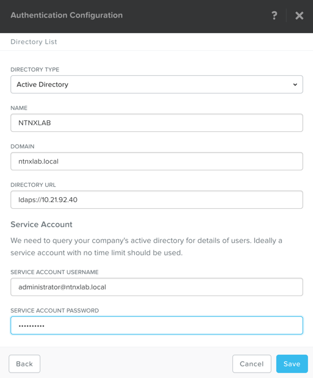
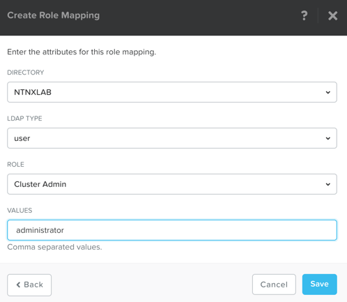

.. _authentication:

-------------------------------
Authentication and Role Mapping
-------------------------------

In most environments you will want to connect your Nutanix cluster(s) to your companies Active Directory or LDAP servers.

This allows the admins to login with those credentials instead of local Nutanix cluster credentials.

.. note::

  The Steps are the same for Prism Central and Prism Element

In **Prism**, click :fa:`cog` **> Authentication**

Click **+ New Directory**

Fill out the following fields and click **Save**:

- **Directory Type** - Active Directory
- **Name** - NTNXLAB
- **Domain** - ntnxlab.local
- **Directory URL** - ldaps://10.21.XX.40
- **Service Account Name** - administrator@ntnxlab.local
- **Service Account Password** - nutanix/4u

Click on the yellow ! next to **NTNXLAB**

.. figure:: images/authentication_02.png

Click on the **Click Here** to go to the Role Mapping screen

Click **+ New Mapping**

Fill out the following fields and click **Save**:

- **Directory** - NTNXLAB
- **LDAP Type** - user
- **Role** - Cluster Admin
- **Values** - administrator

Close the Role Mapping and Authentication windows
