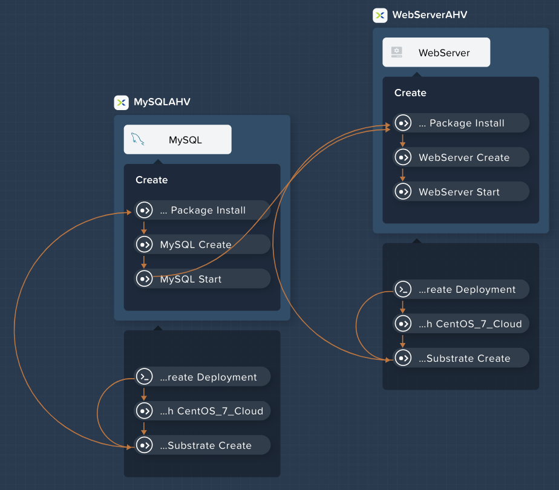
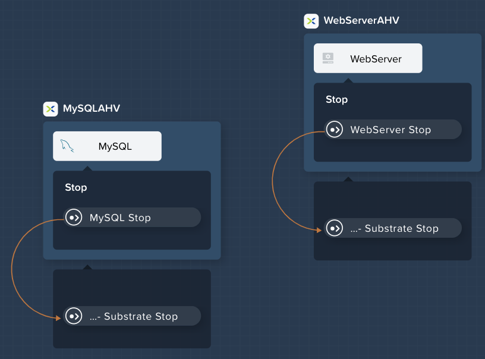
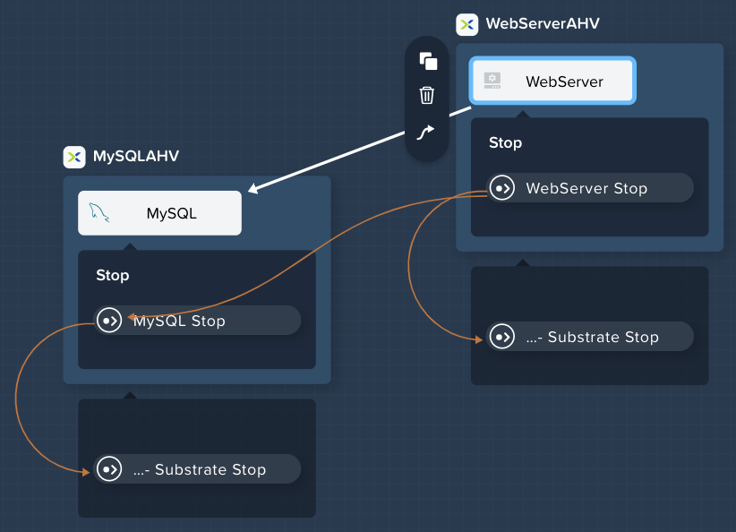
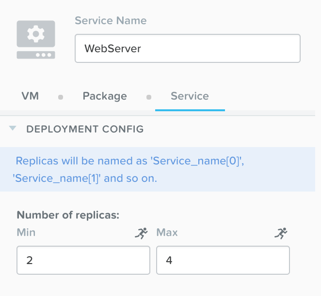
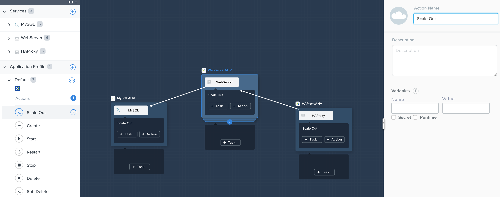
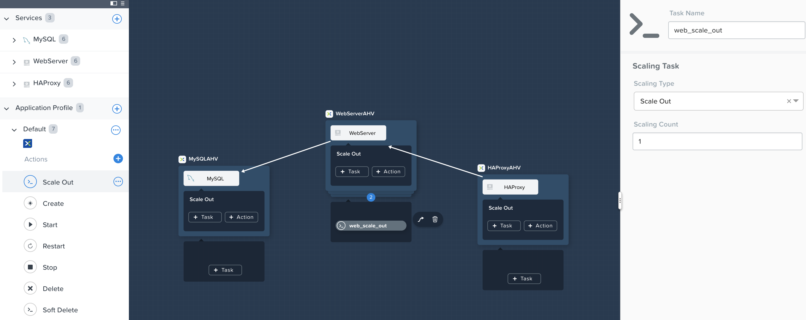
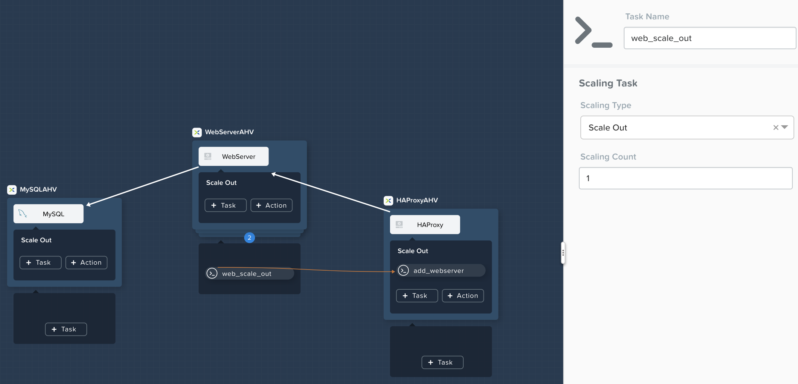
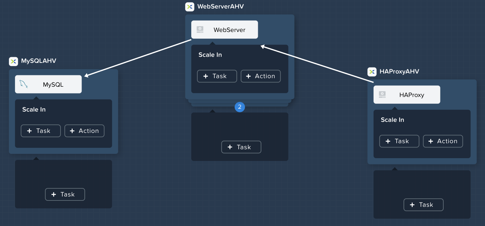
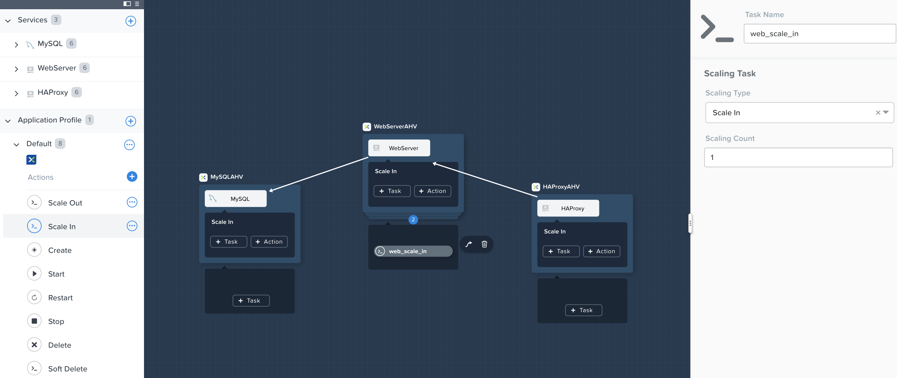
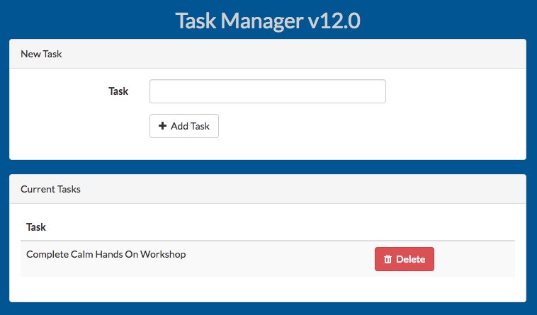

.. _calm_lamp_blueprint:

--------------------
Calm: 3TWA Blueprint
--------------------

Overview
++++++++

Calm Blueprint (3TWA)
+++++++++++++++++++++

In this exercise you will extend the MySQL Blueprint created previously into a basic 3 Tier Web Application (a Task Manager), as shown below.  You'll also add the ability to perform Day 2 operations (scaling) to the blueprint.

As with the previous MySQL Lab, this lab has two tracks:

 - **Cloud Track** - We'll use a Cloud based CentOS image which does not allow password based authentication, instead it relies on *SSH keys*.  Most Public Clouds authenticate in this manner.  If you're comfortable with SSH keys, we recommend you follow this track.
 - **Local Track** - We'll use a local CentOS image which allows password based authentication.  If you've never used SSH keys before, we recommend you follow this track.

You **must** follow the same track as you did for the MySQL lab.

.. figure:: images/3twa1.png

Creating the Web Server
.......................

From **Prism Central > Apps**, select **Blueprints** from the sidebar and select your Blueprint from the previous exercise.

In **Application Overview > Services**, click :fa:`plus-circle`.

Note **Service2** appears in the **Workspace** and the **Configuration Pane** reflects the configuration of the selected Service. You can rearrange the Service icons on the Workspace by clicking and dragging them.

With the WebServer service icon selected in the workspace window, scroll to the top of the **Configuration Panel**, click **VM**.

- **Service Name** - WebServer
- **Name** - WebServer\_AHV
- **Cloud** - Nutanix
- **OS** - Linux
- **VM Name** - WebServer-@@{calm\_array\_index}@@-@@{calm\_time}@@
- **Image** - CentOS\_7\_Cloud
- **Device Type** - Disk
- **Device Bus** - SCSI
- Select **Bootable**
- **vCPUs** - 2
- **Cores per vCPU** - 1
- **Memory (GiB)** - 4
- **Guest Customization** - Depending on your track:

  - **Cloud Track** - Select Guest Customization

    - Leave **Cloud-init** selected and paste in the following script

      .. code-block:: bash

        #cloud-config
        users:
          - name: centos
            ssh-authorized-keys:
              - @@{INSTANCE_PUBLIC_KEY}@@
            sudo: ['ALL=(ALL) NOPASSWD:ALL']

      .. code-block:: bash

  - **Local Track** - Leave Guest Customization Unselected

- Select :fa:`plus-circle` under **Network Adapters (NICs)**
- **NIC** - Primary
- **Credential** - CENTOS

Click **Save** and ensure no errors or warnings pop-up.  If they do, resolve the issue, and **Save** again.

With the WebServer service icon selected in the workspace window, scroll to the top of the **Configuration Panel**, click **Package**.  Name the Package as **WebServer_PACKAGE**, and then click the **Configure install** button.

On the Blueprint Canvas section, a **Package Install** field will pop up next to the WebServer Service tile.  Click on the **+ Task** button, and fill out the following fields on the **Configuration Panel** on the right:

- **Name Task** - Install_WebServer
- **Type** - Execute
- **Script Type** - Shell
- **Credential** - CENTOS

Copy and paste the following script into the **Script** field:

.. code-block:: bash

  #!/bin/bash
  set -ex

  sudo yum update -y
  sudo yum -y install epel-release
  sudo setenforce 0
  sudo sed -i 's/enforcing/disabled/g' /etc/selinux/config /etc/selinux/config
  sudo systemctl stop firewalld || true
  sudo systemctl disable firewalld || true
  sudo rpm -Uvh https://mirror.webtatic.com/yum/el7/webtatic-release.rpm
  sudo yum update -y
  sudo yum install -y nginx php56w-fpm php56w-cli php56w-mcrypt php56w-mysql php56w-mbstring php56w-dom git unzip

  sudo mkdir -p /var/www/laravel
  echo "server {
   listen 80 default_server;
   listen [::]:80 default_server ipv6only=on;
  root /var/www/laravel/public/;
   index index.php index.html index.htm;
  location / {
   try_files \$uri \$uri/ /index.php?\$query_string;
   }
   # pass the PHP scripts to FastCGI server listening on /var/run/php5-fpm.sock
   location ~ \.php$ {
   try_files \$uri /index.php =404;
   fastcgi_split_path_info ^(.+\.php)(/.+)\$;
   fastcgi_pass 127.0.0.1:9000;
   fastcgi_index index.php;
   fastcgi_param SCRIPT_FILENAME \$document_root\$fastcgi_script_name;
   include fastcgi_params;
   }
  }" | sudo tee /etc/nginx/conf.d/laravel.conf
  sudo sed -i 's/80 default_server/80/g' /etc/nginx/nginx.conf
  if `grep "cgi.fix_pathinfo" /etc/php.ini` ; then
   sudo sed -i 's/cgi.fix_pathinfo=1/cgi.fix_pathinfo=0/' /etc/php.ini
  else
   sudo sed -i 's/;cgi.fix_pathinfo=1/cgi.fix_pathinfo=0/' /etc/php.ini
  fi

  sudo systemctl enable php-fpm
  sudo systemctl enable nginx
  sudo systemctl restart php-fpm
  sudo systemctl restart nginx

  if [ ! -e /usr/local/bin/composer ]
  then
   curl -sS https://getcomposer.org/installer | php
   sudo mv composer.phar /usr/local/bin/composer
   sudo chmod +x /usr/local/bin/composer
  fi

  sudo git clone https://github.com/ideadevice/quickstart-basic.git /var/www/laravel
  sudo sed -i 's/DB_HOST=.*/DB_HOST=@@{MySQL.address}@@/' /var/www/laravel/.env

  sudo su - -c "cd /var/www/laravel; composer install"
  if [ "@@{calm_array_index}@@" == "0" ]; then
   sudo su - -c "cd /var/www/laravel; php artisan migrate"
  fi

  sudo chown -R nginx:nginx /var/www/laravel
  sudo chmod -R 777 /var/www/laravel/
  sudo systemctl restart nginx

.. code-block:: bash

Select the WebServer service icon in the workspace window again and scroll to the top of the **Configuration Panel**, click **Package**.

Fill out the following fields:

- **Click** - Configure uninstall
- **Click** - + Task
- **Name Task** - Uninstall_WebServer
- **Type** - Execute
- **Script Type** - Shell
- **Credential** - CENTOS

Copy and paste the following script into the **Script** field:

.. code-block:: bash

  #!/bin/bash
  set -ex

  sudo rm -rf /var/www/laravel
  sudo yum erase -y nginx

.. code-block:: bash

Click **Save** and ensure no errors or warnings pop-up.  If they do, resolve the issue, and **Save** again.

Adding Dependencies
...................

As our application will require the database to be running before the web server starts, our Blueprint requires a dependency to enforce this ordering.  There are a couple of ways to do this, one of which we've already done without likely realizing it.  If you didn't save after the last step, be sure to do that first.

In the **Application Overview > Application Profile** section, expand the **Default** Application Profile (if you renamed the Application Profile at a previous step, then just select that re-named application profile).  Next, click on the **Create** Profile Action and view the **Workspace**:

Take note of the **Orange Orchestration Edge** going from the **MySQL Start** task to the **WebServer Package Install** task.  This edge was automatically created by Calm due to the **@@{MySQL.address}@@** macro reference in the **WebServer Package Install** task.  Since the system needs to know the IP Address of the MySQL service prior to being able to proceed with the WebServer Install task, it automatically creates the orchestration edge.  This requires the MySQL service to be started prior to moving on to the WebServer Install task.

Next, back in the **Application Overview > Application Profile** section, select the **Stop** Profile Action.  View the **Workplace** section: notice how there are no orange orchestration edges?  This could cause issues if the MySQL service shutdown slightly before the WebServer accepted a request.  Click on each Profile Action to take note of the current presence (or lack thereof) of the orange orchestration edges.

To resolve this, we'll manually create a dependency.  In the **Workspace**, select the **WebServer** Service and click the **Create Dependency** icon that appears above the Service icon, and then click on the **MySQL** service.  This represents that the **WebServer** service "depends" upon the **MySQL** service, meaning the **MySQL** service will start before, and stop after, the **WebServer** service.

Click **Save**.  You should see the system draw an **Orange Orchestration Edge** like so:

Drawing the white dependency arrows will cause Calm to create orange orchestration edges for all **System Defined Profile Actions** (Create, Start, Restart, Stop, Delete, and Soft Delete).  Click on each Profile Action to see the difference compared to before the white dependency arrow was drawn.

Adding Replicas
...............

Calm makes it simple to add multiple copies of a given Service, which is helpful for scale out workloads such as web servers.

In the **Workspace**, select the **WebServer** Service.

In the **Configuration Pane**, select the **Service** tab.

Under **Deployment Config**, change the **Min** number of replicas from 1 to 2, and the **Max** Number of replicas from 1 to 4.

Creating the Load Balancer
..........................

To take advantage of a scale out web tier our application needs to be able to load balance connections across multiple web server VMs. HAProxy is a free, open source TCP/HTTP load balancer used to distribute workloads across multiple servers. It can be used in small, simple deployments and large web-scale environments such as GitHub, Instagram, and Twitter.

In **Application Overview > Services**, click :fa:`plus-circle`.

Select **Service3** and fill out the following fields in the **Configuration Pane**:

- **Service Name** - HAProxy
- **Name** - HAPROXYAHV
- **Cloud** - Nutanix
- **OS** - Linux
- **VM Name** - HAProxy-@@{calm\_array\_index}@@-@@{calm\_time}@@
- **Image** - CentOS\_7\_Cloud
- **Device Type** - Disk
- **Device Bus** - SCSI
- Select **Bootable**
- **vCPUs** - 2
- **Cores per vCPU** - 1
- **Memory (GiB)** - 4
- **Guest Customization** - Depending on your track:

  - **Cloud Track** - Select Guest Customization

    - Leave **Cloud-init** selected and paste in the following script

      .. code-block:: bash

        #cloud-config
        users:
          - name: centos
            ssh-authorized-keys:
              - @@{INSTANCE_PUBLIC_KEY}@@
            sudo: ['ALL=(ALL) NOPASSWD:ALL']

      .. code-block:: bash

  - **Local Track** - Leave Guest Customization Unselected

- Select :fa:`plus-circle` under **Network Adapters (NICs)**
- **NIC** - Primary
- **Credential** - CENTOS

Scroll to the top of the **Configuration Panel**, click **Package**.

Fill out the following fields:

- **Package Name** - HAPROXY_PACKAGE
- **Click** - Configure install
- **Click** - + Task
- **Name Task** - install_haproxy
- **Type** - Execute
- **Script Type** - Shell
- **Credential** - CENTOS

Copy and paste the following script into the **Script** field:

.. code-block:: bash

  #!/bin/bash
  set -ex

  sudo yum update -y
  sudo yum install -y haproxy
  sudo setenforce 0
  sudo sed -i 's/enforcing/disabled/g' /etc/selinux/config /etc/selinux/config
  sudo systemctl stop firewalld || true
  sudo systemctl disable firewalld || true

  echo "global
   log 127.0.0.1 local0
   log 127.0.0.1 local1 notice
   maxconn 4096
   quiet
   user haproxy
   group haproxy
  defaults
   log global
   mode http
   retries 3
   timeout client 50s
   timeout connect 5s
   timeout server 50s
   option dontlognull
   option httplog
   option redispatch
   balance roundrobin
  # Set up application listeners here.
  listen admin
   bind 127.0.0.1:22002
   mode http
   stats uri /
  frontend http
   maxconn 2000
   bind 0.0.0.0:80
   default_backend servers-http
  backend servers-http" | sudo tee /etc/haproxy/haproxy.cfg

  hosts=$(echo "@@{WebServer.address}@@" | tr "," "\n")
  port=80

  for host in $hosts
    do echo " server host-${host} ${host}:${port} weight 1 maxconn 100 check" | sudo tee -a /etc/haproxy/haproxy.cfg
  done

  sudo systemctl daemon-reload
  sudo systemctl enable haproxy
  sudo systemctl restart haproxy

.. code-block:: bash

Select the HAProxy service icon in the workspace window again and scroll to the top of the **Configuration Panel**, click **Package**.

Fill out the following fields:

- **Click** - Configure uninstall
- **Click** - + Task
- **Name Task** - uninstall_haproxy
- **Type** - Execute
- **Script Type** - Shell
- **Credential** - CENTOS

Copy and paste the following script into the **Script** field:

.. code-block:: bash

  #!/bin/bash
  set -ex

  sudo
  yum -y erase haproxy

.. code-block:: bash

Click **Save**.

In the **Workspace**, select the **HAProxy** Service and click the **Create Dependency** icon that appears above the Service icon.  Select the **WebServer** Service.

Click **Save** and ensure no errors or warnings pop-up.  If they do, resolve the issue, and **Save** again.

Scale Out
.........

Imagine you're the administrator of the Task Manager Application that we've been building, and you're currently unsure of the amount of demand for this application by your end users.  Or imagine you expect the demand to ebb and flow due to the time of the year.  How can we easily scale to meet this changing demand?

If you recall in a previous step, we set the minimum number of **WebServer** replicas to 2, and our maximum to 4.  In current versions of Calm, the minimum number is always the starting point.  In the event our default 2 replicas of our **WebServer** web server is not enough to handle the load of your end users, we can perform a **Scale Out** Action.

In the **Application Overview > Application Profile** section, expand the **Default** Application Profile.  Then, select :fa:`plus-circle` next to the **Actions** section.  On the **Configuration Panel** to the right, rename the new Action to be **Scale Out**.

Next to the **WebServer** service tile, click the **+ Task** button, then fill out the following fields:

- **Task Name** - web_scale_out
- **Type** - Scaling
- **Scaling Type** - Scale Out
- **Scaling Count** - 1

Click **Save** and ensure no errors or warnings pop-up.  If they do, resolve the issue, and **Save** again.

When a user later runs the **Scale Out** task, a new **WebServer** VM will get created, and the **Package Install** tasks for that service will be exectured.  However, we do need to modify the **HAProxy** configuration in order to start taking advantage of this new web server.

Next to the **HAProxy** service tile, click the **+ Task** button, then fill out the following fields:

- **Task Name** - add_webserver
- **Type** - Execute
- **Script Type** - Shell
- **Credential** - CENTOS

Copy and paste the following script into the **Script** field:

.. code-block:: bash

  #!/bin/bash
  set -ex

  host=$(echo "@@{WebServer.address}@@" | awk -F "," '{print $NF}')
  port=80
  echo " server host-${host} ${host}:${port} weight 1 maxconn 100 check" | sudo tee -a /etc/haproxy/haproxy.cfg

  sudo systemctl daemon-reload
  sudo systemctl restart haproxy

.. code-block:: bash

That script will grab the last address in the WebServer address array, and add it to the haproxy.cfg file.  However, we want to be sure that this doesn't happen until **after** the new WebServer is fully up, otherwise the HAProxy server may send requests to a non-functioning WebServer.

To solve this issue, on the **Workspace**, click on the **web_scale_out** task, then the **Create Edge** arrow icon, and finally click on the **add_webserver** task to draw the edge.  Afterwards your **Workspace** should look like this:

Scale In
........

Again imagine you're the administrator of this Task Manager Application we're building.  It's the end of your busy season, and you'd like to scale the Web Server back in to save on resource utilization.  To accomplish this, navigate to the **Application Overview > Application Profile** section, expand the **Default** Application Profile.  Then, select :fa:`plus-circle` next to the **Actions** section.  On the **Configuration Panel** to the right, rename the new Action to be **Scale In**.

Next to the **WebServer** service tile, click the **+ Task** button, then fill out the following fields:

- **Task Name** - web_scale_in
- **Type** - Scaling
- **Scaling Type** - Scale In
- **Scaling Count** - 1

Click **Save** and ensure no errors or warnings pop-up.  If they do, resolve the issue, and **Save** again.

When a user later runs the **Scale In** task, the last **WebServer** replica will have its **Package Uninstall** task run, the VM will be shut down, and then deleted, which will reclaim resources.  However, we do need to modify the **HAProxy** configuration to ensure that we're no longer sending traffic to the to-be-deleted Web Server.

Next to the **HAProxy** service tile, click the **+ Task** button, then fill out the following fields:

- **Task Name** - del_webserver
- **Type** - Execute
- **Script Type** - Shell
- **Credential** - CENTOS

Copy and paste the following script into the **Script** field:

.. code-block:: bash

  #!/bin/bash
  set -ex

  host=$(echo "@@{WebServer.address}@@" | awk -F "," '{print $NF}')
  sudo sed -i '/$host/d' /etc/haproxy/haproxy.cfg

  sudo systemctl daemon-reload
  sudo systemctl restart haproxy

.. code-block:: bash

That script will grab the last address in the WebServer address array, and remove it from the haproxy.cfg file.  Similar to the last step, we want to be sure that this happens **before** the new WebServer is destroyed, otherwise the HAProxy server may send requests to a non-functioning WebServer.

To solve this issue, on the **Workspace**, click on the **del_webserver** task, then the **Create Edge** arrow icon, and finally click on the **web_scale_in** task to draw the edge.  Afterwards your **Workspace** should look like this:

.. figure:: images/scalein3.png

Click **Save** and ensure no errors or warnings pop-up.  If they do, resolve the issue, and **Save** again.

Launching and Managing the Application
......................................

Within the blueprint editor, click **Launch**. Specify a unique **Application Name** (e.g. Calm3TWA*<INITIALS>*-2) and click **Create**.  Monitor the application as it deploys.

Once the application changes into a **RUNNING** state, navigate to the **Services** tab and select the **HAProxy** service.  On the panel that pops open on the right, highlight and copy the **IP Address** field.  In a new browser tab or window, navigate to http://<HAProxy-IP>, and test out your Task Manager Web Application.

Now, back within Calm, navigate to the **Manage** tab, and click the play button next to the **Scale Out** task, and click **Run** to Scale out the Web Server.  Monitor the Scale Out action on the **Audit** tab.

Takeaways
+++++++++

- Applications typically span across multiple VMs, each responsible for different services. Calm is capable of automated and orchestrating full applications.
- Dependencies between services can be easily modeled in the Blueprint Editor.
- Users can quickly provision entire application stacks for production or testing for repeatable results without time lost to manual configuration.
- Day 2 operations such as scaling can also be easily modeled, allowing administrators to manage an application for months or years.

.. |proj-icon| image:: ../images/projects_icon.png
.. |mktmgr-icon| image:: ../images/marketplacemanager_icon.png
.. |mkt-icon| image:: ../images/marketplace_icon.png
.. |bp-icon| image:: ../images/blueprints_icon.png
