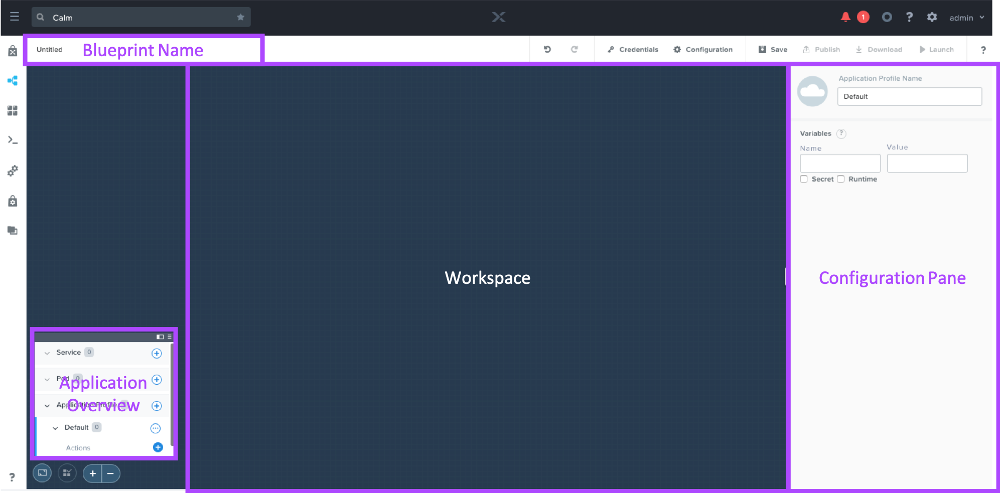
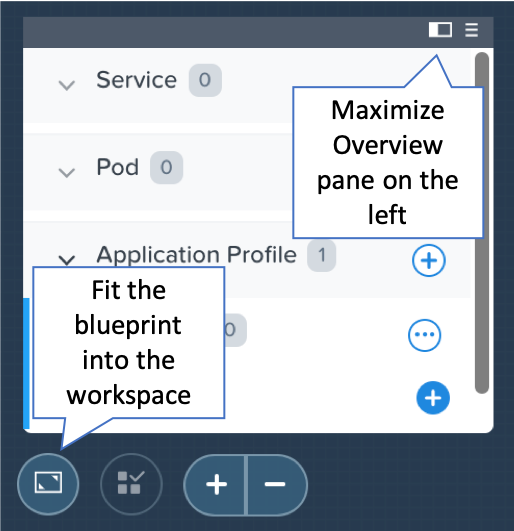

.. _calm_basics:

***********
Calm Basics
***********

Accessing Calm
==============

Open \https://<*Prism-Central-IP*>:9440/ in a browser and log in.

From the navigation bar, select **Apps**.

The **Applications** tab shows all of the instances of applications that have been launched from a Blueprint.

Tabbed Navigation
=================

Calm introduces a new sidebar to Prism Central. Note the titles and description of each tab:

Blueprint Editor
================

The Blueprint Editor is the UI within Prism Central used to graphically model applications that consist of one or more Services or Pods to be deployed to one or more Clouds or Kubernetes providers. Note the key sections:

Note the additional buttons below as they can be helpful when actively editing a Blueprint:

Glossary
========

Project
.......

A project defines a set of Active Directory groups with a common set of requirements or a common structure and function, such as a team of engineers collaborating on a product. The project also specifies the roles to associate with its members, networks that they can use, infrastructure to deploy onto, and (optionally) usage limits on infrastructure resources.

You can also define the environment associated with a project, in case you want to publish the applications into the Marketplace.

Blueprint
.........

A blueprint is the framework for every application that you model by using Nutanix Calm. Blueprints are templates that describe all the steps that are required to provision, configure, and execute tasks on the services and applications that are created. You can create a blueprint to represent the architecture of your application and then run the blueprint repeatedly to create an instance, provision, and launch your applications. A blueprint also defines the lifecycle of an application and its underlying infrastructure starting from the creation of the application to the actions that are carried out on a blueprint until the termination of the application.

You can use blueprints to model the applications of various complexities; from simply provisioning a single virtual machine to provisioning and managing a multi-node, multi-tier application.

  - **Single VM Blueprint** - This new Calm feature helps you to create new blueprints with only few clicks. Customers looking to build very quickly a private cloud with Infrastructure as a Service and Self-Service Portal capabilities, the Single VM Blueprint simplifies the task. (only AHV)
  - **Multi VM/Pod Blueprint** - The Multi VM Bluprint supports Kubernetes applications now. Keep virtual machines and containers together on a blueprint and help with the deployment and operations of hybrid applications. Start containerising the stateless layer of your applications (web servers, app servers, ...) and leave your databases as virtual machines. This will help you on your journey to containers and also cloud-native applications.

Blueprint Editor
................

Provides graphical representation of an entire multi-tier application and a user interface for configuring application components and dependencies.

Service
.......

Services are the virtual machine instances, existing machines or bare-metal machines, that you can provision and configure by using Nutanix Calm. You can either provision a single service instance or multiple services based on the topology of your application. Different Services serve different purposes (e.g. a web-tier Service and a database Service), but an individual Service can also be comprised of multiple VMs all providing the same functionality (e.g. scaling out a web-tier to multiple VMs). A Service is comprised of a VM, a Package, and a Service.

  - **VM** - A VM defines the configuration of the virtual machine instance, the platform on which the VM will be installed, and the connection information of the machine. Note this may also include existing machines that could be virtual or physical.

  - **Package** - A package enables you to install and uninstall software on a VM by using a script. You need to provide the credentials of the VM on which you need to run the script. The package also defines the port number and the protocol that is used to access the service.

  - **Service** - A service enables you to create the variables that are used to define the service-level tasks and service-level actions. As part of the service, you can also define the number of replicas that you want to create of a service.

Pod
...

Pods are Kubernetes compute units that run containerised applications, that you can provision and configure by using Nutanix Calm. You can either provision a single Kubernetes deployment instance or multiple deployments based on the topology of your application. Different Pods serve different purposes (e.g. a web-tier Pod and a database Pod), but an individual Pod can also be comprised of multiple Pods all providing the same functionality (e.g. scaling out a web-tier to multiple replicas). A Pod is comprised of a Deployment, one or more containers, and a Service.

  - **Deployment** - A Deployment defines the configuration of the desired state for the Pod, namespace, number of replicas, and metadata to be referenced by other Kubernetes objects like services.

  - **Containers** - A Pod can have one or more containers. You configure the details for each container like name, container image, and so on.

  - **Service** - A Service enables you to publish your containerised application internally or externally to your Kubernetes cluster. Details like Service Type (ClusterIP, LoadBalancer and NodePort), port settings, or metadata are configured here.

Action
......

An action is a set of operations that you can run on your application that are created as a result of running a Blueprint. There are two types of Actions:

  - **System Action** - Pre-defined functions including Create, Start, Stop, Delete, and Soft Delete. System Actions cannot be deleted.
  - **Custom Action** - User created actions that can be used to carry out additional orchestration workflows, such as updating a running application.

Application Profile
...................

Alternate environment configurations to support running the same Blueprint on multiple platforms, such as launching the same Blueprint on both Nutanix AHV and AWS.

Dependency
..........

Dependencies are used to define the dependence of one service in your application on another service or multiple other services for properties such as IP addresses and DNS names. For example, if service 2 is dependent on service 1, then service 1 starts first and stops after service 2.

Macro
.....

Macros enable you to access the value of variables and properties that are set on Services. The variables can be user defined or system generated. Macros help in making scripts generic and creating reusable workflows.

The syntax of a macro is @@{variable_name}@@, where variable_name is the name of the variable. See Calm documentation for additional details on using Macros, including working with built-in Macros and array Services.

Application
...........

A running instance of a Blueprint comprised of one or more Services.

Application Overview
....................

The pane within the Blueprint Editor used to create and manage Blueprint Layers. Blueprint Layers consist of Services, Actions, and Application Profiles.

Task Library
............

The Task Library tab lists all the published user-defined tasks. The tasks can be shared with different projects bringing code reusability optimising the time required to develop new blueprints.

Marketplace
...........

The Marketplace provides a set of pre-seeded application Blueprints that are available for you to use. The Marketplace is a common platform for both the publisher and the consumer. The Marketplace provides you with the ability to provision an application instantly.

Takeaways
.........

Calm Blueprint Design:

- **Hybrid Blueprints:** You can mix and match virtual machines and containers in your blueprints. Reduce application silos and improve the operation of new application technologies.
- **Single VM Blueprints:** The easiest way to have an Infrastructure as a Service platform with Self-Service Portal in few clicks.
- **Task Library:** Reuse your code and optimise the time you spend design new blueprints. The use of macros in tasks make reusable the code mitigating at the same time the risk of task sprawl.
- **Multi-Cloud:** With Application Profiles you can reuse your blueprints on any cloud with no need to redesign them.