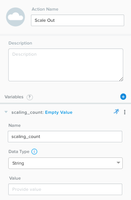

.. _calm_day2:

---------------------------------
Calm: Day 2 Operations
---------------------------------

Overview
++++++++

In the :ref:`calm_linux` and :ref:`calm_win` labs you explored how Calm can be used to model and deploy complex applications using a blueprint. Calm, however, it capable of managing applications throughout their **entire** lifecycle.

**In this lab you will implement custom actions within Calm to address "Day 2" operations, including scaling out, scaling in, and upgrading your application.**

Lab Setup
+++++++++

This lab depends on the availability of a multi-tier **Task Manger** web application implemented during the :ref:`calm_linux` lab.

If you already have basic Calm familiarity and have not completed the :ref:`calm_linux` lab, please refer to the :ref:`taskman` lab for instructions on importing the base **Task Manager** blueprint.

**You do NOT need to launch the Task Manager blueprint once imported.**

Scaling Out
+++++++++++

Imagine you're the administrator of the Task Manager application that we've been building, and you're currently unsure of the amount of demand for this application by your end users. Or, potentially, you expect the demand to ebb and flow due to the time of the year. How can we easily scale to meet this changing demand?

During the creation of the Task Manager blueprint, the **WebServer** service was configured with a minimum number of 2 replicas, with a maximum of 4. As a result, Calm will create 2 WebServer VMs during the initial deployment. In the event the 2 replicas are not enough to handle the load of your end users, a **Scale Out** operation is required.

#. In the **Application Overview > Application Profile** section, expand the **Default** Application Profile.

   .. figure:: images/510scaleout0.png

#. Select :fa:`plus-circle` next to **Actions** to add a new, custom action.  On the **Configuration Pane** to the right, rename the new Action to be **Scale Out**.

   .. figure:: images/510scaleout1.png

#. In the box **below** the **WebServer** service tile, click the **+ Task** button to add a scaling task, and fill out the following fields:

   - **Task Name** - web_scale_out
   - **Scaling Type** - Scale Out
   - **Scaling Count** - 1

   .. figure:: images/510scaleout2.png

   .. note::

     The **+ Task** button that appears below the service tile is only used for scaling the number of replicas up and down, so it is important to select the correct option.

   When a user later runs the **Scale Out** task, a new **WebServer** VM will get created, and the **Package Install** tasks for that service will be executed.  However, we do need to modify the **HAProxy** configuration in order to start taking advantage of this new web server.

#. **Within** the **HAProxy** service tile, click the **+ Task** button, then fill out the following fields:

   - **Task Name** - add_webserver
   - **Type** - Execute
   - **Script Type** - Shell
   - **Credential** - CENTOS

#. Copy and paste the following script into the **Script** field:

   .. code-block:: bash

     #!/bin/bash
     set -ex

     host=$(echo "@@{WebServer.address}@@" | awk -F "," '{print $NF}')
     port=80
     echo " server host-${host} ${host}:${port} weight 1 maxconn 100 check" | sudo tee -a /etc/haproxy/haproxy.cfg

     sudo systemctl daemon-reload
     sudo systemctl restart haproxy

   The script will parse the last IP address in the WebServer address array and append it to the haproxy.cfg file.  However, we want to be sure that this doesn't happen until **after** the new WebServer is fully up, otherwise the HAProxy server may send requests to a non-functioning WebServer.

#. To solve this issue, create an edge to force a dependency on the **web_scale_out** task completing prior to the **add_webserver** task.

   Your **Workspace** should now look like this:

   .. figure:: images/510scaleout3.png

Scaling In
++++++++++

It's the end of your busy season, and you'd like to optimize your resource utilization by scaling back the number of deployed Web Servers.

#. Select :fa:`plus-circle` to add a custom action named **Scale In** to the Default **Application Profile**.

   .. figure:: images/510scalein1.png

#. **Below** the **WebServer** service tile, click the **+ Task** button to add a scaling task, and fill out the following fields:

   - **Task Name** - web_scale_in
   - **Scaling Type** - Scale In
   - **Scaling Count** - 1

   .. figure:: images/510scalein2.png

   When a user later runs the **Scale In** task, the last **WebServer** replica will have its **Package Uninstall** task run, the VM will be shut down, and then deleted, which will reclaim resources.  However, we do need to modify the **HAProxy** configuration to ensure that we're no longer sending traffic to the to-be-deleted Web Server.

#. **Within** the **HAProxy** service tile, click the **+ Task** button, then fill out the following fields:

   - **Task Name** - del_webserver
   - **Type** - Execute
   - **Script Type** - Shell
   - **Credential** - CENTOS

#. Copy and paste the following script into the **Script** field:

   .. code-block:: bash

     #!/bin/bash
     set -ex

     host=$(echo "@@{WebServer.address}@@" | awk -F "," '{print $NF}')
     sudo sed -i "/$host/d" /etc/haproxy/haproxy.cfg

     sudo systemctl daemon-reload
     sudo systemctl restart haproxy

   Similar to the scale out script, this script will parse the last IP in the WebServer address array and use the `sed <http://www.grymoire.com/Unix/Sed.html>`_ command to remove the corresponding entry from haproxy.cfg.

   Again, similar to the scale out script, we want to ensure requests stop being sent to the VM **before** it is removed.

#. To solve this issue, create an edge to force a dependency on the **del_webserver** task completing prior to the **web_scale_in** task.

   Your **Workspace** should now look like this:

   .. figure:: images/510scalein3.png

#. Click **Save** and ensure no errors or warnings pop-up. If they do, resolve the issue, and **Save** again.

Upgrading
+++++++++

Your company has a mandate to keep all application code up to date, to help minimize security vulnerabilities. Your company also has a strict change control process, meaning you can only update your application during the weekend. You currently spend a significant portion of your time on one Saturday every month completing application update procedures during a maintenance window. Let's look at how you can reclaim your weekend by modeling the application upgrade with Calm.

#. Select :fa:`plus-circle` to add a custom action named **Upgrade** to the Default **Application Profile**.

   The first thing we're going to need to do is to stop the respective processes on each of our Services.

#. **Within each** of our 3 Services, click the **+ Task** button to add a new task, and fill in the following information:

   +------------------+-----------+---------------+-------------+
   | **Service Name** | MySQL     | WebServer     | HAProxy     |
   +------------------+-----------+---------------+-------------+
   | **Task Name**    | StopMySQL | StopWebServer | StopHAProxy |
   +------------------+-----------+---------------+-------------+
   | **Type**         | Execute   | Execute       | Execute     |
   +------------------+-----------+---------------+-------------+
   | **Script Type**  | Shell     | Shell         | Shell       |
   +------------------+-----------+---------------+-------------+
   | **Credential**   | CENTOS    | CENTOS        | CENTOS      |
   +------------------+-----------+---------------+-------------+
   | **Script**       | See Below | See Below     | See Below   |
   +------------------+-----------+---------------+-------------+

   **StopMySQL Script:**

   .. code-block:: bash

      #!/bin/bash
      set -ex

      sudo systemctl stop mysqld

   **StopWebServer Script:**

   .. code-block:: bash

      #!/bin/bash
      set -ex

      sudo systemctl stop php-fpm
      sudo systemctl stop nginx

   **StopHAProxy Script:**

   .. code-block:: bash

      #!/bin/bash
      set -ex

      sudo systemctl stop haproxy

   Once complete, your **Workspace** should look like this:

   .. figure:: images/upgrade1.png

   Similar to both scaling and initial deployment operations, we do not want to get into a situation where the WebServer goes down before the HAProxy, nor do we want the MySQL database to go down before the WebServers.

#. Create edges between services such that HAProxy stops before WebServers, and all WebServers stop before MySQL:

   .. figure:: images/upgrade2.png

   Now that our critical services are stopped, we'll want to perform our updates.

#. Again, **within each** Service, add a new Task.  All of the 3 tasks are identical other than the name:

   +------------------+--------------+------------------+----------------+
   | **Service Name** | MySQL        | WebServer        | HAProxy        |
   +------------------+--------------+------------------+----------------+
   | **Task Name**    | UpgradeMySQL | UpgradeWebServer | UpgradeHAProxy |
   +------------------+--------------+------------------+----------------+
   | **Type**         | Execute      | Execute          | Execute        |
   +------------------+--------------+------------------+----------------+
   | **Script Type**  | Shell        | Shell            | Shell          |
   +------------------+--------------+------------------+----------------+
   | **Credential**   | CENTOS       | CENTOS           | CENTOS         |
   +------------------+--------------+------------------+----------------+
   | **Script**       | See Below    | See Below        | See Below      |
   +------------------+--------------+------------------+----------------+

   **Script for all 3 Upgrade Tasks:**

   .. code-block:: bash

      #!/bin/bash
      set -ex

      sudo yum update -y

   This script will use the Red Hat/CentOS package management tool, `yum <https://access.redhat.com/solutions/9934>`_ to search for and install updates to all installed packages.

   Your **Workspace** should now look like this:

   .. figure:: images/upgrade3.png

   From an a task ordering perspective, do we need to draw any orchestration edges? Notice in the screenshot above that Calm automatically draws and edge from the **Stop** task to the **Upgrade** task, which is good as that's required. However, do we need any side to side dependencies?

   If you said "no", you're correct. The critical components are starting and stopping of the Services, there's no reason to have each Service upgrade one at a time.

   Unless you specify otherwise, Calm will always run tasks in parallel to save time.

   Now that our Services have been upgraded, it's time to start them.

#. Again, we'll add a Task **within each** Service, with the following values:

   +------------------+--------------+------------------+----------------+
   | **Service Name** | MySQL        | WebServer        | HAProxy        |
   +------------------+--------------+------------------+----------------+
   | **Task Name**    | StartMySQL   | StartWebServer   | StartHAProxy   |
   +------------------+--------------+------------------+----------------+
   | **Type**         | Execute      | Execute          | Execute        |
   +------------------+--------------+------------------+----------------+
   | **Script Type**  | Shell        | Shell            | Shell          |
   +------------------+--------------+------------------+----------------+
   | **Credential**   | CENTOS       | CENTOS           | CENTOS         |
   +------------------+--------------+------------------+----------------+
   | **Script**       | See Below    | See Below        | See Below      |
   +------------------+--------------+------------------+----------------+

   **StartMySQL Script:**

   .. code-block:: bash

      #!/bin/bash
      set -ex

      sudo systemctl start mysqld

   **StartWebServer Script:**

   .. code-block:: bash

      #!/bin/bash
      set -ex

      sudo systemctl start php-fpm
      sudo systemctl start nginx

   **StartHAProxy Script:**

   .. code-block:: bash

      #!/bin/bash
      set -ex

      sudo systemctl start haproxy

   Your **Workspace** should now look like this:

   .. figure:: images/upgrade4.png

   This time, we **DO** require additional orchestration edges. As previously discussed, we would not want our HAProxy service up before our WebServers, or our WebServers up before our MySQL database.

#. Create orchestration edges starting with MySQL, then the WebServers, and lastly the HAProxy:

   .. figure:: images/upgrade5.png

#. Click **Save** and ensure no errors or warnings pop-up.  If they do, resolve the issue, and **Save** again.

Launching and Managing the Application
++++++++++++++++++++++++++++++++++++++

#. From the upper toolbar in the Blueprint Editor, click **Launch**.

#. Specify a unique **Application Name** (e.g. *Initials*\ -CalmLinuxIntro1) and your **User_initials** Runtime variable value for VM naming.

#. Click **Create**.

#. Once the application reaches a **Running** status, navigate to the **Manage** tab, and run the **Scale Out** action.

   Changes to the application can be monitored on the **Audit** tab.

   Once the scaling operation has completed, you can log into the HAProxy VM and verify the new Web Server has been added to ``/etc/haproxy/haproxy.cfg``.

#. Run the **Upgrade** action to update each service.

#. Finally, run the **Scale In** action to remove the additional Web Server VM.

(Optional) Variable Scaling
+++++++++++++++++++++++++++

In this lab you configured scaling operations that expanded or shrank the WebServer service array by a single VM.

When creating a new custom action, additional variables can be defined in the Configuration Pane specific to that action.

Leveraging a runtime variable, can you modify the scale out or scale in actions to perform a variable scaling operation?

This will require some bash scripting experience to ensure the appropriate number of entries are being added and/or removed from the haproxy.cfg file.

Takeaways
+++++++++

What are the key things you should know about **Nutanix Calm**?

- Not only can Calm orchestrate complex application deployments, it can manage applications throughout their entire lifecycle, by modeling complex Day 2 operations.

- Whether it's a built in task, like scaling, or a custom task, like upgrades, Calm can be directed to perform the operations in specific order, or if order doesn't matter, perform them in parallel to save on time.

- What operation are you currently doing on a regular basis?  It's likely that it can be modeled in Calm, saving you countless hours.  Take back your weekend!
