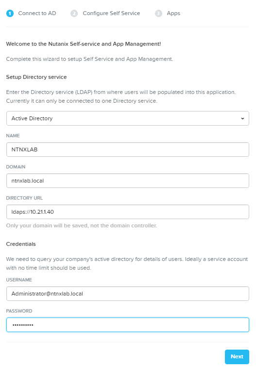
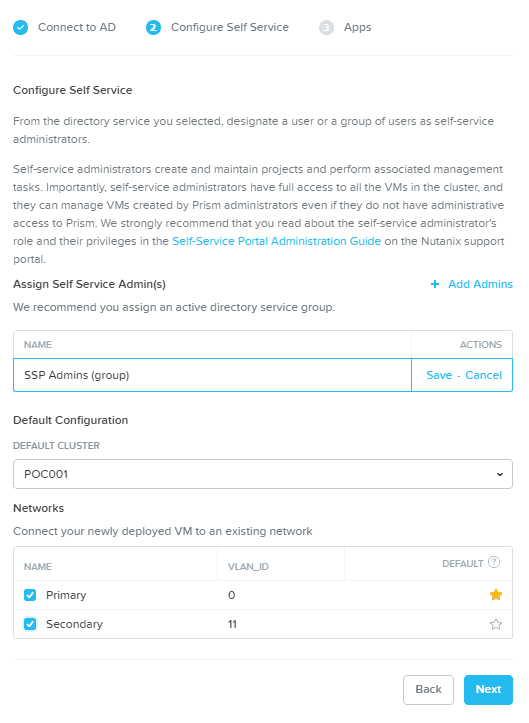

.. _calm_enable:

------------
Calm: Enable
------------

Overview
++++++++

.. note::

  Review :ref:`calm_basics` before proceeding with the lab to familiarize yourself with the UI and common terminology used in Nutanix Calm.

  Estimated time to complete: **170 MINUTES**

In this exercise you will enable Nutanix Calm and configure a Project to contain your Blueprints and Applications created throughout the Workshop.

Enabling App Management
+++++++++++++++++++++++

In this exercise you will enable Nutanix Calm and configure a Project to contain your Blueprints and Applications created throughout the Workshop.

Open \https://*<Prism-Central-IP>*:9440/ in a browser and log in.

From the navigation bar, select **Apps**.

Click **Click here to enable Self Service and App management**.

Click **New Directory**. Fill out the following fields and click **Next**:

- **Directory Type** - Active Directory
- **Name** - NTNXLAB
- **Domain** - ntnxlab.local
- **Directory URL** - ldaps://*<DC-VM-IP>*
- **Username** - Administrator@ntnxlab.local
- **Password** - nutanix/4u

Click **+ Add Admins**. Fill out the following fields:

- **Name** - SSP Admins
- **Default Cluster** - *<Cluster Name>*

Under **Network**, select the **Primary** and if available, the **Secondary** networks. Select :fa:`star` for the **Primary** network to make it the default virtual network for VMs in the **Calm** project.

Click **Next**.

.. note::

  The Administrators, Default Cluster, and Networks chosen here will define the **Default** project created when enabling Self-Service Portal or App Management. In the following section you will create an additional project used for the remainder of the Workshop.

Select **Enable App Management** and click **Finish**.

.. note:: Nutanix Calm is a separately licensed product that can be used with Acropolis Starter, Pro, or Ultimate editions. Each Prism Central instance can manage up to 25 VMs for free before additional licensing is required.

.. figure:: images/enable4.png

Following successful completion of the **Enable App Management** task, refresh the browser and select **Apps** from the navigation bar.

.. note:: Starting Calm services for the first time can take ~6 minutes. If the Calm UI doesn't load immediately, wait a moment and try refreshing the browser again.

.. note about possibly needing to SSH into PC VM to do 'cluster start' if Epsilon service doesn't start on its own

Creating A Project
++++++++++++++++++

Projects are the logical construct that integrate Calm with Nutanix's native Self-Service Portal (SSP) capabilities, allowing an administrator to assign both infrastructure resources and the roles/permissions of Active Directory users/groups to specific Blueprints and Applications.

Select |proj-icon| **Projects** from the sidebar.

.. figure:: images/enable6.png

Fill out the following fields:

- **Project Name** - Calm-*intials*
- **Description** - Calm-*intials*

Under **Users, Groups, and Roles**, click **+ User**.

Fill out the following fields and click **Save**:

- **Name** - SSP Admins
- **Role** - Project Admin

Click **+ User**, fill out the following fields and click **Save**:

- **Name** - SSP Developers
- **Role** - Developer

Click **+ User**, fill out the following fields and click **Save**:

- **Name** - SSP Power Users
- **Role** - Consumer

Click **+ User**, fill out the following fields and click **Save**:

- **Name** - SSP Basic Users
- **Role** - Operator

Under **Infrastructure**, fill out the following fields:
- **Select which resources you want this project to consume** - Local only
- **AHV Cluster** - *<Cluster Name>*

Under **Network**, select the **Primary** and if available, the **Secondary** networks. Select :fa:`star` for the **Primary** network to make it the default virtual network for VMs in the **Calm** project.

Click **Save**.

.. figure:: images/enable7.png

.. note::

  Click `here <https://portal.nutanix.com/#/page/docs/details?targetId=Nutanix-Calm-Admin-Operations-Guide-v56:nuc-roles-responsibility-matrix-c.html>`_ to view the complete matrix of default SSP roles and associated permissions.

Takeaways
+++++++++

- Nutanix Calm is a fully integrated component of the Nutanix stack. Easily enabled, highly available out of the box in a Scale Out Prism Central deployment, and takes advantage of non-disruptive One Click upgrades for new features and fixes.
- By using different projects assigned to different clusters and users, administrators can ensure that workloads are deployed the right way each time.  For example, a developer can be a Project Admin for a dev/test project, so they have full control to deploy to their development clusters or to a cloud, while having Read Only access to production projects, allowing them access to logs but no ability to alter production workloads.
