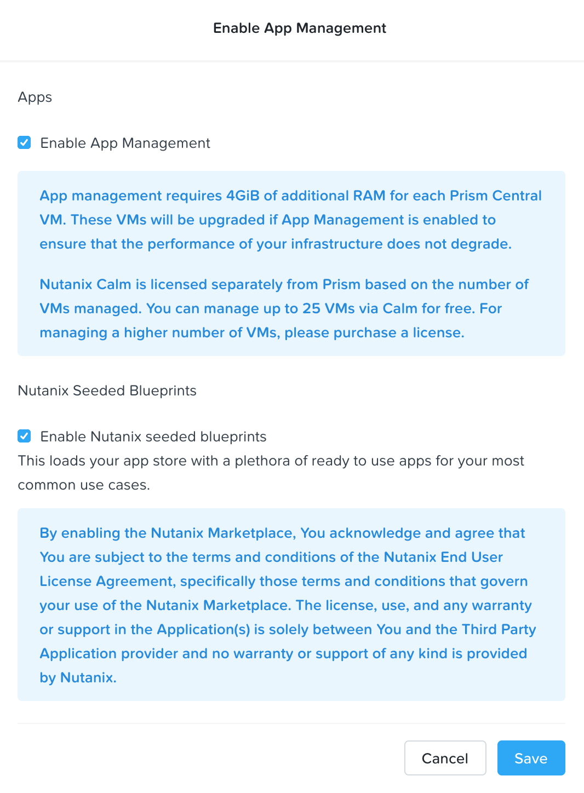
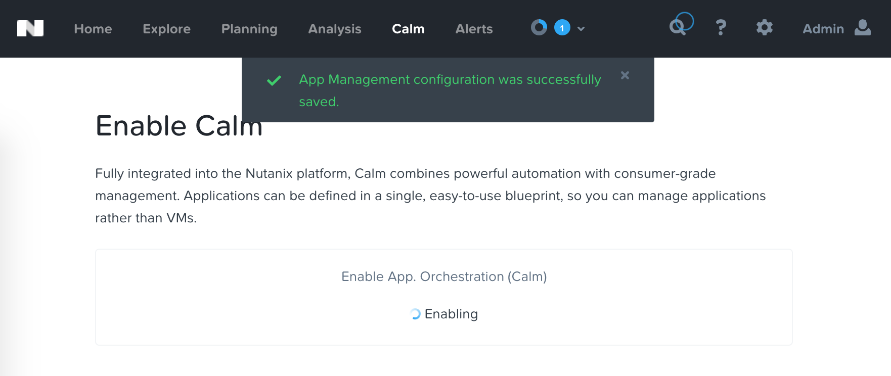
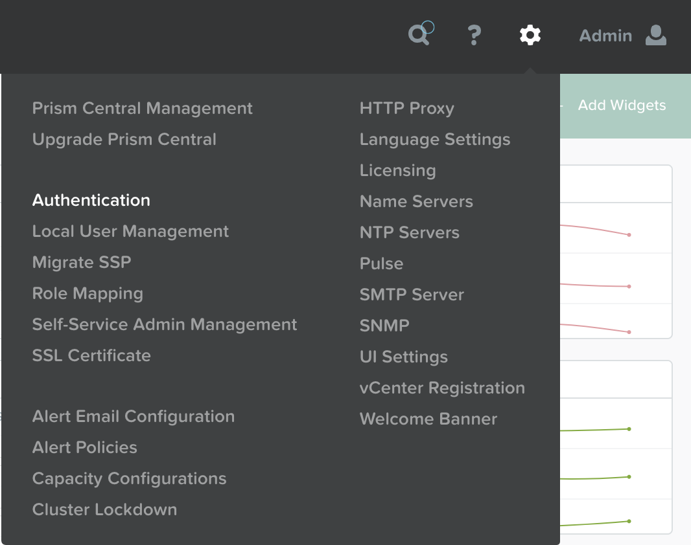
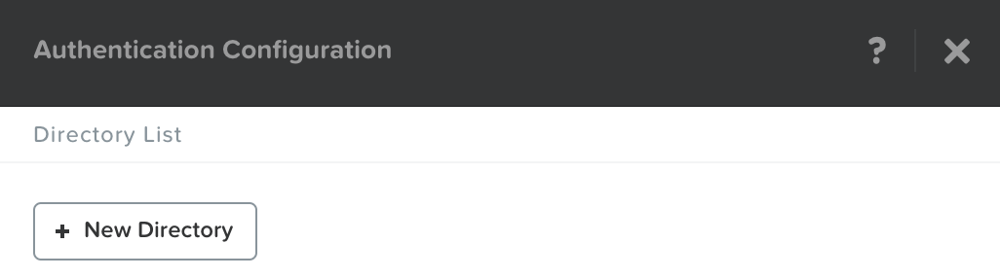
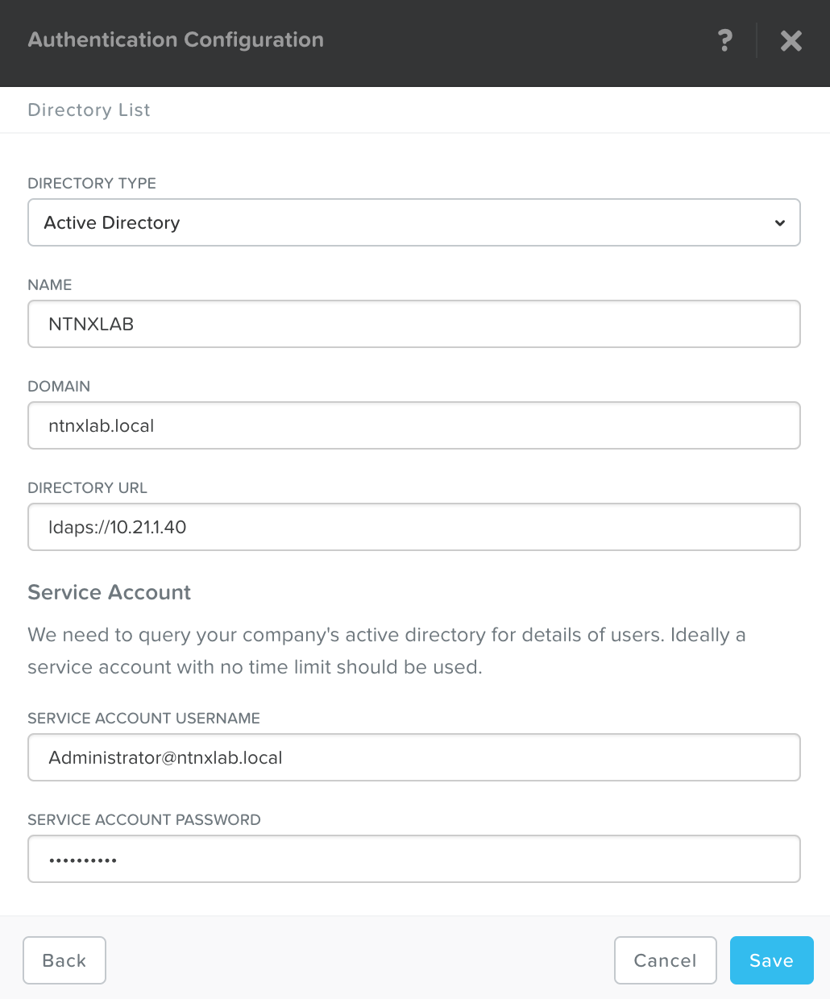
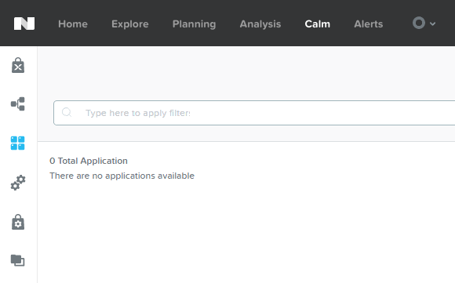

.. _calm_enable:

------------
Calm: Enable
------------

Overview
++++++++

.. note::

  Review :ref:`calm_basics` before proceeding with the lab to familiarize yourself with the UI and common terminology used in Nutanix Calm.

  Estimated time to complete: **170 MINUTES**

In this exercise you will enable Nutanix Calm and configure a Project to contain your Blueprints and Applications created throughout the Workshop.

Enabling App Management
+++++++++++++++++++++++

In this exercise you will enable Nutanix Calm and configure a Project to contain your Blueprints and Applications created throughout the Workshop.

Open \https://*<Prism-Central-IP>*:9440/ in a browser and log in.

From the navigation bar, select **Calm** (if you're running PC <5.8.1, then select **Apps**).

Click **Enable**.

.. figure:: images/581enable1.png

Select **Enable App Management** and click **Save**.

.. note:: Nutanix Calm is a separately licensed product that can be used with Acropolis Starter, Pro, or Ultimate editions. Each Prism Central instance can manage up to 25 VMs for free before additional licensing is required.

You should get verification that Calm is enabling, which will take 5 to 10 minutes.

Adding Active Directory
+++++++++++++++++++++++

While we're waiting for Calm to enable, we'll add an Active Directory server.  While this isn't required for basic Calm use, it is required to do any Role Based Access Control, so it's a good idea to get set up.

Click the **Gear Icon** and then **Authentication**.

In the pop up, click **New Directory**.

Fill out the following fields and click **Save**:

- **Directory Type** - Active Directory
- **Name** - NTNXLAB
- **Domain** - ntnxlab.local
- **Directory URL** - ldaps://*<DC-VM-IP>*
- **Username** - Administrator@ntnxlab.local
- **Password** - nutanix/4u

Refresh the browser and select **Calm** from the navigation bar.  If Calm is still enabling, wait another minute, and try again.

