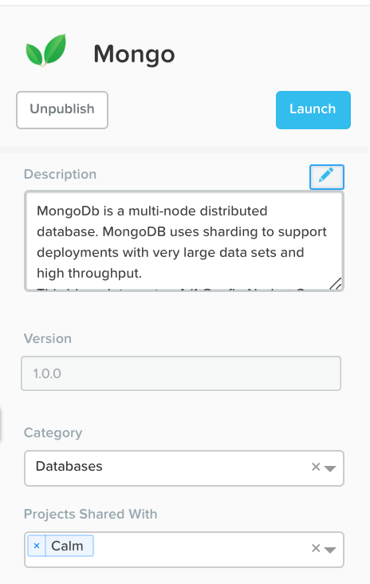
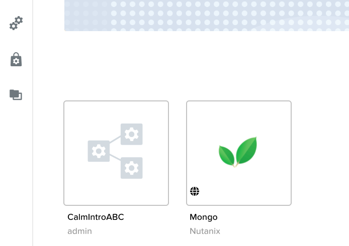

.. _calm_marketplace:

-----------------
Calm: Marketplace
-----------------

Overview
++++++++

Calm Marketplace Part 1
+++++++++++++++++++++++

In this exercise you will learn how to manage Calm Blueprints within the Nutanix Marketplace. As part of the exercise you will publish a pre-configured Blueprint to the local Marketplace, clone the Blueprint from the Marketplace for editing, and launch the application.

Publishing Blueprints from Marketplace Manager
..............................................

By default, Calm comes pre-seeded with validated Blueprints for multiple open source and enterprise applications. Marketplace Manager acts as a staging area for publishing default and user-created Blueprints to your local Marketplace. The Marketplace acts as an application store, providing end users with a catalog of available applications.

#. From **Prism Central > Calm**, select |mktmgr-icon| **Marketplace Manager** from the sidebar.

#. Under **Marketplace Blueprints**, select **Mongo**.

.. note::
The Blueprint description contains key information including licensing, hardware requirements, OS, supported platforms, and limitations.

#. Select the **Calm** project from the right-hand side drop down and Click **Publish**.

.. figure:: images/510marketplace_p1_1.png

#. Wait for the Blueprint **Status** to appear as **Published**.

#. Under **Projects Shared With**, select the **Calm** Project and click **Apply**.

.. note::

  If the **Projects Shared With** drop down menu is unavailable, refresh your browser.

Cloning Blueprints from Marketplace
...................................

#. From **Prism Central > Calm**, select |mkt-icon| **Marketplace** from the sidebar. All Blueprints published in Marketplace Manager are visible here.

.. figure:: images/510marketplace_p1_4.png

#. Select the **Mongo** Blueprint and click **Clone**.

.. note::

  Selecting **Actions Included** for a Blueprint will display the actions that have been implemented for a given Blueprint, such as Create, Start, Stop, Delete, Update, Scale Up, Scale Down, etc.

#. Fill out the following fields and click **Clone**:

- **Blueprint Name** - MongoDB*<INITIALS>*
- **Project** - Calm

Editing Cloned Blueprint
........................

#. Select |bp-icon| **Blueprints** from the sidebar and click your **MongoDB<INITIALS>** Blueprint to open the Blueprint Editor.

.. figure:: images/510marketplace_p1_6.png

#. Click :fa:`exclamation-circle` to review the list of errors that would prevent a successful deployment of the Blueprint.

.. figure:: images/510marketplace_p1_7.png

#. Click **Credentials** and select **CENTOS (Default)**.

#. Fill out the following fields and click **Back**:

- **Username** - root
- **Secret** - Password
- **Password** - nutanix/4u

#. Select the **Mongo_ConfigSet** Service and make the following changes in the **Configuration Pane**:

- Update the **VM Configuration > Image** to **CentOS**.
- Update the **Network Adapters > NIC** to **Primary**.
- Update the **Connection > Credential** to **CENTOS**.
- Uncheck **Guest Customization**

#. Repeat these steps for the **Mongo_Router** and **Mongo_ReplicaSet** Services.

#. Click **Save**.

#. Click **Launch**. Specify a unique **Application Name** (e.g. MongoDB*<INITIALS>*-1) and click **Create**.

.. figure:: images/510marketplace_p1_8.png

Calm Marketplace Part 2
+++++++++++++++++++++++

.. note::

  This exercise assumes you have a Blueprint available from a previous exercise.

In this exercise you will learn how to manage Calm Blueprints within the Nutanix Marketplace. As part of the exercise you will publish a Blueprint from the Blueprint Editor, use Marketplace Manager to approve, assign roles and projects, and publish to the Marketplace. Finally you will edit a project environment so your Blueprint can be launched directly from the Marketplace.

Publishing Blueprints
.....................

#. From **Prism Central > Apps**, select |bp-icon| **Blueprints** from the sidebar.

#. Open any **Active** Blueprint by clicking on its **Name**.

.. figure:: images/510marketplace_p2_1.png

#. Click **Publish**.

#. Provide the following details:

- **Name** (e.g. Blueprint Name *<INITIALS>*)
- **Publish as a** - New Marketplace blueprint
- **Initial Version** - 1.0.0
- **Description** - Finished MySQL app

#. Click **Submit for Approval**.

Approving Blueprints
....................

#. From **Prism Central > Apps**, select |mktmgr-icon| **Marketplace Manager** from the sidebar.

.. note:: You must be logged in as a Cluster Admin user to access the Marketplace Manager.

#. Note your Blueprint does not appear in the list of **Marketplace Items**.

#. Select the **Approval Pending** tab.

.. figure:: images/510marketplace_p2_4.png

#. Select your **Pending** Blueprint.

#. Review the available actions:

- **Reject** - Prevents  Blueprint from being launched or published in the Marketplace. The Blueprint will need to be submitted again after being rejected before it can be published.
- **Approve** - Approves the Blueprint for publication to the Marketplace.
- **Launch** - Launches the Blueprint as an application, similar to launching from the Blueprint Editor.

#. Click **Approve**.

#. Once the application has been successfully approved, it will appear under the **Marketplace Blueprints** tabs. Find it and assign the appropriate **Category** and **Project Shared With**. Click **Apply**.

.. figure:: images/510marketplace_p2_6.png

#. Select select your Blueprint from the **Marketplace Blueprints** tab and click **Publish**.

#. Verify the Blueprint's **Status** is now shown as **Published**.

#. From **Prism Central > Apps**, select |mkt-icon| **Marketplace** from the sidebar. Verify your Blueprint is available for launching as an application.

Configuring Project Environment
...............................

#. To launch a Blueprint directly from the Marketplace, we need to ensure our Project has all of the requisite environment details to satisfy the Blueprint.

#. From **Prism Central > Apps**, select |proj-icon| **Projects** from the sidebar.

#. Select the Project **Name** associated with your Blueprint at the time of publishing (e.g. the **Calm** Project that was assigned as **Project Shared With**).

#. Select the **Environment** tab.

#. Under **Credential**, click :fa:`plus-circle` and depending on which track you're on, do *one* of the two following steps to add a new credential:

**Cloud Track**:
- **Credential Name** - CENTOS
- **Username** - centos
- **Secret** - Key
- **Key** - Paste in your private key from the previous lesson **Calm: SSH Key Creation**

**Local Track**:
- **Credential Name** - CENTOS
- **Username** - root
- **Secret** - Password
- **Password** - nutanix/4u
- Select **Use as default**

Under **VM Configuration**
- select **AHV on NUTANIX**.
- **VM Name** - add prefix "default" to the name
- **Image** - CentOS
- **vCPUs** - 2
- **Cores per vCPU** - 1
- **Memory** - 4GiB

#. Under **Network Adapters (NICs)**, click :fa:`plus-circle` and select **Primary**.

#. Click **Save**.

Launching Blueprint from the Marketplace
........................................

#. From **Prism Central > Calm**, select |mkt-icon| **Marketplace** from the sidebar.

#. Select the Blueprint published as part of this exercise and click **Launch**.

.. figure:: images/510marketplace_p2_12.png

#. Select the **Calm** Project and click **Launch**.

.. figure:: images/510marketplace_p2_13.png

#. Specify a unique **Application Name** (e.g. Marketplace*<INITIALS>*) and click **Create**.

.. note::

  To see the configured **Environment** details, expand the **VM Configurations** entities.

#. Monitor the provisioning of the Blueprint until complete.

.. figure:: images/510marketplace_p2_15.png

Takeaways
+++++++++

- By using pre-seeded Blueprints from the Nutanix Marketplace, users can quickly try out new applications.
- Marketplace Blueprints can be cloned and modified to suit a user's needs. For example, the pre-seeded LAMP Blueprint could be a starting point for a developer looking to swap PHP for a Go application server.
- Marketplace Blueprints can use local disk images or automatically download associated disk images. Users can create their own keys and slipstream them into Blueprints (via cloud-init) to control access.
- Developers can publish Blueprints to the Marketplace for fast and easy consumption by users.
- Blueprints can be launched directly from the Marketplace with no additional configuration from users, delivering a public cloud-like SaaS experience for end users.
- Administrators have control over what Blueprints are published to the Marketplace and which projects have access to published Blueprints.

.. |proj-icon| image:: ../images/projects_icon.png
.. |mktmgr-icon| image:: ../images/marketplacemanager_icon.png
.. |mkt-icon| image:: ../images/marketplace_icon.png
.. |bp-icon| image:: ../images/blueprints_icon.png
