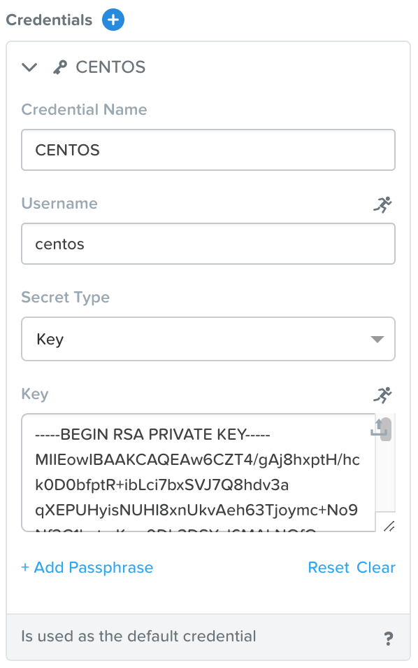
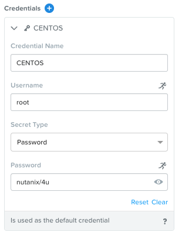
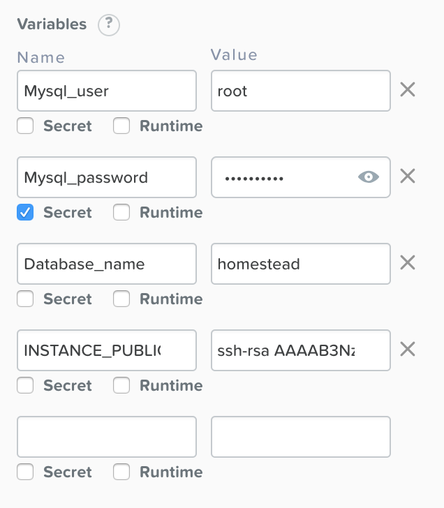
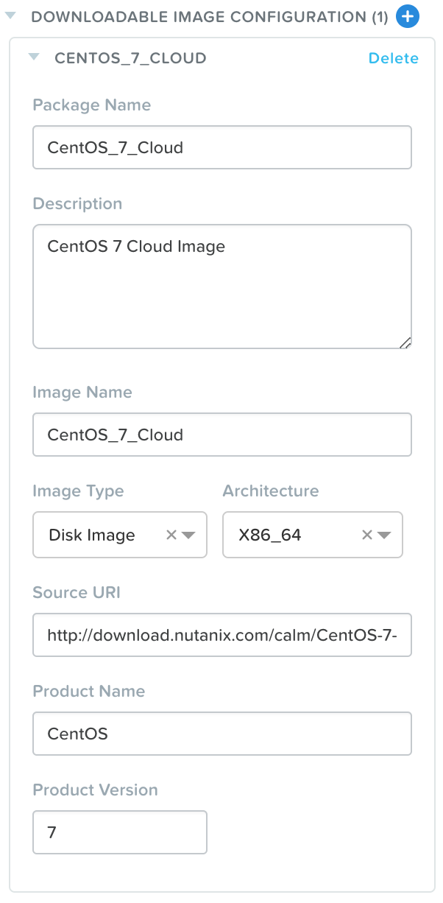
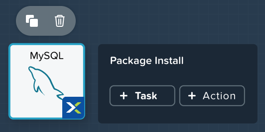

.. _calm_mysql_blueprint:

---------------------
Calm: MySQL Blueprint
---------------------

Overview
++++++++

Creating Blueprint (MySQL)
++++++++++++++++++++++++++

In this exercise you will explore the basics of Nutanix Calm by building and deploying a Blueprint that installs and configures a single service, MySQL, on a CentOS image.

Depending on how comfortable you are with SSH Keys, in this lab you'll have two options:

 - **Cloud Track** - We'll use a Cloud based CentOS image which does not allow password based authentication, instead it relies on *SSH keys*.  Most Public Clouds authenticate in this manner.  If you're comfortable with SSH keys, we recommend you follow this track.
 - **Local Track** - We'll use a local CentOS image which allows password based authentication.  If you've never used SSH keys before, we recommend you follow this track.

Creating Blueprint
..................

From **Prism Central > Apps** (**Prism Central > Calm** if you're running 5.8.1 or later), select **Blueprints** from the sidebar and click **+ Create Application Blueprint**.

Specify **CalmIntro<INITIALS>** in the **Blueprint Name** field.
Enter a **Description** in the Description field.
Select **Calm** from the **Project** drop down menu and click **Proceed**.

Click **Proceed** to continue.

Click **Credentials >** :fa:`plus-circle` and depending on which track you're on, do *one* of the two following steps:

**Cloud Track**:

- **Credential Name** - CENTOS
- **Username** - centos
- **Secret** - Key
- **Key** - Paste in your private key from the previous lesson

**Local Track**:

- **Credential Name** - CENTOS
- **Username** - root
- **Secret** - Password
- **Password** - nutanix/4u

Click **Save**, and then **Back**.

.. note::
   Credentials are unique to each Blueprint.
   Each Blueprint requires a minimum of 1 Credential.

Click **Save** to save your Blueprint.

Setting Variables
.................

Variables allow extensibility of Blueprints, meaning a single Blueprint can be used for multiple purposes and environments depending on the configuration of its variables. Variables can either be static values saved as part of the Blueprint or they can be specified at **Runtime** (when the Blueprint is launched). By default, variables are stored in plaintext and visible in the Configuration Pane. Setting a variable as **Secret** will mask the value and is ideal for variables such as passwords.

Variables can be used in scripts executed against objects using the **@@{variable_name}@@** construct. Calm will expand and replace the variable with the appropriate value before sending to the VM.

In the **Configuration Pane** under **Variable List**, fill out the following fields:

+------------------------+------------------------------------------------------+------------+
| **Variable Name**      | **Value**                                            | **Secret** |
+------------------------+------------------------------------------------------+------------+
| Mysql\_user            | root                                                 |            |
+------------------------+------------------------------------------------------+------------+
| Mysql\_password        | nutanix/4u                                           | X          |
+------------------------+------------------------------------------------------+------------+
| Database\_name         | homestead                                            |            |
+------------------------+------------------------------------------------------+------------+
| INSTANCE\_PUBLIC\_KEY  | Only required for the **Cloud Track**.               |            |
|                        | Paste in your public key from the previous lesson.   |            |
+------------------------+------------------------------------------------------+------------+

Click **Save**.

Adding a Downloadable Image
...........................

All VMs in AHV are based off of a disk image.  You have the option of selecting an image that's already managed by Prism Central (**Local Track**), or specifying a Downloadable Image via a URI (**Cloud Track**).  If the latter is chosen, during the application deployment Prism Central will automatically download and create the image specified.  If an image with the same URI already exists on the cluster, it will skip the download and use that instead.

If you're on the **Cloud Track**, then follow these steps.  If you're on the **Local Track**, skip to the next section (**Adding DB Service**).  Near the top, click **Configuration > Downloadable Image Configuration** :fa:`plus-circle` and fill out the following fields:

- **Package Name** - CentOS\_7\_Cloud
- **Description** - CentOS 7 Cloud Image
- **Image Name** - CentOS\_7\_Cloud
- **Image Type** - Disk Image
- **Architecture** - X86\_64
- **Source URI** - http://download.nutanix.com/calm/CentOS-7-x86\_64-GenericCloud.qcow2
- **Product Name** - CentOS
- **Product Version** - 7

.. note::
   This Cloud based image is the same that's used for the majority of the Nutanix Pre-Seeded Application Blueprints.

Click **Back** and then **Save**.

Adding DB Service
.................

.. note::
   Application Overview - The pane within the Blueprint Editor used to create and manage Blueprint Layers. Blueprint Layers consist of Services, Application Profiles, and Actions.

In **Application Overview > Services**, click :fa:`plus-circle`.

Note **Service1** appears in the **Workspace** and the **Configuration Pane** reflects the configuration of the selected Service.

Fill out the following fields:

- **Service Name** - MySQL
- **Name** - MySQLAHV

.. note::
   This defines the name of the substrate within Calm. Names can only contain alphanumeric characters, spaces, and underscores.
- **Cloud** - Nutanix
- **OS** - Linux
- **VM Name** - MYSQL-@@{calm_array_index}@@-@@{calm_time}@@
- **Image**

  - **Cloud Track** - CentOS\_7\_Cloud
  - **Local Track** - CentOS

- **Device Type** - Disk
- **Device Bus** - SCSI
- Select **Bootable**
- **vCPUs** - 2
- **Cores per vCPU** - 1
- **Memory (GiB)** - 4
- **Guest Customization** - Depending on your track:

  - **Cloud Track** - Select Guest Customization

    - Leave **Cloud-init** selected and paste in the following script

      .. code-block:: bash

        #cloud-config
        users:
          - name: centos
            ssh-authorized-keys:
              - @@{INSTANCE_PUBLIC_KEY}@@
            sudo: ['ALL=(ALL) NOPASSWD:ALL']

  - **Local Track** - Leave Guest Customization Unselected

- Select :fa:`plus-circle` under **Network Adapters (NICs)**
- **NIC** - Primary
- **Credential** - CENTOS

Click **Save** and ensure no errors or warnings pop-up.  If they do, resolve the issue, and **Save** again.

With the MySQL service icon selected in the workspace window, scroll to the top of the **Configuration Panel**, click **Package**.  Name the Package as **MYSQL_PACKAGE**, and then click the **Configure install** button.

On the Blueprint Canvas section, a **Package Install** field will pop up next to the MySQL Service tile:

Click on the **+ Task** button, and fill out the following fields on the **Configuration Panel** on the right:

- **Name Task** - Install_sql
- **Type** - Execute
- **Script Type** - Shell
- **Credential** - CENTOS

Copy and paste the following script into the **Script** field:

.. code-block:: bash

  #!/bin/bash
  set -ex

  sudo yum install -y "http://repo.mysql.com/mysql-community-release-el7-5.noarch.rpm"
  sudo yum update -y
  sudo setenforce 0
  sudo sed -i 's/enforcing/disabled/g' /etc/selinux/config /etc/selinux/config
  sudo systemctl stop firewalld || true
  sudo systemctl disable firewalld || true
  sudo yum install -y mysql-community-server.x86_64

  sudo /bin/systemctl start mysqld
  sudo /bin/systemctl enable mysqld

  #Mysql secure installation
  mysql -u root<<-EOF

  UPDATE mysql.user SET Password=PASSWORD('@@{Mysql_password}@@') WHERE User='@@{Mysql_user}@@';
  DELETE FROM mysql.user WHERE User='@@{Mysql_user}@@' AND Host NOT IN ('localhost', '127.0.0.1', '::1');
  DELETE FROM mysql.user WHERE User='';
  DELETE FROM mysql.db WHERE Db='test' OR Db='test\_%';

  FLUSH PRIVILEGES;
  EOF

  mysql -u @@{Mysql_user}@@ -p@@{Mysql_password}@@ <<-EOF
  CREATE DATABASE @@{Database_name}@@;
  GRANT ALL PRIVILEGES ON homestead.* TO '@@{Database_name}@@'@'%' identified by 'secret';

  FLUSH PRIVILEGES;
  EOF

.. note::
   You can click the **Pop Out** icon on the script field for a larger window to view/edit scripts.
   Looking at the script you can see the package will install MySQL, configure the credentials and create a database based on the variables specified earlier in the exercise.

Select the MySQL service icon in the workspace window again and scroll to the top of the **Configuration Panel**, click **Package**.

- **Click** - Configure Uninstall
- **Click** - + Task
- **Name Task** - Uninstall_sql
- **Type** - Execute
- **Script Type** - Shell
- **Credential** - CENTOS

Copy and paste the following script into the **Script** field:

.. code-block:: bash

  #!/bin/bash
  echo "Goodbye!"

.. note::
   The uninstall script can be used for removing packages, updating network services like DHCP and DNS, removing entries from Active Directory, etc. It is not being used for this simple example.

Click **Save**. You will be prompted with specific errors if there are validation issues such as missing fields or unacceptable characters.

Launching the Blueprint
.......................

From the toolbar at the top of the Blueprint Editor, click **Launch**.

In the **Name of the Application** field, specify a unique name (e.g. CalmMySQL*<INITIALS>*-1).

.. note::
   A single Blueprint can be launched multiple times within the same environment but each instance requires a unique **Application Name** in Calm.

Click **Create**.

You will be taken directly to the **Applications** page to monitor the provisioning of your Blueprint.

Select **Audit > Create** to view the progress of your application. After **MySQLAHV - Check Login** is complete, select **PackageInstallTask** to view the real time output of your installation script.

Note the status changes to **Running** after the Blueprint has been successfully provisioned.

.. figure:: https://s3.amazonaws.com/s3.nutanixworkshops.com/calm/lab1/image25.png

Takeaways
+++++++++

- The Blueprint Editor provides a simple UI for modeling potentially complex applications.
- Blueprints are tied to SSP Projects which can be used to enforce quotas and role based access control.
- Having a Blueprint install and configure binaries means no longer creating specific images for individual applications. Instead the application can be modified through changes to the Blueprint or installation script, both of which can be stored in source code repositories.
- Variables allow another dimension of customizing an application without having to edit the underlying Blueprint.
- There are multiple ways of authenticating to a VM (keys or passwords), which is dependent upon the source image.
- Application status can be monitored in real time.

.. |proj-icon| image:: ../images/projects_icon.png
.. |mktmgr-icon| image:: ../images/marketplacemanager_icon.png
.. |mkt-icon| image:: ../images/marketplace_icon.png
.. |bp-icon| image:: ../images/blueprints_icon.png
