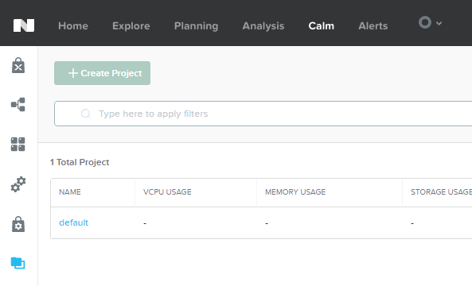
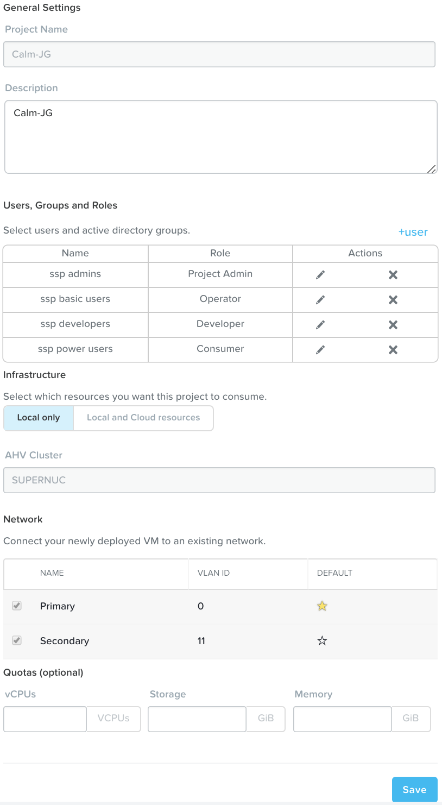

.. _calm_projects:

------------
Calm: Projects
------------

Overview
++++++++

.. note::

  Review :ref:`calm_basics` before proceeding with the lab to familiarize yourself with the UI and common terminology used in Nutanix Calm.

  Estimated time to complete: **170 MINUTES**

In this exercise you will configure a Project to contain your Blueprints and Applications created throughout the Workshop.

Creating A Project
++++++++++++++++++

Projects are the logical construct that integrate Calm with Nutanix's native Self-Service Portal (SSP) capabilities, allowing an administrator to assign both infrastructure resources and the roles/permissions of Active Directory users/groups to specific Blueprints and Applications.

Click + Create Project

Select |proj-icon| **Projects** from the sidebar.

Fill out the following fields:

- **Project Name** - Calm-*initials*
- **Description** - Calm-*initials*

Under **Users, Groups, and Roles**, click **+ User**.

Fill out the following fields and click **Save**:

- **Name** - SSP Admins
- **Role** - Project Admin

Click **+ User**, fill out the following fields and click **Save**:

- **Name** - SSP Developers
- **Role** - Developer

Click **+ User**, fill out the following fields and click **Save**:

- **Name** - SSP Power Users
- **Role** - Consumer

Click **+ User**, fill out the following fields and click **Save**:

- **Name** - SSP Basic Users
- **Role** - Operator

Under **Infrastructure**, fill out the following fields:
- **Select which resources you want this project to consume** - Local only
- **AHV Cluster** - *<Cluster Name>*

Under **Network**, select the **Primary** and if available, the **Secondary** networks. Select :fa:`star` for the **Primary** network to make it the default virtual network for VMs in the **Calm** project.

Click **Save**.

.. note::

  Click `here <https://portal.nutanix.com/#/page/docs/details?targetId=Nutanix-Calm-Admin-Operations-Guide-v56:nuc-roles-responsibility-matrix-c.html>`_ to view the complete matrix of default SSP roles and associated permissions.

Takeaways
+++++++++

- Nutanix Calm is a fully integrated component of the Nutanix stack. Easily enabled, highly available out of the box in a Scale Out Prism Central deployment, and takes advantage of non-disruptive One Click upgrades for new features and fixes.
- By using different projects assigned to different clusters and users, administrators can ensure that workloads are deployed the right way each time.  For example, a developer can be a Project Admin for a dev/test project, so they have full control to deploy to their development clusters or to a cloud, while having Read Only access to production projects, allowing them access to logs but no ability to alter production workloads.

.. |proj-icon| image:: ../images/projects_icon.png
.. |mktmgr-icon| image:: ../images/marketplacemanager_icon.png
.. |mkt-icon| image:: ../images/marketplace_icon.png
.. |bp-icon| image:: ../images/blueprints_icon.png
