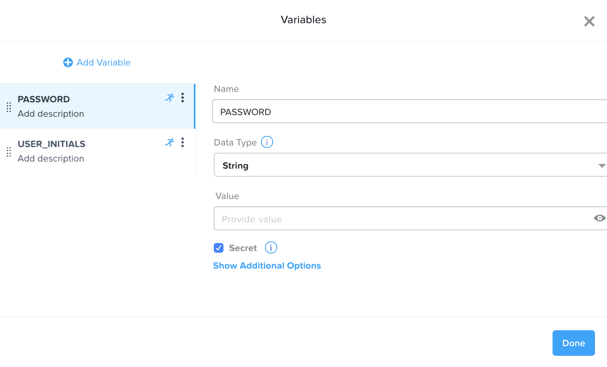
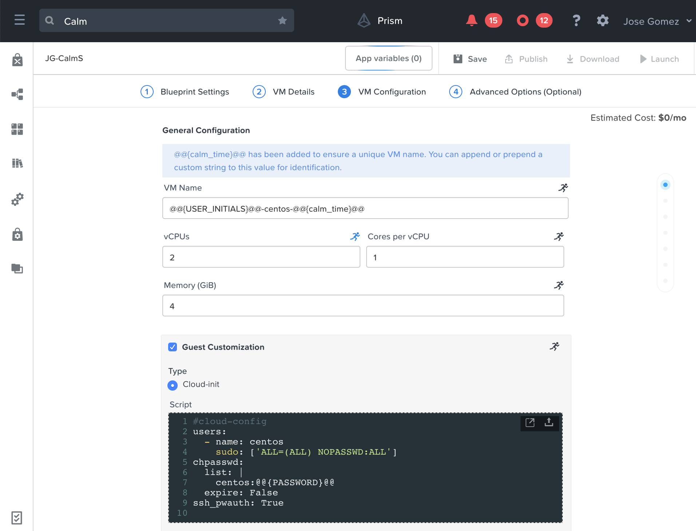

.. _calm_singlevm_blueprint:

------------
Calm: Single VM Blueprint
------------

Overview
++++++++

Creating Single VM Blueprint (CentOS)
++++++++++++++++++++++++++

In this exercise you will explore the basics of Nutanix Calm by building and deploying a Blueprint that installs and configures a single service, MySQL, on a CentOS image.

Creating Blueprint
..................

From the navigation bar, click ( |menu-icon| top left corner) **Menu** > **Services** > **Calm** (if you're running PC <5.10, then select **Calm** on top navigation bar), select **Blueprints** from the sidebar and click **+ Create Blueprint** > **Single VM Blueprint**.

Blueprint Settings
..................

Specify **CalmSingle<INITIALS>** in the **Name** field.
(Optional) Enter a **Description** in the Description field.
Select **Calm-<your_initials>** from the **Project** drop down menu.

Click **VM Details>** to continue.

VM Details
..................

Specify **CentOSAHV** in the **Name** field.
Leave the default value, **Nutanix**, for the **Cloud** field.
Leave the default value, **Linux**, for the **Operating System** field. 
Click **Variables>** to continue.

Variables
.........

Create the following variables:

+------------------------+------------------------------------------------------+-------------+
| **Variable Name**      | **Value**                                            | **Runtime** |
+------------------------+------------------------------------------------------+-------------+
| INSTANCE\_PUBLIC\_KEY  | Paste in your public key from the previous lesson.   |      X      |
+------------------------+------------------------------------------------------+-------------+
| USER_INITIALS          | Type your initials                                   |      X      |
+------------------------+------------------------------------------------------+-------------+

Click **VM Configuration>** to continue.

VM Configuration
................

Fill out the following fields:

- **VM Name** - centos@@{USER_INITIALS}@@-@@{calm_time}@@

.. note::
   This defines the name of the virtual machine within Nutanix. We are using macros (case sensitive) to use the variables values as inputs. This approach can be used to meet your naming convention.

- **vCPUs** - 2
- **Cores per vCPU** - 1
- **Memory (GiB)** - 4
- Select **Guest Customization**

  - Leave **Cloud-init** selected and paste in the following script

    .. code-block:: bash

      #cloud-config
      users:
        - name: centos
          ssh-authorized-keys:
            - @@{INSTANCE_PUBLIC_KEY}@@
          sudo: ['ALL=(ALL) NOPASSWD:ALL']

- **Image** - CentOS-7-x86_64-GenericCloud
- Select **Bootable**
- Select :fa:`plus-circle` along **Network Adapters (NICs)**
- **NIC 1** - Primary

Scroll to the top and click **Save** and ensure no errors or warnings pop-up.  If they do, resolve the issue, and **Save** again.

Launching the Blueprint
.......................

From the toolbar at the top of the Blueprint Editor, click **Launch**.

In the **Name of the Application** field, specify a unique name (e.g. CalmCentOS*<INITIALS>*-1).

.. note::
   A single Blueprint can be launched multiple times within the same environment but each instance requires a unique **Application Name** in Calm.

Click **Create**.

You will be taken directly to the **Applications** page to monitor the provisioning of your Blueprint.

Select **Audit > Create** to view the progress of your application. Select **CentOSAHV - Provision Nutanix** to view the real time output of the provisioning.

Note the status changes to **Running** after the Blueprint has been successfully provisioned.

Takeaways
+++++++++

- The Single VM Blueprint Editor provides a simple UI for modeling IaaS blueprints in less than five minutes.
- Blueprints are tied to SSP Projects which can be used to enforce quotas and role based access control.
- Variables allow another dimension of customizing an application without having to edit the underlying Blueprint.
- There are multiple ways of authenticating to a VM (keys or passwords), which is dependent upon the source image.
- Virtual machine status can be monitored in real time.

.. |proj-icon| image:: ../images/projects_icon.png
.. |mktmgr-icon| image:: ../images/marketplacemanager_icon.png
.. |mkt-icon| image:: ../images/marketplace_icon.png
.. |bp-icon| image:: ../images/blueprints_icon.png
.. |menu-icon| image:: ../images/menu_icon.png
