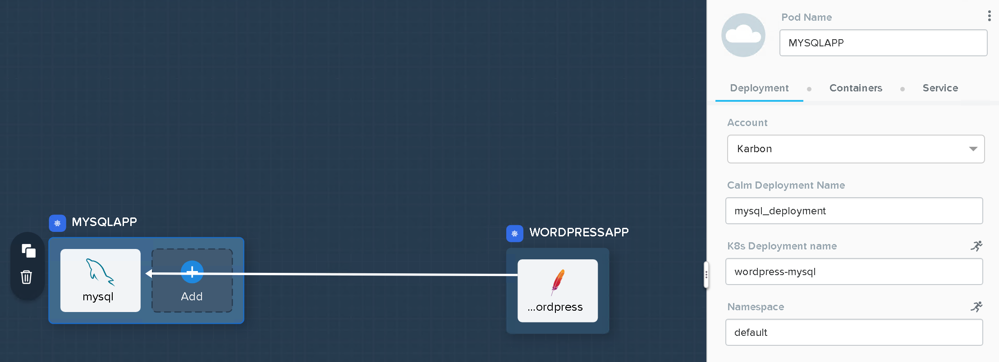
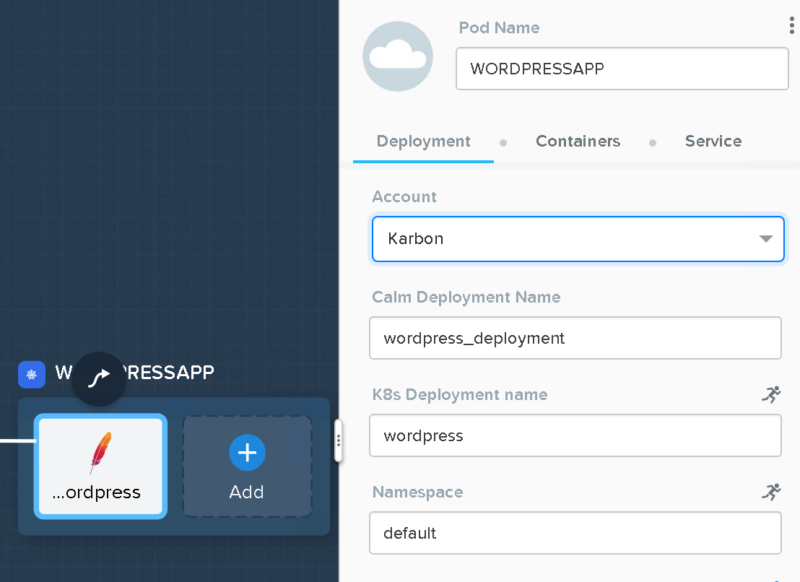
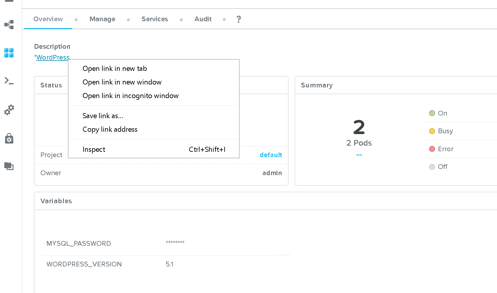

.. __wordpress_blueprint:

--------------------------------------
Calm: WordPress Blueprint (Kubernetes)
--------------------------------------

Overview
++++++++

In this exercise you will download a blueprint from Nutanix GitHub repository, upload this into your project in Calm and deploy a containerised WordPress using a Kubernetes cluster already provisioned in Nutanix Karbon.

.. note::
   1) Kubernetes provider in Nutanix Calm is in Technical Preview.
   2) `Nutanix Karbon <https://www.nutanix.com/products/karbon/>`_ is an Enterprise-Grade Kubernetes Certified Distribution that simplifies the provisioning, operations and lifecycle management of Kubernetes with a native Kubernetes experience. Karbon makes it simple to deploy a highly available Kubernetes cluster and operate web-scale workloads. Karbon is in Technical Preview.

Adding Kubernetes provider
++++++++++++++++++++++++++

From **Prism Central > Apps** (**Prism Central > Calm** if you're running 5.8.1 or later), select **Settings** from the sidebar and click **Providers**.

You can see a Kubernetes provider has been already configured with the name **Karbon**. You do not create or modify any of the providers.

Enabling Kubernetes on project
++++++++++++++++++++++++++++++

Your Calm project was created with **Local only** resources. Kubernetes provider is considered a cloud provider what requires change your project to support **Local and Cloud resources**.

From **Prism Central > Apps** (**Prism Central > Calm** if you're running 5.8.1 or later), select **Projects** from the sidebar and click your **Calm-<your_initials>** project.

Scroll down and change from **Local only** to **Local and Cloud resources**.
Scroll down and select **Karbon** from the **Kubernetes** drop down menu and click **Save**.

.. figure:: images/calm_wp_00.png

Importing Blueprint (WordPress)
+++++++++++++++++++++++++++++++

To download the WordPress blueprint right click on the following link and **Save Link As** https://raw.githubusercontent.com/pipoe2h/blueprints/bootcamp/-wordpress/-WordPress.json

Save the JSON file on your VDI desktop.

From **Prism Central > Apps** (**Prism Central > Calm** if you're running 5.8.1 or later), select **Blueprints** from the sidebar and click **Upload Blueprint**.

Select **-wordpress.json** file from your VDI desktop and click **Open**.
Specify **WordPress<INITIALS>** in the **Blueprint Name** field.
Select **Calm-<your_initials>** from the Project drop down menu and click **Upload**.

Configuring Blueprint (WordPress)
+++++++++++++++++++++++++++++++++

Setting Variables
.................

Variables allow extensibility of Blueprints, meaning a single Blueprint can be used for multiple purposes and environments depending on the configuration of its variables. Variables can either be static values saved as part of the Blueprint or they can be specified at **Runtime** (when the Blueprint is launched). By default, variables are stored in plaintext and visible in the Configuration Pane. Setting a variable as **Secret** will mask the value and is ideal for variables such as passwords.

Variables can be used in scripts executed against objects using the **@@{variable_name}@@** construct. Calm will expand and replace the variable with the appropriate value before sending to the VM or Pod.

Click the **Default Application Profile** on the left side. In the **Configuration Pane** under **Variable List** on the right side, fill out the values for the existing variables if they are not populated with one:

+------------------------+------------------------------------------------------+------------+
| **Variable Name**      | **Value**                                            | **Secret** |
+------------------------+------------------------------------------------------+------------+
| MYSQL_PASSWORD         | nutanix/4u                                           | X          |
+------------------------+------------------------------------------------------+------------+
| WORDPRESS_VERSION      | 5.1                                                  |            |
+------------------------+------------------------------------------------------+------------+

.. figure:: images/variables.png
  :scale: 75 %

Click **Save**.

Setting Pod Deployment Account
..............................

Like VMs with the on-prem or public cloud providers, the Pods need the configuration of a Kubernetes provider.

Click **MYSQLAPP** Kubernetes pod.
On the right side in the **Configuration Pane** under **Deployment** select the **Account** with name **Karbon**.

Repeat the previous step but with the **WORDPRESSAPP** Kubernetes pod.

Click **Save** to save your Blueprint.

.. note::
  Ignore the warnings. Only fix the errors if you get them.

.. figure:: images/calm_wp_03.png

Launching the Blueprint
.......................

From the toolbar at the top of the Blueprint Editor, click **Launch**.

In the **Name of the Application** field, specify a unique name (e.g. WordPress*<INITIALS>*).

.. note::
   A single Blueprint can be launched multiple times within the same environment but each instance requires a unique **Application Name** in Calm.

Click **Create**.

You will be taken directly to the **Applications** page to monitor the provisioning of your Blueprint.

Select **Manage > Create** and click on the eye to view the progress of your application.

Note the status changes to **Running** after the Blueprint has been successfully provisioned.

.. figure:: images/calm_wp_04.png

Open the WordPress URL in a new tab. Right click on the link in the **description** section of the **application overview** page.

Install WordPress if you like.

.. figure:: images/calm_wp_06.png
  :scale: 50 %

Scaling out WordPress
.....................

Calm supports actions for VMs and Pods. Actions help with day two operations. This example scales the WordPress PHP tier with more replicas of the WordPress pod.

From **Prism Central > Apps** (**Prism Central > Calm** if you're running 5.8.1 or later), select **Applications** from the sidebar and click your **WordPress-<your_initials>** application.

Click **Manage** and click the *play* button for **Scale Out** action.
Click **Run**

Click the *eye* icon for **Scale Out** action and check the scaling out process.

.. figure:: images/calm_wp_07.png

Once finished click **Services** and expand the *Apache* tier to see the two pods.

.. figure:: images/calm_wp_08.png

Takeaways
+++++++++

- Deploy Kubernetes applications anywhere and not only VMs.
- Orchestrate visually complex containerised applications.
- Create hybrid blueprints with VMs and Pods together.
- Scale with one-click your applications.

.. |proj-icon| image:: ../images/projects_icon.png
.. |mktmgr-icon| image:: ../images/marketplacemanager_icon.png
.. |mkt-icon| image:: ../images/marketplace_icon.png
.. |bp-icon| image:: ../images/blueprints_icon.png
