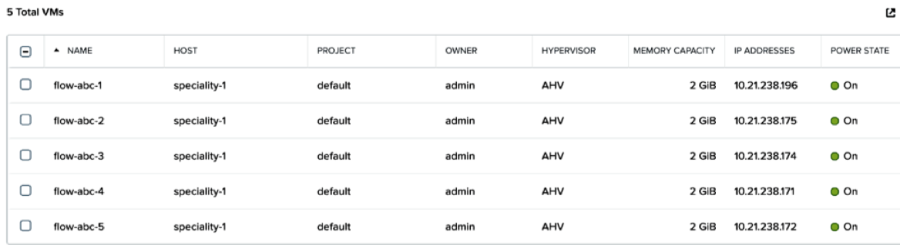
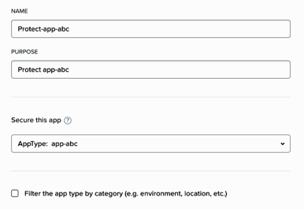
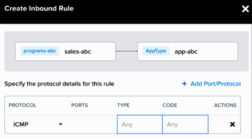
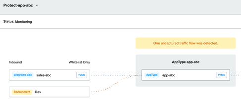
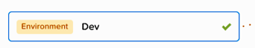

.. _enable_flow:

-------------
Flow
-------------

Overview
++++++++

.. note::

  Estimated time to complete: 30-40 MINUTES

In this exercise you will enable Nutanix Flow, formally known as Microsegmentation, and create the VMs to be used throughout the remaining Flow exercises, **if you have not cloned the VMs already as part of the Lab - Deploying Workloads exercise**.

As part of this exercise, you will place a VM into quarantine and observe the behavior of the VM. You will also inspect the configurable options inside the quarantine policy and create a category with different values. Then you will create and implement an isolation security policy that uses the newly created category in order to restrict unauthorized access.

Finally, you will create an application category named **app-abc**, assign the **AppType: app-abc** category to your application VM, which in this exercise is the **flow-abc-5** VM, and create a security policy to restrict the application VM from receiving ICMP ping requests from VMs outside of the **programs-abc: sales-abc** category.

Enabling Microsegmentation
++++++++++++++++++++++++++

Open https://<Prism-Central-IP>:9440/ in a browser and log in.

From the navigation bar, click the question mark at the top right corner and expand the **New in Prism Central** section of the menu.

Click **Microsegmentation**.

Select the **Enable Microsegmentation** check box within the **Enable Microsegmentation** dialog box.

.. figure:: images/enable_flow.png

.. note::

  Flow can only be enabled once per Prism Central instance. If **Microsegmentation** displays a green check mark next to it, that means Microsegmentation has already been enabled for the Prism Central instance being used.

Click **Enable**

.. figure:: images/enable.png

Create Five VMs
+++++++++++++++

.. note::

  Skip this VM creation section if you have already created the Flow VMs as part of the Lab - Deploying Workloads exercise.

Now you will create the **five** virtual machines you will use to test the capabilities of Nutanix Flow. Create these virtual machines from the base VM in Prism Central called CentOS.

In **Prism Central > Explore > VMs**, click **Create VM**.

Fill out the following fields and click **Save**:

- **Name** - flow-<your_initials>-1
- **Description** - Flow testing VM
- **vCPU(s)** - 2
- **Number of Cores per vCPU** - 1
- **Memory** - 4 GiB
- Select **+ Add New Disk**

  - **Operation** - Clone from Image Service
  - **Image** - CentOS
  - Select **Add**
- Remove **CD-ROM** Disk
- Select **Add New NIC**

  - **VLAN Name** - Primary
  - **IP Address** - *10.21.XX.42*
  - Select **Add**

Clone the other four VMs:
-------------------------

Take that VM and clone it four times to have a total of five VMs named as follows:

flow-<your_initials>-1
flow-<your_initials>-2
flow-<your_initials>-3
flow-<your_initials>-4
flow-<your_initials>-5

Select the **flow-<your_initials>-1** VM and click **Actions > Clone**.

- **Number of Clones** - 4
- **Prefix Name** - flow-<your_initials>-
- **Starting Index Number** - 2

Select the five newly created Flow VMs and click **Actions > Power on**.

Quarantine a VM and Explore the Quarantine Policy
+++++++++++++++++++++++++++++++++++++++++++++++++

Confirm Communication between flow-abc-1 and flow-abc-2
.......................................................

Log on to the Prism Central environment and navigate to **Explore > VMs**.

Open the VM console of **flow-abc-1** and **flow-abc-2** by selecting one VM at a time and clicking on the checkbox next to it.

Click **Actions > Launch Console**.

.. figure:: images/quarantine_pings.png

Log into both VMs with the following user credentials:

- **Username** - root
- **Password** - nutanix/4u

Find the IPs of the VMs via the command *ifconfig*, and start a continuous ping from the **flow-abc-1** VM to the **flow-abc-2** VM.

Quarantine a VM and Edit The Quarantine Policy
..............................................

Quarantine the **flow-abc-2** VM by navigating to **Explore > VMs**.

Select **flow-abc-2 > Actions > Quarantine VMs**. Select **Forensic** and click **Quarantine**.

.. figure:: images/select_forensic.png

What happens with the continuous ping between VMs 1 and 2?

Navigate to **Explore > Security Policies > Quarantine**.

Select **Update** in the top right corner then select **+ Add Source** to the Quarantine policy.

Add a source by **Subnet/IP** with the IP address of **flow-abc-1**, a netmask of **/32**. Click on the plus sign ( + ) near **Forensic** category and allow any protocol on any port to the Forensic quarantine category.

What targets can this source be connected to?

What is the difference between the Forensic and Strict quarantine mode?

Select **Next > Apply Now** to save the policy.

What happens to the pings between **flow-abc-1** and **flow-abc-2** after the source is added?

Unquarantine **flow-abc-2** by navigating to **Explore > VMs > flow-abc-2 > Actions > Unquarantine VM**.

Isolate Environments with Flow
++++++++++++++++++++++++++++++

Create a New Category
.....................

Log on to the Prism Central environment and navigate to **Explore > Categories**.

.. note::
  There should be default categories present. Now you will create a custom category to add to the list as well.

Click **New Category**.

Fill out the following fields and click **Save**:

- **Name** - Programs-abc, replacing abc with your initials.
- **Purpose** - This category will be used to tag VMs belonging to the program called "Programs-abc", as an example. This category will have "intern" and "sales" values in order to differentiate intern and sales VMs within the **programs-abc** category.
- **Values** - interns-abc.
- **Values** - sales-abc.

.. figure:: images/create_category.png

Create a New Security Policy
............................

Navigate to **Explore > Security Policies** within Prism Central.

Click **Create Security Policy** > Select **Isolate Environments**.

Fill out the following fields and click **Apply Now**:

- **Name** - isolate-interns-sales-abc, replacing abc with your initials.
- **Purpose** - Isolate intern vm traffic from sales.
- **Isolate This Category** - programs-abc:interns-abc.
- **From This Category** - programs-abc:sales-abc.
Do NOT select the check box for **Apply the isolation only within a subset of the data center**.

•	Enter interns-abc as a possible value of this category, replacing abc with your initials.
•	Click the plus sign and enter sales-abc as another value in this category, replacing abc with your initials.

.. note::
  The Save and Monitor button allows you to save the configuration and monitor how the security policy works without applying it.

.. figure:: images/create_isol_pol.png

Apply the New Security Policy
.............................

Confirm communication is possible before applying the categories to the VMs
---------------------------------------------------------------------------

Navigate to **Explore > VMs**.

Open the VM console of **flow-abc-3** and **flow-abc-4** by selecting one VM at a time then clicking on the checkbox next to it.

Click **Actions > Launch Console**.

Log into both VMs and find the ips of the VMs via the command *ifconfig*. Ping from the **flow-abc-3** VM to the **flow-abc-4** VM.

.. note::
  The pings should succeed because these two VMs do not yet have categories assigned.

Assign a category to the VMs flow-abc-3 and flow-abc-4
-------------------------------------------------------
Navigate to **Explore > VMs**.

Select **flow-abc-3** and click **Actions > Manage Categories**.

In the Set Categories text box on the left side of the UI, type intern and select **programs-abc:interns-abc** from autocomplete. Click Save.

Select **flow-abc-4** and click **Actions > Manage Categories**.

In the Set Categories text box on the left side of the UI, type sales and select **Actions > Manage Categories** programs-abc:sales-abc from autocomplete. Click Save.

Confirm communication is NOT possible after applying the categories to the VMs
------------------------------------------------------------------------------

Open the VM console of **flow-abc-3** and **flow-abc-4**.

Log into both VMs and ping from the **flow-abc-3** VM to the **flow-abc-4** VM.

.. note::
  The pings should NOT succeed because these two VMs now belong to the programs-abc:intern-abc and programs-abc:sales-abc categories and the policy isolate-interns-sales-abc, which was created earlier, isolates these two types of VMs.

Secure Applications with Microsegmentation
++++++++++++++++++++++++++++++++++++++++++

Create and Assign Categories
............................

Update **AppType** with New Category Value **app-abc**
------------------------------------------------------

Log on to the Prism Central environment and navigate to **Explore > Categories**.

Click the check box beside **AppType**. Click **Actions > Update**.

Scroll down and click the plus sign beside the last entry.

Enter **app-abc**, replacing abc with your initials and click **Save**.

Assign VM **flow-abc-5** to the category **AppType: app-abc**.
--------------------------------------------------------------

Within the **Explore > VMs** view in Prism Central, click the check box beside the **flow-abc-5** VM.

Click **Actions > Manage Categories**.

In the Set Categories text box, type **AppType** and select **AppType: app-abc** from autocomplete then click **Save**.

.. figure:: images/set_app_category.png

Assign VM **flow-abc-1** the default category **Environment: Dev**
------------------------------------------------------------------

Within the **Explore > VMs** view in Prism Central, click the check box beside the **flow-abc-5** VM.

Click **Actions > Manage Categories**.

In the Set Categories text box, type **Dev** and select **Environment: Dev** from autocomplete then click **Save**.

Secure the Application VM
.........................

Create a new security policy to protect the **app-abc** application.
--------------------------------------------------------------------

Navigate to **Explore > Security Policies**.

Click **Create Security Policy > Secure an Application**.

Fill out the following fields and click **Next**:

- **Name** - Protect-app-abc, replacing abc with your initials.
- **Purpose** - Protect app-abc from ICMP outside of sales VMs.
- **Secure this app** - AppType: app-abc.
Do NOT select the check box for the option **Filter the app type by category**.

In the Inbound rules section, allow incoming traffic with the following steps:

- Leave **Whitelist Only** selected.
- Select **+ Add Source**.
- Leave **Add source by: Category** selected.
- Type **sales** and select **programs-abc:sales-abc**. Click Add.

Click + which appears on the left side of **AppType: app-abc** after completing the steps above.

This opens the Create Inbound Rule window.

In the Protocol column, select **ICMP** to allow inbound ping requests for this app and leave all other fields blank. Click **Save**.

On the right side, **Outbound** should be set to **Allow All**. You should see **All Destinations**.

Click **Next** then click **Save and Monitor**.

Confirm that VMs belonging to the **programs-abc:sales-abc** category can ping the application VM which belongs to the **AppType: app-abc** category.

Navigate to **Explore > VMs** and open the console window for the following three VMs:

 - The designated AppType: app-abc VM, flow-abc-5.
 - The Sales VM (a VM in the programs-abc:sales-abc category, flow-abc-4).
 - The Dev VM (a VM in Environment: Dev, flow-abc-1).

Send a ping from the Sales VM (4) to the AppType: app-abc VM (5).

This ping request should succeed.

Send a ping from the Dev VM (1) to the AppType: app-abc VM (5).

This ping also succeeds, even though Environment: Dev is not part of the allowed policy. Why? What is the policy Status?

Flow Visualization
++++++++++++++++++

Add Flows to a Policy Using Flow Visualization
..............................................

View the detected traffic flows from Environment: Dev
-----------------------------------------------------

Navigate to **Explore > Security Policies > Protect-app-abc** to view the detected traffic flows from **Environment: Dev**

Confirm that **Environment: Dev** is listed as a source to **AppType: app-abc**. This can take a few minutes to appear.

Hover over the yellow flow line from **Environment: Dev** to **AppType: app-abc** to view the protocol and connection information.

Click the yellow flow line to view a detailed graph of connection attempts.

.. figure:: images/network_flows.png

Add The Detected Flow to The Security Policy
--------------------------------------------

Select **Update** in the top right corner to edit the policy.

Click **Next** and view the detected traffic flows.

Hover over the **Environment: Dev** source in the inbound list.

Select the green check box to add this source to the inbound allowed list.

Select OK to Add to Rule

Hover over the blue **Environment: Dev** source and select the pencil icon to edit the rule.

Select the pencil on **AppType: app-abc** to define specific ports and protocols.

Currently ICMP is allowed due to the ping detected in the previous task.

Select **Save** to save the ICMP rule.

Select **Next** to review the changes to the policy.

Move Policy from **Monitoring** Mode to **Applied** Mode
------------------------------------------------------------

Now that the policy is complete, let move it from monitor mode to apply mode.

Select **Apply Now** to save the policy and move it into apply mode.

Navigate to **Explore > Security Policies > Protect-app-abc**.

Confirm that **Environment: Dev** shows in blue as an allowed source.

Attempt to send traffic from another source such as **flow-abc-2** to **flow-abc-5**.

Is this traffic blocked?

Takeaways
+++++++++

- Microsegmentation is a decentralized security framework included from within Prism Central.
- It offers additional protection against malicious threats that originate from within the data center and spread laterally, from one machine to another.
- Once Microsegmentation is enabled in the cluster, VMs can be easily protected through Security Policies as created in the Prism Central UI. These function as labels that can easily be applied to VMs without any additional network setup.
- In this exercise you utilized Flow to quarantine a VM in the environment using the two modalities of the quarantine policy, which are strict and forensic.
- The forensic modality is key in allowing you to study the connection patterns into and out of a VM in order to establish which connections are allowed or denied while the VM is quarantined.
- In this exercise you also created categories and an isolation security policy with ease without having to alter or change any networking configuration.
- After tagging the VMs with the categories created, the VMs simply behaved according to the policies they belong to.
- You also created a category to protect a special application VM. Then you created the security policy to restrict ICMP traffic into that application VM.
- Notice that the policy created is in **Save and Monitor** mode, which means traffic is not actually going to get blocked yet until the policy is applied. This is helpful in order to study the connections and ensure no true traffic is getting blocked unintentionally.
- Flow visualization allows you to visualize the flows that are occurring within a policy. From there it's really easy to edit the policy in order to add or remove the flows that should or should not be occurring.
