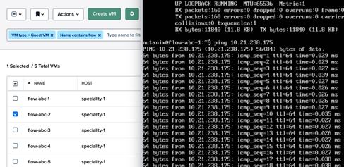
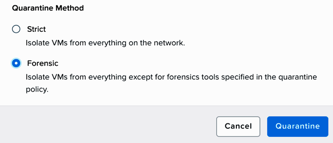

.. _flow_quarantine_vm:

-------------------
Flow: Quarantine VM
-------------------

Overview
++++++++

.. note::

  Estimated time to complete: 30-40 MINUTES

In this exercise you will enable Nutanix Flow, formally known as Microsegmentation, and create the VMs to be used throughout the remaining Flow exercises, **if you have not cloned the VMs already as part of the Lab - Deploying Workloads exercise**.

As part of this exercise, you will place a VM into quarantine and observe the behavior of the VM. You will also inspect the configurable options inside the quarantine policy and create a category with different values. Then you will create and implement an isolation security policy that uses the newly created category in order to restrict unauthorized access.

Finally, you will create an application category named **app-abc**, assign the **AppType: app-abc** category to your application VM, which in this exercise is the **flow-abc-5** VM, and create a security policy to restrict the application VM from receiving ICMP ping requests from VMs outside of the **programs-abc: sales-abc** category.

Quarantine a VM and Explore the Quarantine Policy
+++++++++++++++++++++++++++++++++++++++++++++++++

Confirm Communication between flow-abc-1 and flow-abc-2
.......................................................

Log on to the Prism Central environment and navigate to **Explore > VMs**.

Open the VM console of **flow-abc-1** and **flow-abc-2** by selecting one VM at a time and clicking on the checkbox next to it.

Click **Actions > Launch Console**.

Log into both VMs with the following user credentials:

- **Username** - root
- **Password** - nutanix/4u

Find the IPs of the VMs via the command *ifconfig*, and start a continuous ping from the **flow-abc-1** VM to the **flow-abc-2** VM.

Quarantine a VM and Edit The Quarantine Policy
..............................................

Quarantine the **flow-abc-2** VM by navigating to **Explore > VMs**.

Select **flow-abc-2 > Actions > Quarantine VMs**. Select **Forensic** and click **Quarantine**.

What happens with the continuous ping between VMs 1 and 2?

Navigate to **Explore > Security Policies > Quarantine**.

Select **Update** in the top right corner then select **+ Add Source** to the Quarantine policy.

Add a source by **Subnet/IP** with the IP address of **flow-abc-1**, a netmask of **/32**. Click on the plus sign ( + ) near **Forensic** category and allow any protocol on any port to the Forensic quarantine category.

What targets can this source be connected to?

What is the difference between the Forensic and Strict quarantine mode?

Select **Next > Apply Now** to save the policy.

What happens to the pings between **flow-abc-1** and **flow-abc-2** after the source is added?

Unquarantine **flow-abc-2** by navigating to **Explore > VMs > flow-abc-2 > Actions > Unquarantine VM**.

Takeaways
+++++++++

- In this exercise you utilized Flow to quarantine a VM in the environment using the two modalities of the quarantine policy, which are strict and forensic.
- The forensic modality is key in allowing you to study the connection patterns into and out of a VM in order to establish which connections are allowed or denied while the VM is quarantined.
