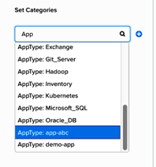

.. _flow_secure_app:

----------------
Flow: Secure App
----------------

Overview
++++++++

.. note::

  Estimated time to complete: 15-30 MINUTES

In this exercise you will create an application category named **app-abc**. You will assign the **AppType: app-abc** category to our application VM, which in this example is the **flow-abc-5** VM. Finally you will create a security policy to restrict the application VM from receiving ICMP ping requests from VMs outside of the **programs-abc: sales-abc** category.

Secure Applications with Microsegmentation
++++++++++++++++++++++++++++++++++++++++++

Create and Assign Categories
............................

Update **AppType** with New Category Value **app-abc**
------------------------------------------------------

Log on to the Prism Central environment and navigate to **Explore > Categories**.

Click the check box beside **AppType**. Click **Actions > Update**.

Scroll down and click the plus sign beside the last entry.

Enter **app-abc**, replacing abc with your initials and click **Save**.

Assign VM **flow-abc-5** to the category **AppType: app-abc**.
--------------------------------------------------------------

Within the **Explore > VMs** view in Prism Central, click the check box beside the **flow-abc-5** VM.

Click **Actions > Manage Categories**.

In the Set Categories text box, type **AppType** and select **AppType: app-abc** from autocomplete then click **Save**.

Assign VM **flow-abc-1** the default category **Environment: Dev**
------------------------------------------------------------------

Within the **Explore > VMs** view in Prism Central, click the check box beside the **flow-abc-1** VM.

Click **Actions > Manage Categories**.

In the Set Categories text box, type **Dev** and select **Environment: Dev** from autocomplete then click **Save**.

Secure the Application VM
.........................

Create a new security policy to protect the **app-abc** application.
--------------------------------------------------------------------

Navigate to **Explore > Security Policies**.

Click **Create Security Policy > Secure an Application**.

Fill out the following fields and click **Next**:

- **Name** - Protect-app-abc, replacing abc with your initials.
- **Purpose** - Protect app-abc from ICMP outside of sales VMs.
- **Secure this app** - AppType: app-abc.
Do NOT select the check box for the option **Filter the app type by category**.

.. figure:: images/create_app_vm_sec_pol.png

In the Inbound rules section, allow incoming traffic with the following steps:

- Leave **Whitelist Only** selected.
- Select **+ Add Source**.
- Leave **Add source by: Category** selected.
- Type **sales** and select **programs-abc:sales-abc**. Click Add.

Click + which appears on the left side of **AppType: app-abc** after completing the steps above.

This opens the Create Inbound Rule window.

In the Protocol column, select **ICMP** to allow inbound ping requests for this app and leave all other fields blank. Click **Save**.

On the right side, **Outbound** should be set to **Allow All**. You should see **All Destinations**.

.. figure:: images/create_inbound_rule.png

Click **Next** then click **Save and Monitor**.

Confirm that VMs belonging to the **programs-abc:sales-abc** category can ping the application VM which belongs to the **AppType: app-abc** category.

Navigate to **Explore > VMs** and open the console window for the following three VMs:

 - The designated AppType: app-abc VM, flow-abc-5.
 - The Sales VM (a VM in the programs-abc:sales-abc category, flow-abc-4).
 - The Dev VM (a VM in Environment: Dev, flow-abc-1).

Send a ping from the Sales VM (4) to the AppType: app-abc VM (5).

This ping request should succeed.

Send a ping from the Dev VM (1) to the AppType: app-abc VM (5).

This ping also succeeds, even though Environment: Dev is not part of the allowed policy. Why? What is the policy Status?

Takeaways
+++++++++

- You also created a category to protect a special application VM. Then you created the security policy to restrict ICMP traffic into that application VM.
- Notice that the policy created is in **Save and Monitor** mode, which means traffic is not actually going to get blocked yet until the policy is applied. This is helpful in order to study the connections and ensure no true traffic is getting blocked unintentionally.
