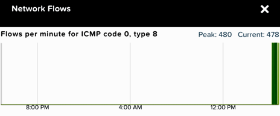

.. _flow_visualization:

-------------------
Flow: Visualization
-------------------

Overview
++++++++

.. note::

  Estimated time to complete: 30-40 MINUTES

In this exercise you will enable Nutanix Flow, formally known as Microsegmentation, and create the VMs to be used throughout the remaining Flow exercises, **if you have not cloned the VMs already as part of the Lab - Deploying Workloads exercise**.

As part of this exercise, you will place a VM into quarantine and observe the behavior of the VM. You will also inspect the configurable options inside the quarantine policy and create a category with different values. Then you will create and implement an isolation security policy that uses the newly created category in order to restrict unauthorized access.

Finally, you will create an application category named **app-abc**, assign the **AppType: app-abc** category to your application VM, which in this exercise is the **flow-abc-5** VM, and create a security policy to restrict the application VM from receiving ICMP ping requests from VMs outside of the **programs-abc: sales-abc** category.

Flow Visualization
++++++++++++++++++

Add Flows to a Policy Using Flow Visualization
..............................................

View the detected traffic flows from Environment: Dev
-----------------------------------------------------

Navigate to **Explore > Security Policies > Protect-app-abc** to view the detected traffic flows from **Environment: Dev**

Confirm that **Environment: Dev** is listed as a source to **AppType: app-abc**. This can take a few minutes to appear.

.. figure:: images/flow_viz.png

Hover over the yellow flow line from **Environment: Dev** to **AppType: app-abc** to view the protocol and connection information.

Click the yellow flow line to view a detailed graph of connection attempts.

Add The Detected Flow to The Security Policy
--------------------------------------------

Select **Update** in the top right corner to edit the policy.

Click **Next** and view the detected traffic flows.

Hover over the **Environment: Dev** source in the inbound list.

Select the green check box to add this source to the inbound allowed list.

.. figure:: images/add_env_flow.png

Select OK to Add to Rule

Hover over the blue **Environment: Dev** source and select the pencil icon to edit the rule.

Select the pencil on **AppType: app-abc** to define specific ports and protocols.

Currently ICMP is allowed due to the ping detected in the previous task.

Select **Save** to save the ICMP rule.

Select **Next** to review the changes to the policy.

Move Policy from **Monitoring** Mode to **Applied** Mode
------------------------------------------------------------

Now that the policy is complete, let move it from monitor mode to apply mode.

Select **Apply Now** to save the policy and move it into apply mode.

Navigate to **Explore > Security Policies > Protect-app-abc**.

Confirm that **Environment: Dev** shows in blue as an allowed source.

Attempt to send traffic from another source such as **flow-abc-2** to **flow-abc-5**.

Is this traffic blocked?

Takeaways
+++++++++

- Flow visualization allows you to visualize the flows that are occurring within a policy. From there it's really easy to edit the policy in order to add or remove the flows that should or should not be occurring.
