.. _calm:

----
Calm
----

Overview
++++++++

.. note::

  Review :ref:`calm_basics` before proceeding with the lab to familiarize yourself with the UI and common terminology used in Nutanix Calm.

  Estimated time to complete: **170 MINUTES**

In this exercise you will enable Nutanix Calm and configure a Project to contain your Blueprints and Applications created throughout the Workshop.

Enabling App Management
+++++++++++++++++++++++

In this exercise you will enable Nutanix Calm and configure a Project to contain your Blueprints and Applications created throughout the Workshop.

Open \https://*<Prism-Central-IP>*:9440/ in a browser and log in.

From the navigation bar, select **Apps**.

Click **Click here to enable Self Service and App management**.

.. figure:: images/enable1.png

Click **New Directory**. Fill out the following fields and click **Next**:

- **Directory Type** - Active Directory
- **Name** - NTNXLAB
- **Domain** - ntnxlab.local
- **Directory URL** - ldaps://*<DC-VM-IP>*
- **Username** - Administrator@ntnxlab.local
- **Password** - nutanix/4u

.. figure:: images/enable2.png

Click **+ Add Admins**. Fill out the following fields:

- **Name** - SSP Admins
- **Default Cluster** - *<Cluster Name>*

Under **Network**, select the **Primary** and if available, the **Secondary** networks. Select :fa:`star` for the **Primary** network to make it the default virtual network for VMs in the **Calm** project.

Click **Next**.

.. note::

  The Administrators, Default Cluster, and Networks chosen here will define the **Default** project created when enabling Self-Service Portal or App Management. In the following section you will create an additional project used for the remainder of the Workshop.

.. figure:: images/enable3.png

Select **Enable App Management** and click **Finish**.

.. note:: Nutanix Calm is a separately licensed product that can be used with Acropolis Starter, Pro, or Ultimate editions. Each Prism Central instance can manage up to 25 VMs for free before additional licensing is required.

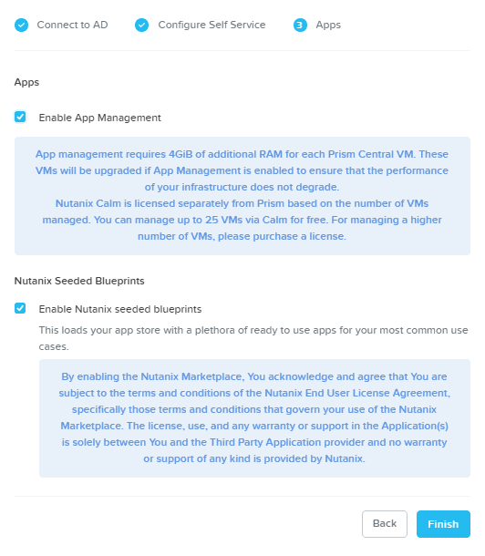

Following successful completion of the **Enable App Management** task, refresh the browser and select **Apps** from the navigation bar.

.. figure:: images/enable5.png

.. note:: Starting Calm services for the first time can take ~6 minutes. If the Calm UI doesn't load immediately, wait a moment and try refreshing the browser again.

.. note about possibly needing to SSH into PC VM to do 'cluster start' if Epsilon service doesn't start on its own

Creating A Project
++++++++++++++++++

Projects are the logical construct that integrate Calm with Nutanix's native Self-Service Portal (SSP) capabilities, allowing an administrator to assign both infrastructure resources and the roles/permissions of Active Directory users/groups to specific Blueprints and Applications.

Select |proj-icon| **Projects** from the sidebar.

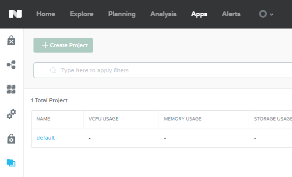

Fill out the following fields:

- **Project Name** - Calm
- **Description** - Calm

Under **Users, Groups, and Roles**, click **+ User**.

Fill out the following fields and click **Save**:

- **Name** - SSP Admins
- **Role** - Project Admin

Click **+ User**, fill out the following fields and click **Save**:

- **Name** - SSP Developers
- **Role** - Developer

Click **+ User**, fill out the following fields and click **Save**:

- **Name** - SSP Power Users
- **Role** - Consumer

Click **+ User**, fill out the following fields and click **Save**:

- **Name** - SSP Basic Users
- **Role** - Operator

Under **Infrastructure**, fill out the following fields:
- **Select which resources you want this project to consume** - Local only
- **AHV Cluster** - *<Cluster Name>*

Under **Network**, select the **Primary** and if available, the **Secondary** networks. Select :fa:`star` for the **Primary** network to make it the default virtual network for VMs in the **Calm** project.

Click **Save**.

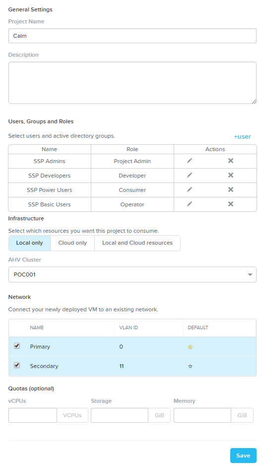

.. note::

  Click `here <https://portal.nutanix.com/#/page/docs/details?targetId=Nutanix-Calm-Admin-Operations-Guide-v56:nuc-roles-responsibility-matrix-c.html>`_ to view the complete matrix of default SSP roles and associated permissions.

Creating Blueprint (MySQL)
++++++++++++++++++++++++++

In this exercise you will explore the basics of Nutanix Calm by building and deploying a Blueprint that installs and configures a single service, MySQL, on a CentOS image.

Creating Blueprint
..................

From **Prism Central > Apps**, select **Blueprints** from the sidebar and click **+ Create Application Blueprint**.

Specify **CalmIntro<INITIALS>** in the **Blueprint Name** field.
Enter a **Description** in the Description field.
Select **Calm** from the **Project** drop down menu and click **Proceed**.

Click **Proceed** to continue.

Click **Credentials >** :fa:`plus-circle` and fill out the following fields then click **Save**:

- **Credential Name** - CENTOS
- **Username** - root
- **Secret** - Password
- **Password** - nutanix/4u

Click **Back**.

.. note::

  Credentials are unique to each Blueprint.

  Each Blueprint requires a minimum of 1 Credential.

Click **Save** to save your Blueprint.

Setting Variables
.................

Variables allow extensibility of Blueprints, meaning a single Blueprint can be used for multiple purposes and environments depending on the configuration of its variables. Variables can either be static values saved as part of the Blueprint or they can be specified at **Runtime** (when the Blueprint is launched). By default, variables are stored in plaintext and visible in the Configuration Pane. Setting a variable as **Secret** will mask the value and is ideal for variables such as passwords.

Variables can be used in scripts executed against objects using the **@@{variable_name}@@** construct. Calm will expand and replace the variable with the appropriate value before sending to the VM.

In the **Configuration Pane** under **Variable List**, fill out the following fields:

+----------------------+------------------------------------------------------+------------+
| **Variable Name**    | **Value**                                            | **Secret** |
+----------------------+------------------------------------------------------+------------+
| Mysql\_user          | root                                                 |            |
+----------------------+------------------------------------------------------+------------+
| Mysql\_password      | nutanix/4u                                           | X          |
+----------------------+------------------------------------------------------+------------+
| Database\_name       | homestead                                            |            |
+----------------------+------------------------------------------------------+------------+
| App\_git\_link       | https://github.com/ideadevice/quickstart-basic.git   |            |
+----------------------+------------------------------------------------------+------------+

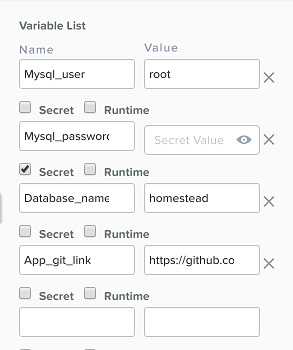

Click **Save**.

Adding DB Service
.................

In **Application Overview > Services**, click :fa:`plus-circle`.

Note **Service1** appears in the **Workspace** and the **Configuration Pane** reflects the configuration of the selected Service.

Fill out the following fields:

- **Service Name** - MySQL
- **Name** - MySQLAHV

  .. note:: This defines the name of the substrate within Calm. Names can only contain alphanumeric characters, spaces, and underscores.

- **Cloud** - Nutanix
- **OS** - Linux
- **VM Name** - MYSQL-@@{calm_array_index}@@-@@{calm_time}@@
- **Image** - CentOS
- **Device Type** - Disk
- **Device Bus** - SCSI
- Select **Bootable**
- **vCPUs** - 2
- **Cores per vCPU** - 1
- **Memory (GiB)** - 4
- Select :fa:`plus-circle` under **Network Adapters (NICs)**
- **NIC** - Primary
- **Credential** - CENTOS

.. note::

  Ensure selecting the **Credential** is the final selection made before proceeding to the next step, selecting other fields can clear your **Credential** selection.

With the MySQL service icon selected in the workspace window, scroll to the top of the **Configuration Panel**, click **Package**.

Fill out the following fields:

- **Package Name** - MYSQL_PACKAGE
- **Click** - Configure install
- **Click** - + Task
- **Name Task** - Install_sql
- **Type** - Execute
- **Script Type** - Shell
- **Credential** - CENTOS

Copy and paste the following script into the **Script** field:

.. code-block:: bash

  #!/bin/bash
  set -ex

  yum install -y "http://repo.mysql.com/mysql-community-release-el7.rpm"
  yum update -y
  yum install -y mysql-community-server.x86_64

  /bin/systemctl start mysqld

  #Mysql secure installation
  mysql -u root<<-EOF

  #UPDATE mysql.user SET Password=PASSWORD('@@{Mysql_password}@@') WHERE User='@@{Mysql_user}@@';
  DELETE FROM mysql.user WHERE User='@@{Mysql_user}@@' AND Host NOT IN ('localhost', '127.0.0.1', '::1');
  DELETE FROM mysql.user WHERE User='';
  DELETE FROM mysql.db WHERE Db='test' OR Db='test\_%';

  FLUSH PRIVILEGES;
  EOF

  sudo yum install firewalld -y
  sudo service firewalld start
  sudo firewall-cmd --add-service=mysql --permanent
  sudo firewall-cmd --reload

  #mysql -u @@{Mysql_user}@@ -p@@{Mysql_password}@@ <<-EOF
  mysql -u @@{Mysql_user}@@ <<-EOF
  CREATE DATABASE @@{Database_name}@@;
  GRANT ALL PRIVILEGES ON homestead.* TO '@@{Database_name}@@'@'%' identified by 'secret';

  FLUSH PRIVILEGES;
  EOF

.. note::

  You can click the **Pop Out** icon on the script field for a larger window to view/edit scripts.

  Looking at the script you can see the package will install MySQL, configure the credentials and create a database based on the variables specified earlier in the exercise.

Select the MySQL service icon in the workspace window again and scroll to the top of the **Configuration Panel**, click **Package**.

- **Click** - Configure Uninstall
- **Click** - + Task
- **Name Task** - Uninstall_sql
- **Type** - Execute
- **Script Type** - Shell
- **Credential** - CENTOS

Copy and paste the following script into the **Script** field:

.. code-block:: bash

  #!/bin/bash
  echo "Goodbye!"

.. note:: The uninstall script can be used for removing packages, updating network services like DHCP and DNS, removing entries from Active Directory, etc. It is not being used for this simple example.

Click **Save**. You will be prompted with specific errors if there are validation issues such as missing fields or unacceptable characters.

Launching the Blueprint
.......................

From the toolbar at the top of the Blueprint Editor, click **Launch**.

In the **Name of the Application** field, specify a unique name (e.g. CalmIntro*<INITIALS>*-1).

.. note::

  A single Blueprint can be launched multiple times within the same environment but each instance requires a unique **Application Name** in Calm.

Click **Create**.

You will be taken directly to the **Applications** page to monitor the provisioning of your Blueprint.

Select **Audit > Create** to view the progress of your application. After **MySQLAHV - Check Login** is complete, select **PackageInstallTask** to view the real time output of your installation script.

Note the status changes to **Running** after the Blueprint has been successfully provisioned.

.. figure:: https://s3.amazonaws.com/s3.nutanixworkshops.com/calm/lab1/image25.png

Calm Blueprint (LAMP)
+++++++++++++++++++++

In this exercise you will extend the MySQL Blueprint created previously into a basic LAMP Stack (Linux Apache MySQL PHP) deployment with a scalable web tier as shown below.

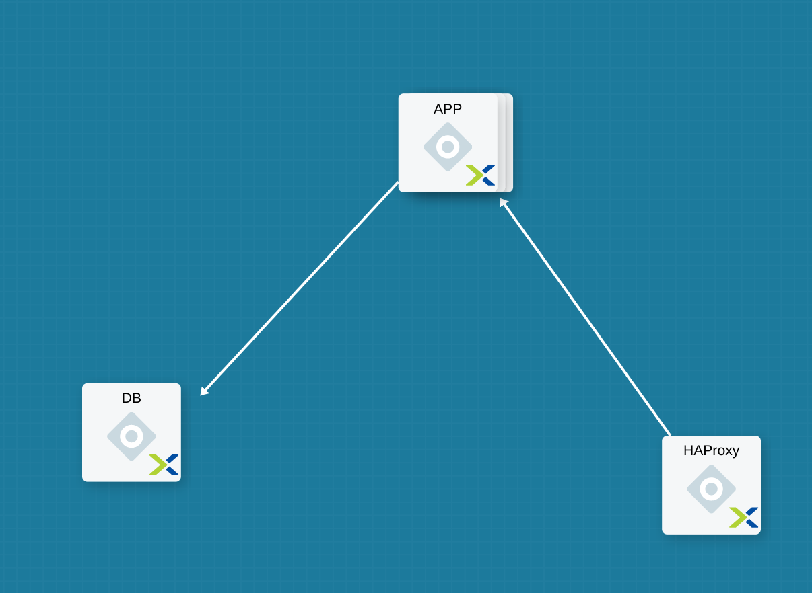

Creating the Web Server
.......................

From **Prism Central > Apps**, select **Blueprints** from the sidebar and select your Blueprint from the previous exercise.

In **Application Overview > Services**, click :fa:`plus-circle`.

Note **Service1** appears in the **Workspace** and the **Configuration Pane** reflects the configuration of the selected Service. You can rearrange the Service icons on the Workspace by clicking and dragging them.

With the Apache service icon selected in the workspace window, scroll to the top of the **Configuration Panel**, click **Package**.

- **Service Name** - APACHE_PHP
- **Name** - APACHE_PHP_AHV
- **Cloud** - Nutanix
- **OS** - Linux
- **VM Name** - APACHE_PHP-@@{calm_array_index}@@-@@{calm_time}@@
- **Image** - CentOS
- **Device Type** - Disk
- **Device Bus** - SCSI
- Select **Bootable**
- **vCPUs** - 2
- **Cores per vCPU** - 1
- **Memory (GiB)** - 4
- Select :fa:`plus-circle` under **Network Adapters (NICs)**
- **NIC** - Primary
- **Credential** - CENTOS

Scroll to the top of the **Configuration Panel**, click **Package**.

Click on the Apache service icon again and fill out the following fields:

- **Package Name** - APACHE_PHP_PACKAGE
- **Click** - Configure install
- **Click** - + Task
- **Name Task** - Install_Apache
- **Type** - Execute
- **Script Type** - Shell
- **Credential** - CENTOS

Copy and paste the following script into the **Script** field:

.. code-block:: bash

  #!/bin/bash
  set -ex
  # -*- Install httpd and php
  sudo yum update -y
  sudo yum -y install epel-release
  sudo rpm -Uvh https://mirror.webtatic.com/yum/el7/webtatic-release.rpm
  sudo yum install -y httpd php56w php56w-mysql

  echo "<IfModule mod_dir.c>
          DirectoryIndex index.php index.html index.cgi index.pl index.php index.xhtml index.htm
  </IfModule>" | sudo tee /etc/httpd/conf.modules.d/dir.conf

  echo "<?php
  phpinfo();
  ?>" | sudo tee /var/www/html/info.php
  sudo systemctl restart httpd
  sudo systemctl enable httpd

.. code-block:: bash

Select the Apache service icon in the workspace window again and scroll to the top of the **Configuration Panel**, click **Package**.

Fill out the following fields:

- **Click** - Configure uninstall
- **Click** - + Task
- **Name Task** - Uninstall_apache
- **Type** - Execute
- **Script Type** - Shell
- **Credential** - CENTOS

Copy and paste the following script into the **Script** field:

.. code-block:: bash

  #!/bin/bash
  echo "Goodbye!"

.. code-block:: bash

Click **Save**.

Adding Dependencies
...................

As our application will require the database to be running before the web server starts, our Blueprint requires a dependency to enforce this ordering.

In the **Workspace**, select the **APACHE_PHP** Service and click the **Create Dependency** icon that appears above the Service icon.

Select the **MySQL** Service. This will hold the execution of **APACHE_PHP** installation script until the **MySQL** Service is running.

Click **Save**.

Adding Replicas
...............

Calm makes it simple to add multiple copies of a given Service, which is helpful for scale out workloads such as web servers.

In the **Workspace**, select the **APACHE_PHP** Service.

In the **Configuration Pane**, select the **Service** tab.

Under **Deployment Config**, change the **Max** Number of replicas from 1 to 2.

Creating the Load Balancer
..........................

To take advantage of a scale out web tier our application needs to be able to load balance connections across multiple web server VMs. HAProxy is a free, open source TCP/HTTP load balancer used to distribute workloads across multiple servers. It can be used in small, simple deployments and large web-scale environments such as GitHub, Instagram, and Twitter.

In **Application Overview > Services**, click :fa:`plus-circle`.

Select **Service1** and fill out the following fields in the **Configuration Pane**:

- **Service Name** - HAProxy
- **Name** - HAPROXYAHV
- **Cloud** - Nutanix
- **OS** - Linux
- **VM Name** - HAProxy
- **Image** - CentOS
- **Device Type** - Disk
- **Device Bus** - SCSI
- Select **Bootable**
- **vCPUs** - 2
- **Cores per vCPU** - 1
- **Memory (GiB)** - 4
- Select :fa:`plus-circle` under **Network Adapters (NICs)**
- **NIC** - Primary
- **Credential** - CENTOS

Scroll to the top of the **Configuration Panel**, click **Package**.

Fill out the following fields:

- **Package Name** - HAPROXY_PACKAGE
- **Click** - Configure install
- **Click** - + Task
- **Name Task** - install_haproxy
- **Type** - Execute
- **Script Type** - Shell
- **Credential** - CENTOS

Copy and paste the following script into the **Script** field:

.. code-block:: bash

  #!/bin/bash
  set -ex

  sudo setenforce 0
  sudo sed -i 's/permissive/disabled/' /etc/sysconfig/selinux

  port=80
  sudo yum update -y
  sudo yum install -y haproxy

  echo "global
    log 127.0.0.1 local0
    log 127.0.0.1 local1 notice
    maxconn 4096
    quiet
    user haproxy
    group haproxy
  defaults
    log     global
    mode    http
    retries 3
    timeout client 50s
    timeout connect 5s
    timeout server 50s
    option dontlognull
    option httplog
    option redispatch
    balance  roundrobin
  # Set up application listeners here.
  listen stats 0.0.0.0:8080
    mode http
    log global
    stats enable
    stats hide-version
    stats refresh 30s
    stats show-node
    stats uri /stats
  listen admin
    bind 127.0.0.1:22002
    mode http
    stats uri /
  frontend http
    maxconn 2000
    bind 0.0.0.0:80
    default_backend servers-http
  backend servers-http" | sudo tee /etc/haproxy/haproxy.cfg

  sudo sed -i 's/server host-/#server host-/g' /etc/haproxy/haproxy.cfg

  hosts=$(echo "@@{APACHE_PHP.address}@@" | sed 's/^,//' | sed 's/,$//' | tr "," "\n")

  for host in $hosts
  do
     echo "  server host-${host} ${host}:${port} weight 1 maxconn 100 check" | sudo tee -a /etc/haproxy/haproxy.cfg
  done

  sudo systemctl daemon-reload
  sudo systemctl enable haproxy
  sudo systemctl restart haproxy

.. code-block:: bash

Select the HAProxy service icon in the workspace window again and scroll to the top of the **Configuration Panel**, click **Package**.

Fill out the following fields:

- **Click** - Configure install
- **Click** - + Task
- **Name Task** - uninstall_haproxy
- **Type** - Execute
- **Script Type** - Shell
- **Credential** - CENTOS

Copy and paste the following script into the **Script** field:

.. code-block:: bash

  #!/bin/bash
  echo "Goodbye!"

.. code-block:: bash

Click **Save**.

In the **Workspace**, select the **HAProxy** Service and click the **Create Dependency** icon that appears above the Service icon.

Select the **Apache_PHP** Service. This will hold the execution of **HAProxy** installation script until the **APACHE_PHP** Service is running.

Click **Save**.

Click **Launch**. Specify a unique **Application Name** (e.g. CalmIntro*<INITIALS>*-2) and click **Create**.

Calm Marketplace Part 1
+++++++++++++++++++++++

In this exercise you will learn how to manage Calm Blueprints within the Nutanix Marketplace. As part of the exercise you will publish a pre-configured Blueprint to the local Marketplace, clone the Blueprint from the Marketplace for editing, and launch the application.

Publishing Blueprints from Marketplace Manager
..............................................

By default, Calm comes pre-seeded with validated Blueprints for multiple open source and enterprise applications. Marketplace Manager acts as a staging area for publishing default and user-created Blueprints to your local Marketplace. The Marketplace acts as an application store, providing end users with a catalog of available applications.

From **Prism Central > Apps**, select |mktmgr-icon| **Marketplace Manager** from the sidebar.

Under **Marketplace Blueprints**, select **Mongo**.

Note the Blueprint description contains key information including licensing, hardware requirements, OS, supported platforms, and limitations. Click **Publish**.

.. figure:: images/marketplace_p1_1.png

Wait for the Blueprint **Status** to appear as **Published**.

.. figure:: images/marketplace_p1_2.png

Under **Projects Shared With**, select the **Calm** Project and click **Apply**.

.. figure:: images/marketplace_p1_3.png

.. note::

  If the **Projects Shared With** drop down menu is unavailable, refresh your browser.

Cloning Blueprints from Marketplace
...................................

From **Prism Central > Apps**, select |mkt-icon| **Marketplace** from the sidebar. All Blueprints published in Marketplace Manager are visible here.

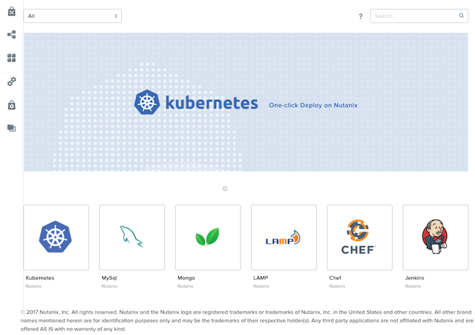

Select the **Mongo** Blueprint and click **Clone**.

.. note::

  Selecting **Actions Included** for a Blueprint will display the actions that have been implemented for a given Blueprint, such as Create, Start, Stop, Delete, Update, Scale Up, Scale Down, etc.

.. figure:: images/marketplace_p1_5.png

Fill out the following fields and click **Clone**:

- **Blueprint Name** - MongoDB*<INITIALS>*
- **Project** - Calm

Editing Cloned Blueprint
........................

Select |bp-icon| **Blueprints** from the sidebar and click your **MongoDB<INITIALS>** Blueprint to open the Blueprint Editor.

.. figure:: images/marketplace_p1_6.png

Click :fa:`exclamation-circle` to review the list of errors that would prevent a successful deployment of the Blueprint.

.. figure:: images/marketplace_p1_7.png

Click **Credentials** and select **CENTOS (Default)**.

Fill out the following fields and click **Back**:

- **Username** - root
- **Secret** - Password
- **Password** - nutanix/4u

Select the **Mongo_ConfigSet** Service and make the following changes in the **Configuration Pane**:

- Update the **VM Configuration > Image** to **CentOS**.
- Update the **Network Adapters > NIC** to **Primary**.
- Update the **Connection > Credential** to **CENTOS**.

Repeat these steps for the **Mongo_Router** and **Mongo_ReplicaSet** Services.

Click **Save**.

Click **Launch**. Specify a unique **Application Name** (e.g. MongoDB*<INITIALS>*-1) and click **Create**.

.. figure:: images/marketplace_p1_8.png

Calm Marketplace Part 2
+++++++++++++++++++++++

.. note::

  This exercise assumes you have a Blueprint available from a previous exercise.

In this exercise you will learn how to manage Calm Blueprints within the Nutanix Marketplace. As part of the exercise you will publish a Blueprint from the Blueprint Editor, use Marketplace Manager to approve, assign roles and projects, and publish to the Marketplace. Finally you will edit a project environment so your Blueprint can be launched directly from the Marketplace.

Publishing Blueprints
.....................

From **Prism Central > Apps**, select |bp-icon| **Blueprints** from the sidebar.

Open any **Active** Blueprint by clicking on its **Name**.

.. figure:: images/marketplace_p2_1.png

Click **Publish**.

.. figure:: images/marketplace_p2_2.png

Provide the following details:
- **Name** (e.g. Blueprint Name *<INITIALS>*)
- **Publish as a** - New Marketplace blueprint
- **Initial Version** - 1.0.0
- **Description** - Finished MySQL app

Click **Submit for Approval**.

.. figure:: images/marketplace_p2_3.png

Approving Blueprints
....................

From **Prism Central > Apps**, select |mktmgr-icon| **Marketplace Manager** from the sidebar.

.. note:: You must be logged in as a Cluster Admin user to access the Marketplace Manager.

Note your Blueprint does not appear in the list of **Marketplace Items**.

Select the **Approval Pending** tab.

.. figure:: images/marketplace_p2_4.png

Select your **Pending** Blueprint.

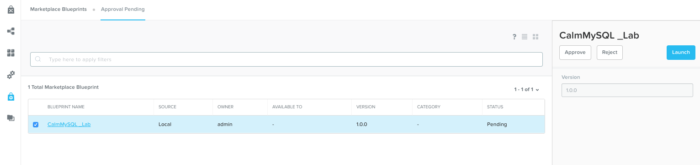

Review the available actions:

- **Reject** - Prevents  Blueprint from being launched or published in the Marketplace. The Blueprint will need to be submitted again after being rejected before it can be published.
- **Approve** - Approves the Blueprint for publication to the Marketplace.
- **Launch** - Launches the Blueprint as an application, similar to launching from the Blueprint Editor.

Click **Approve**.

Once the application has been successfully approved, assign the appropriate **Category** and **Project Shared With**. Click **Apply**.

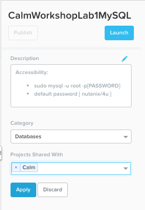

Select the **Marketplace Blueprints** tab and select your Blueprint. Click **Publish**.

Verify the Blueprint's **Status** is now shown as **Published**.

.. figure:: images/marketplace_p2_7.png

From **Prism Central > Apps**, select |mkt-icon| **Marketplace** from the sidebar. Verify your Blueprint is available for launching as an application.

.. figure:: images/marketplace_p2_8.png

Configuring Project Environment
...............................

To launch a Blueprint directly from the Marketplace, we need to ensure our Project has all of the requisite environment details to satisfy the Blueprint.

From **Prism Central > Apps**, select |proj-icon| **Projects** from the sidebar.

Select the Project **Name** associated with your Blueprint at the time of publishing (e.g. the **Calm** Project that was assigned as **Project Shared With**).

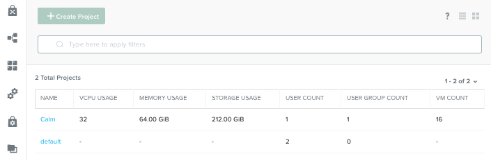

Select the **Environment** tab.

Under **Credential**, click :fa:`plus-circle` to add new credential.
Fill out the following fields:

- **Credential Name** - CENTOS
- **Username** - root
- **Secret** - Password
- **Password** - nutanix/4u
- Select **Use as default**

Under **VM Configuration**
- select **AHV on NUTANIX**.
- **VM Name** - add prefix "default" to the name
- **Image** - CentOS
- **vCPUs** - 2
- **Cores per vCPU** - 1
- **Memory** - 4GiB
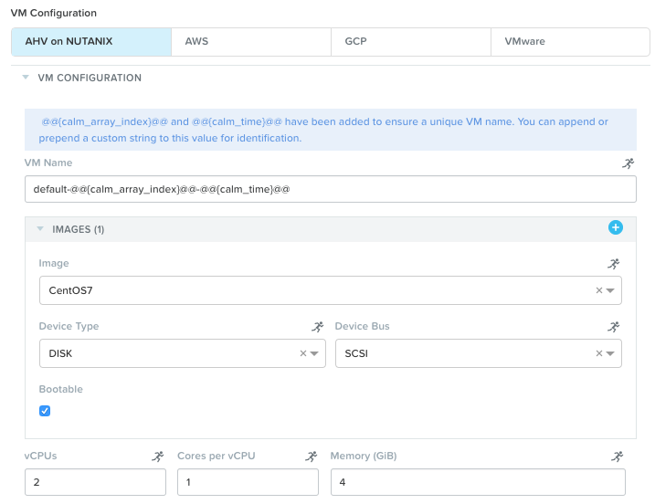

Under **Network Adapters (NICs)**, click :fa:`plus-circle` and select **Primary**.

.. figure:: images/marketplace_p2_10.png

Click **Save**.

Launching Blueprint from the Marketplace
........................................

From **Prism Central > Apps**, select |mkt-icon| **Marketplace** from the sidebar.

.. figure:: images/marketplace_p2_11.png

Select the Blueprint published as part of this exercise and click **Launch**.

.. figure:: images/marketplace_p2_12.png

Select the **Calm** Project and click **Launch**.

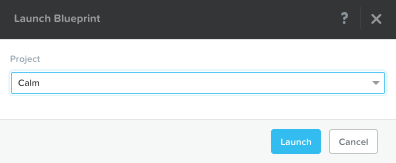

Specify a unique **Application Name** (e.g. Marketplace*<INITIALS>*) and click **Create**.

.. note::

  To see the configured **Environment** details, expand the **VM Configurations** entities.

.. figure:: images/marketplace_p2_14.png

Monitor the provisioning of the Blueprint until complete.

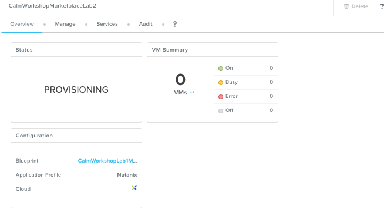

Takeaways
+++++++++

- Nutanix Calm is a fully integrated component of the Nutanix stack. Easily enabled, highly available out of the box in a Scale Out Prism Central deployment, and takes advantage of non-disruptive One Click upgrades for new features and fixes.
- By using different projects assigned to different clusters and users, administrators can ensure that workloads are deployed the right way each time.  For example, a developer can be a Project Admin for a dev/test project, so they have full control to deploy to their development clusters or to a cloud, while having Read Only access to production projects, allowing them access to logs but no ability to alter production workloads.
- The Blueprint Editor provides a simple UI for modeling potentially complex applications.
- Blueprints are tied to SSP Projects which can be used to enforce quotas and role based access control.
- Having a Blueprint install and configure binaries means no longer creating specific images for individual applications. Instead the application can be modified through changes to the Blueprint or installation script, both of which can be stored in source code repositories.
- Variables allow another dimension of customizing an application without having to edit the underlying Blueprint.
- Application status can be monitored in real time.
- Applications typically span across multiple VMs, each responsible for different services. Calm is capable of automated and orchestrating full applications.
- Dependencies between services can be easily modeled in the Blueprint Editor.
- Users can quickly provision entire application stacks for production or testing for repeatable results without time lost to manual configuration.
- By using pre-seeded Blueprints from the Nutanix Marketplace, users can quickly try out new applications.
- Marketplace Blueprints can be cloned and modified to suit a user's needs. For example, the pre-seeded LAMP Blueprint could be a starting point for a developer looking to swap PHP for a Go application server.
- Marketplace Blueprints can use local disk images or automatically download associated disk images. Users can create their own keys and slipstream them into Blueprints (via cloud-init) to control access.
- Developers can publish Blueprints to the Marketplace for fast and easy consumption by users.
- Blueprints can be launched directly from the Marketplace with no additional configuration from users, delivering a public cloud-like SaaS experience for end users.
- Administrators have control over what Blueprints are published to the Marketplace and which projects have access to published Blueprints.

.. |mktmgr-icon| image:: ../images/marketplacemanager_icon.png
.. |mkt-icon| image:: ../images/marketplace_icon.png
.. |bp-icon| image:: ../images/blueprints_icon.png
.. |proj-icon| image:: ../images/projects_icon.png
