.. _nutanix101:

------------------------
Nutanix 101
------------------------

Overview
++++++++

**Estimated time to complete: 60 MINUTES**

This lab will introduce the Prism Element UI, and familiarize you with its layout and navigation.
You will use Prism to perform a basic container, and network setup for the cluster.
The networks you create in the steps below provide VMs with connectivity by assigning the appropriate networks for the VMs’ respective NICs.
Get experience with basic VM deployment, and VM management tasks from Prism, which include power actions, searching, cloning, and migrating.
As well as, learn how to set up protection domains, create VM snapshots, and restore from those snapshots.

Prism Element
+++++++++++++

From the Chrome web browser (preferred), log into the Nutanix Prism GUI using the Cluster IP.

Open https://<*NUTANIX-CLUSTER-IP*>:9440

Fill out the following fields and click **Enter**:

- **Username** - admin
- **Password** - *HPOC Password*

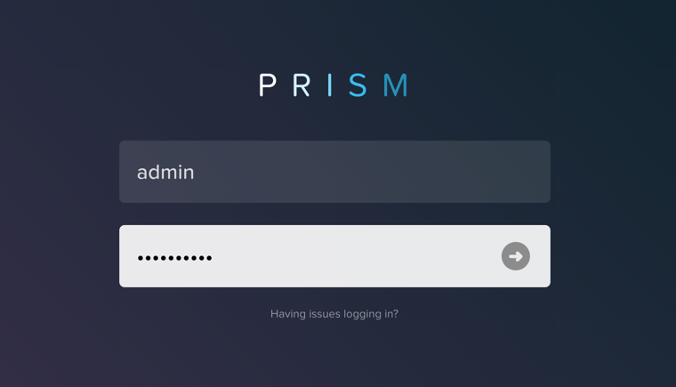

After you log in to Prism Element, familiarize yourself with the Prism UI. Explore the information on the **Home** screen, as well as the other screens.

Review the Home screen, and identify the following items:

- Hypervisor
- Version
- Hardware Model
- Health
- VM Summary
- Warning Alerts
- Data Resiliency Status

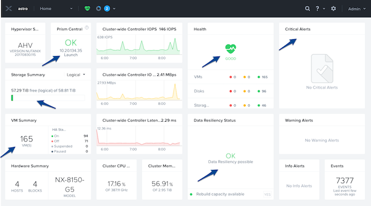

Review the UI navigation options.

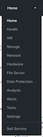

Examine the cluster hardware by using the navigation menu, and go to the Hardware.

In **Prism > Hardware**, click **Hardware**, then click **Diagram**.

Review the hardware summary information:

- Blocks
- Hosts
- Memory
- CPU
- Disks

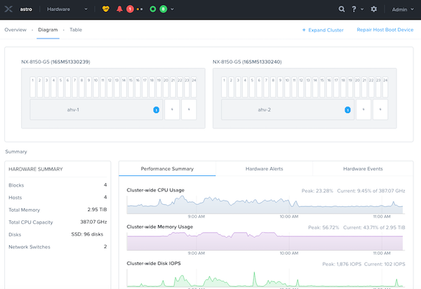

Review the other sections, and do a quick walk through:

- VM
- Health
- Network
- Data Protection
- Storage
- Alerts
- Etc.

Review other sections of the Prism UI

- Health :fa:`heartbeat`
- Alarms :fa:`bell`
- Tasks :fa:`circle-o`
- Search :fa:`search`
- Help :fa:`question`
- Configuration :fa:`cog`
- User :fa:`user`

.......................
Prism Element UI Review
.......................

Where would you locate the version of AOS you are running?

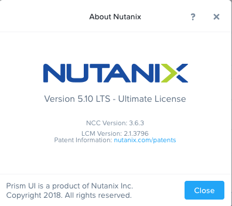

You can do this by clicking on the **User** drop down :fa:`user`, and clicking **About Nutanix**.

How would you get to the following screen to view a summary of the number of hosts (or nodes) and the resource capacity and current utilization?

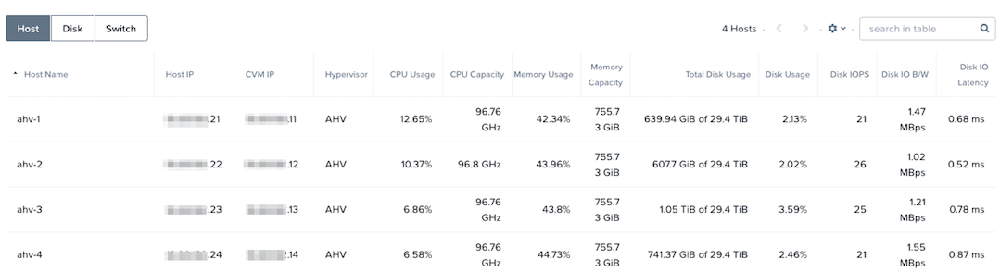

In **Prism > Hardware**, click **Hardware**, then click **Table**.

How would you get the following screen to see the health of your cluster?

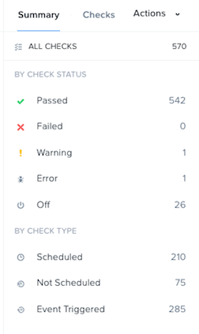

In **Prism > Health**, click **Health**, then click **Summary** in the right pane.

What page would show you the latest activity in the system? On this page, you can monitor the progress of any task and keep track of what has been done in the past using time stamps. Can you figure out two different ways to get there?

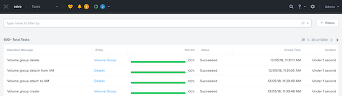

First Way, In **Prism > Tasks**, click **Tasks**. Second Way, click :fa:`circle-o`.

.. note::

  In ESXi:

  - The containers created in Prism appear as datastores in vCenter.

  Example view of storage containers from Prism:

  .. figure:: images/nutanix_tech_overview_13.png

  Example view of storage containers (datastores) from vCenter:

  .. figure:: images/nutanix_tech_overview_14.png

Prism Element Storage Configuration Items
+++++++++++++++++++++++++++++++++++++++++

Configure Storage Containers
............................

**Containers** are software-defined, logical constructs for managing storage policy that greatly simplify storage management. Containers are similar to datastores in ESXi.

Let's use Prism Element to perform a basic container setup.

In **Prism Element> Storage**, click **Storage**, click **Table**, then click **+ Storage Container**.

Use the following specifications (with **Advance Settings**), and click **Save**:

- **Name** - *initials*-container
- **Advertised Capacity** - 5 GiB
- **Compression** - Enabled (inline 0 mins)
- **Deduplication** - Cache Only
- **Erasure Coding** - Disabled

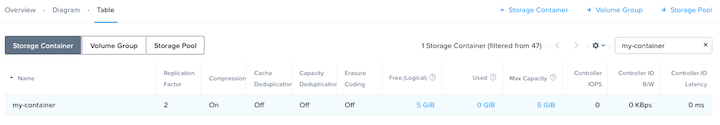

You can create multiple containers with different policies.

.. note::

  Containers do not reserve any actual disk space—they are policies with a soft limit that trigger alerts but do not stop new data from being written to the container.

Explore the configuration basics further.

Go back to the container you created above and edit it to add another 10 GiB to the advertised capacity. While you’re in that window, what is the redundancy factor for the container you created in the first task?

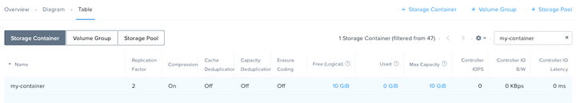

Redundancy Factor (RF)
.................

You can locate the redundancy level of containers and the cluster within Prism.

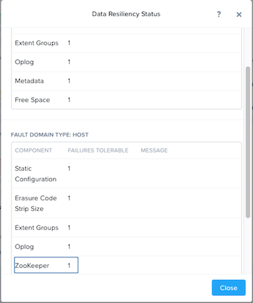

Block awareness, introduced in 4.0, allows the cluster to survive a full 2RU block failure without using any more disk space.The basic requirement for rack/block fault tolerance is to have minimum 3 blocks in the cluster as we need to store 3 copies of metadata. Starting in AOS 5.8, block awareness is supported in conjunction with erasure coding.

In **Prism > Home**, click the **green OK** in the Data Resiliency Status box. This opens the Data Resiliency Status window.

The picture above shows the Data Resiliency Status window, where you can see, for example, how many ZooKeeper node failures can be tolerated without impacting the cluster. Each service listed has a specific function in the cluster. Zookeeper nodes maintain the configuration of the cluster.

The RF of a cluster in Prism Element could be configured by clicking **Redundancy State** in the Gear menu.

.. note::

  For this exercise, please leave the redundancy factor configured as 2.

In **Prism >** :fa:`cog`, click **Redundancy State**.

AHV Networking Background
+++++++++++++++++++++++++

AHV simplifies networking. Typically, nodes are connected with a trunked VLAN such that multiple VM networks can be surfaced into the environment.

With AHV, you can also setup a DHCP server to automatically provide IP addresses for VMs using the IP address management (IPAM) service.

Virtual Networks
................

- Similar to a “distributed portgroup”
- Each virtual NIC belongs to exactly one virtual network
- Each virtual network is a common point of configuration for a group of virtual NICs
- Physical switch port must be configured to trunk VLAN

.. figure:: images/network_config_01.png
.. figure:: images/network_config_001.png

Virtual NICs
............

- Each vNIC belongs to exactly one virtual network
- For IPAM-enabled networks, vNICs get life-long static IP assignments
- User may configure pools to automatically allocate IPs, or specify the IP manually

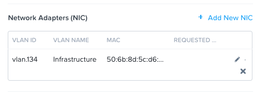

IP Address Management (IPAM)
............................

- Integrated DHCP Server
- AHV intercepts DHCP requests from guests on IPAM networks, and injects responses
- Virtualization admin manages a range of IP addresses
- Supports arbitrary DHCP options, with UI support for DNS and TFTP configuration

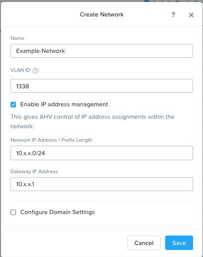

Configure Network
+++++++++++++++++

In this exercise, we intentionally use invalid VLANs so no communication is possible from VMs placed on the network.

.. note::

  This exercise is for demonstration purposes only. VMs connected to networks other than vlan 0 get a DHCP IP, but the network is not valid and does not transmit any traffic.

Setup user VM network
.....................

Connect to Prism Element and create a network for user VM interfaces. Use any VLAN other than 0, and do not enable IP address management.

In **Prism Element > VM**, click **VMs**, then click **Network Config**

Next click **VM Networks**, then click **+ Create Network**.

Fill out the following fields and click **Save**:

- **Name** - *initials*-Network
- **VLAN ID** - Something other than 0
- **Enable IP Address Management** - unchecked

The final result should look like the image below.

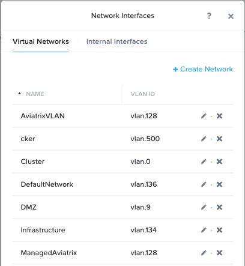

Setup user VM network with IPAM
...............................

Create another network, but this time enable IPAM.

Fill out the following fields and click **Save**:

- **Name** - *initials*-Network_IPAM
- **VLAN ID** - Something other than 0
- **Enable IP Address Management** - Checked
- **Network IP Address / Prefix Length** - 10.0.0.0/24
- **Gateway** - 10.0.0.1
- **Configure Domain Settings** - unchecked
- **Create Pool** - 10.0.0.100-10.0.0.150
- **Override DHCP Server** - unchecked

.. note::

  It is possible to create multiple pool ranges for a network.

Deploying Workloads
+++++++++++++++++++

Creating a Linux VM
...................

Deploy a Linux VM from Prism Element.

In **Prism Element > VM > Table**, click **+ Create VM**.

Fill out the following fields and click **Save**:

- **Name** - *initials*-Linux_VM
- **Description** - (Optional) Description for your VM.
- **vCPU(s)** - 1
- **Number of Cores per vCPU** - 1
- **Memory** - 2 GiB

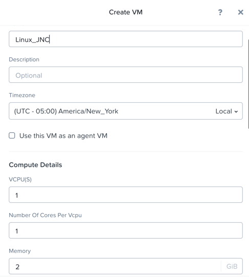

- Select **+ Add New Disk**
    - **Type** - DISK
    - **Operation** - Clone from Image Service
    - **Image** - CentOS7.qcow2
    - Select **Add**

- Select **Add New NIC**
    - **VLAN Name** - Primary
    - Select **Add**

Click **Save** to create the VM.

Creating a Windows VM
.....................

Deploy a Windows VM from Prism Element.

.. note::

  Nutanix provides a set of guest tools and drivers comparable to VMware Tools. To install a Windows-based OS, the I/O drivers must be provided at install time. Nutanix provides a customized set of virtualized I/O drivers for Windows OS on AHV.

In **Prism Element > VM > Table**, click **+ Create VM**.

Fill out the following fields and click **Save**:

- **Name** - *initials*-Windows_VM
- **Description** - (Optional) Description for your VM.
- **vCPU(s)** - 2
- **Number of Cores per vCPU** - 1
- **Memory** - 4 GiB
- Select :fa:`pencil` next to CDROM
    - **Operation** - Clone from Image Service
    - **Image** - Windows2012R2.ISO
    - Select **Update**

- Select **+ Add New Disk**
    - **Type** - DISK
    - **Operation** - Allocate on Storage Container
    - **Storage Container** - Default Container
    - **Size (GiB)** - 30 GiB
    - Select **Add**

- Select **+ Add New Disk**
    - **Type** - CDROM
    - **Operation** - Clone from Image Service
    - **Image** - Nutanix VirtIO
    - Select **Add**

- Select **Add New NIC**
    - **VLAN Name** - Primary
      - Select **Add**

Click **Save** to create the VM.

Now lets power on the VM:

Select the VM, then click **Power On** from the **Actions** drop-down menu.

Next lets open a console session:

Select the VM, then click **Launch Console** from the **Actions** drop-down menu.

Progress through the standard install questions until you reach the Windows install location.

.. note::
  Choose **Datacenter with GUI** and **Custom** installation when presented with the choice.

Click **Load Driver** and navigate to the CD where the Nutanix VirtIO is mounted.

Browse the CD, and select the directory that corresponds to the Windows OS being installed.

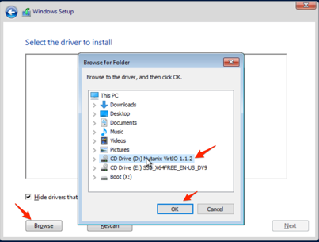

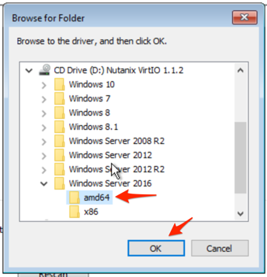

Select the three Nutanix drivers displayed (Press and hold the Ctrl key and select all three drivers):

- Balloon
- Ethernet adapter
- SCSI passthrough controller

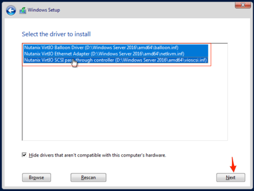

Click Next.

After the drivers are loaded, the disk created in step 1 appears as an installation target. Select that disk and continue with the normal install process.

After the installation completes, the Windows install ISO can be unmounted and the additional CD-ROM used for the drivers can be removed from the VM.

.. note::

  In ESXi:

  - After a VM is created via VMware vSphere, it appears in the Prism VMs list.
  - Alternatively, if a VM is created via Prism, it appears in the VMware vSphere UI. An example is shown in the image below.
  .. figure:: images/deploy_workloads_08.png

Workload Management
+++++++++++++++++++

Now that you have a couple VMs deployed, let’s have some fun and explore some of the VM management tasks with AHV.

Power Actions and Console Access
................................

Explore VM power actions and console access.

In **Prism Element > VM > Table**.

Locate the Linux VM you created in the previous lab (*initials*-Linux_VM). (Use Prism’s search function if necessary)

.. note::

  Note that the Power State column for that VM shows a red dot, indicating that the VM is powered off.

Now lets power on the VM:

Select the VM, then click **Power On**.

Next lets open a console session:

Select the VM, then click **Launch Console**.

Input administrator password: nutanix/4u

.. note::

  When the console window opens, note that there are four actions available in the console (Send Mount ISO, CTRL-ALT-DEL, Take Screen Capture, and Power).

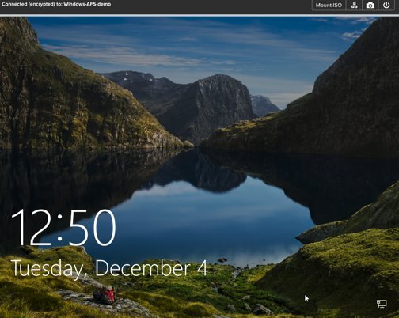

.. note::

  In ESX:

  - The steps in this exercise could also be done from Prism while using an ESXi cluster that has its VMware vCenter instance registered to Prism.

  .. figure:: images/manage_workloads_06.png

Prism Search
............

The Prism search function makes it easier to identify problems or find feature documentation in Prism Central. Use Prism Central’s search capabilities by typing a few search queries to see how easy this can make the tasks above.

Suggestions:

- vm cpu > 1
- vm mem > 2
- vm iops
- create vm
- powered on
- powered on cpu = 8

In **Prism Central >** :fa:`search`.

- Note the result types: Entity, Alerts, and Help.
- Click the star icon to save a search.

.. note::

  The search hot key (a slash mark, or /) can be used from anywhere in the Prism Central UI to bring up the search function.

Clone a VM
..........

In **Prism Element > VM > Table**.

Find and make two clones of the *initials*-Linux virtual machine you created earlier.

Select the VM, then click **Clone** from the **Actions** drop-down menu.

Fill out the following fields and click **Save**:

- **Number of Clones** - 2
- **Prefix Name**  - *initials*-Linux-Clone
- **Starting Index Number** - 1

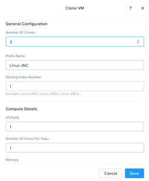

Leave them **Powered Off**.

Migrate a VM Between Hosts
..........................

In **Prism Element > VM > Table**.

Locate the Linux VMs from the previous lab (*initials*-Linux_VM).

- Use Search with the Initials you used.

You should see that it has no entry in the **Host** column when it is powered off.

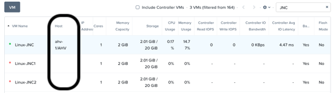

Select the **Powered On** VM, then click **Migrate**.

You can either choose one of the other hosts in the cluster as a migration target for the VM, or accept the default and let AHV automatically select a location.

Click **Migrate** to finalize the action.

When the task completes, verify that your VM host location has changed from the host recorded above to the new location you selected.

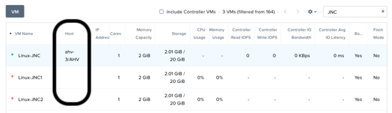

Configure VM-to-Host Affinity Policies
......................................

In **Prism Element > VM > Table**.

Locate the Linux VMs from the previous lab (*initials*-Linux_VM).

- Use Search with the Initials you used.

Select a **Powered OFF** VM, then click **Update** and **+ Set Affinity**.

Select two **Hosts** to which the VM can have affinity, and click **Save** and **Save** to finish.

.. note:: We select more then one host so the VM has a place to migrate too in the event of a Node failure.

Power On the VM, and verify it is on one of the **Hosts** you selected in the affinity policy.

Select the VM, then click **Migrate**.

You should see the following message:

- This VM has host affinity with 2 out of the 4 available hosts. It can only be migrated to those hosts.

Click **Migrate**.

You should see that the VM has moved to the other host.

High Availability
.................

High availability is enabled by default for AHV and will restart VMs in a best-effort manner in the event of a host failure. Additional configuration can set resource reservations to ensure there is capacity during an HA event.

VMware HA works by providing high availability for virtual machines by pooling the virtual machines and the hosts they reside on into a cluster. The hosts in that cluster are then monitored and in case there is a failure, the VMs residing on the failed host would get restarted on alternate hosts. This feature must be turned on in vSphere, as opposed to AHV where it’s on by default without reservation.

Data Protection
+++++++++++++++

In Prism, data protection policies are called protection domains (PDs). A PD is made up of a set of VMs and a policy. The available policies include snapshots, replication locations, and schedules.

VM snapshots
............

Create a VM snapshot and restore a VM from a snapshot.

In **Prism Element > VM**, click **VM**, then click **Table**.

Locate the Linux VM you created in the previous lab (Linux_VM-*intials*).

- If the VM is powered on, power it Off

Select the VM, then click **Snapshot** from the menu below the list of VMs.

Provide a name for your snapshot.

Return to VMs table and click the VM’s name to open its console window.

Click **Snapshots** to see your snapshot.

- Note the four available actions (Details, Clone, Restore, and Delete).

Click **Details** to see all of the VM’s properties at the time of the snapshot.

Now lets break our VM.

Click **Update** from the menu below and modify the original VM you took the snapshot of.

- Scroll down to the disks section and delete the CD-ROM and DISK by clicking the **X** icon for each item.
- Click **Save** to finalize the changes.

Now attempt to power on that VM and open its console window.

- Note that the VM no longer has any disks to boot from and that the 2048 game is displayed.

Power off the VM.

Select the VM, then click **VM Snapshots** from the menu below the list of VMs.

Click **Restore** to revert the VM to the state it was in before you removed the disks.

Attempt to power on the VM and open the console.

Verify that the VM boots successfully and that its configuration has been restored.

Configure a Protection Domain (PD)
..................................

In **Prism Element > Data Protection**, click **Data Protection**, then click **Table**.

Click **+ Protection Domain** to create a PD, then click Async DR.

Provide a name for the PD, and click **Create**.

Select the VMs that you want be members of the PD:

- Filter or scroll to select the VMs you created in this bootcamp to be part of the PD.
- Scroll down and click **Protect Selected Entities**.
- The selected VMs appear in the right-hand side table. Click **Next**.

Configure a local schedule:

- Click **New Schedule**.
- Select a frequency (for example, repeat every one day).

Configure a retention policy:

- Set the retention policy (for example, keep the last two snapshots).

.. note::

  Local is the only option in this lab environment because no remote targets are configured.

  You could setup a remote site with a neighbor cluster.

Click **Create Schedule**.

.. note::

  A Protection Domain can have multiple schedules.

Click **Close** to exit.

Takeaways
+++++++++

What are the key things you should know about **Nutanix 101**?

- Prism is thoughtfully laid out UI

- Critical information is displayed front and center

- The default cluster redundancy factor is set to 2. Clusters with a redundancy factor of 2 have 1/2 of the total usable space (30 TB = 15 TB usable space) because there are two copies of the data kept.

- A ZooKeeper failures tolerable of 1 means that one component in the cluster (one CVM, one NIC, one disk, and so on) can be down without impacting data resiliency. A failures tolerable of 2 means two components in the cluster can be down without impacting data resiliency. The two components can be different types.

- It's very easy to setup a network in the cluster in order to establish VM connectivity.

- IPAM is very simple to setup within a network and it can greatly simplify IP management within the cluster.

- The Image Configuration tool allows you to have a catalog of available images to be used in VM deployments as needed and covering a broad format support which includes qcow, qcow2, vmdk, VHD, VHDx, RAW, and ISO.

- In this lab you got to experience first hand how AHV provides a complete set of tools and actions that can be done manage the VMs in the cluster.

- It is possible to register an ESXI cluster to Prism and be able to perform some of the basic VM management tasks right from Prism as well.

- Nutanix offers data protection solutions for virtual datacenters via different strategies including one-to-one or one-to-many replication.

- Nutanix provides data protection functions at the VM, file, and volume group level, so VMs and data remain safe in a crash-consistent environment.

- You can implement a data protection strategy by configuring protection domains and remote sites through the web console.
