.. _nutanix_terminology:

-------------------
Nutanix Terminology
-------------------

Nutanix HCI
+++++++++++

Physical Infrastructure
.......................

A Nutanix cluster is made up of Nodes and Blocks.

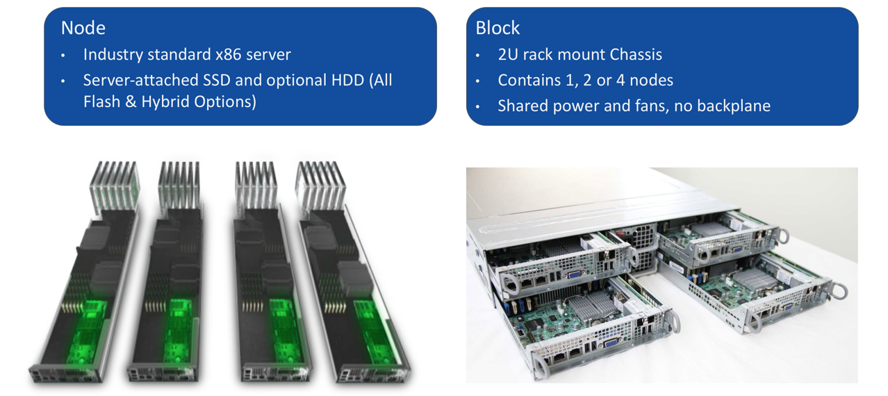

Storage Pools and Containers
............................

Nutanix presents the physical disks as one **Storage Pool**, that can be divided into one or more **Containers**.

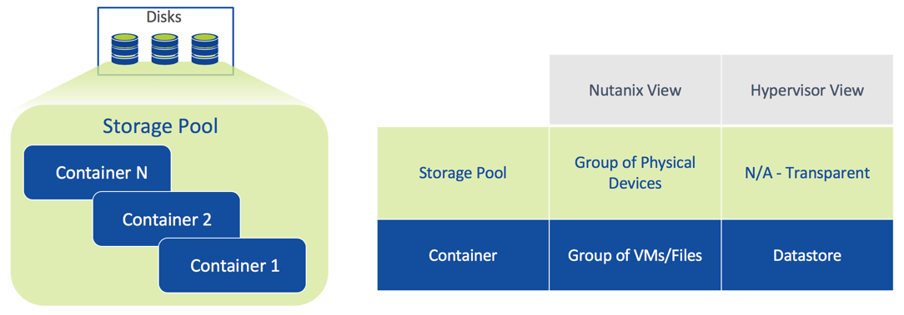

Nutanix Storage
+++++++++++++++

Tunable Redundancy
..................

What is it?

- Configure different levels of fault tolerance for different applications dynamically
- Works with EC-X for capacity savings

Points of differentiation:

- Software-defined. No prior understanding of storage required
- RF-3 offers protection against two simultaneous disk, node and NIC failures
- Switch between RF-2 and RF-3
- Replication set at the container level

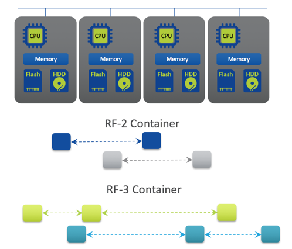

Nutanix EC-X (Erasure Coding)
.............................

- No overhead to the active write path
- Background job
- Only cold data is subject to EC-X
- Lower rebuild times (equal or better than RF2)
- Patent pending algorithm

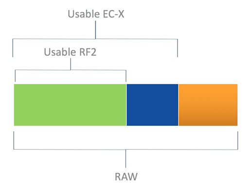

Deduplication
.............

- Inline fingerprinting with post-process deduplication
- Distributed across all nodes – true scale-out
- Global deduplication across entire cluster
- SHA-1 fingerprinting offloaded to Intel processors for greater efficiency
- 100% software-defined
- Strong hash allows dedupe to happen based on metadata match

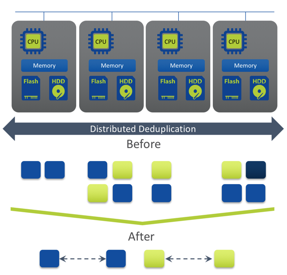

Compression
...........

- Inline and post-process compression
- Inline: Data compressed as it’s written
- MapReduce: Data compressed after “cold” data is migrated to lower-performance storage tiers
- No impact to normal IO path
- Ideal for random batch workloads
- Uses LZH4c algorithm (AOS 5+)

Data Locality
.............

- Keep data on the same node as VM
- All read operations localized on same node
- ILM transparently moves remote data to local controller
- Reduces network chattiness significantly
- Data follows VM during vMotion/Live Migration

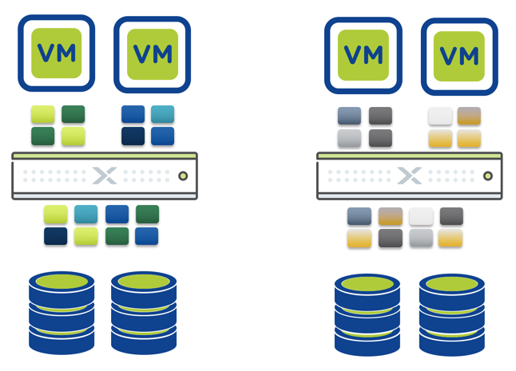

Intelligent Tiering
...................

Automatic Performance Optimization

- Leverage multiple tiers of storage
- Continuously monitors data access patterns
- Optimally places data for best performance
- No user intervention required

Hot Data - SSD

- Random data
- Persistent tier
- Maximum performance

Cold Data - HDD

- Sequential data
- Highest capacity
- Most economical

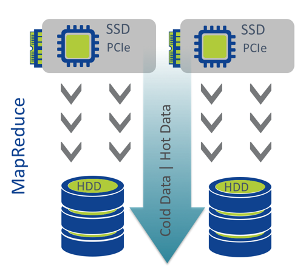

CVM Auto-Pathing
................

What is it?

- Continue to access data through CVM failures
- Hypervisor routing is updated automatically to use another CVM

Benefits

- High availability during software upgrades and failures

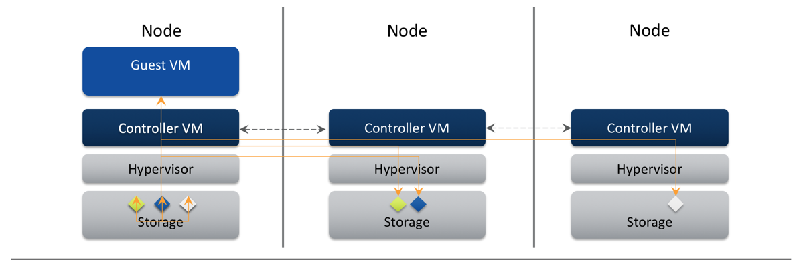

vMotion/DRS or Live Migration
.............................

Seamless VM Migration

- Metadata service can access data from anywhere
- Locality improves over time

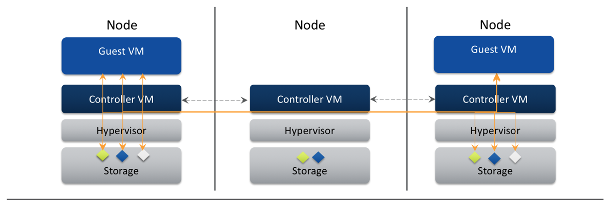

Nutanix VM Mobility
+++++++++++++++++++++++++++++++

Acropolis Dynamic Scheduling (ADS)
..................................

- Automatic Detection, and remediation of CPU and storage hot-spots
- Initial VM Placement
- Following anomalies are detected:
    - CPU hot spots
    - Storage controller hot spots
    - Affinity rule violation
- If anomalies are found, re-mediation by:
    - Live migration of VMs
    - ABS iSCSI session re-direction

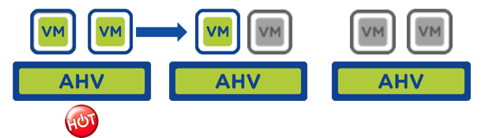

Host High Availability
......................

What it does

- Auto restart user VMs after host failure
- Policy enabled through Prism
- AHV picks the best admission control policy:
    - Reserved segments (default)
    - Reserved host

Benefits

- Always-on VMs
- Reduced administrative overhead

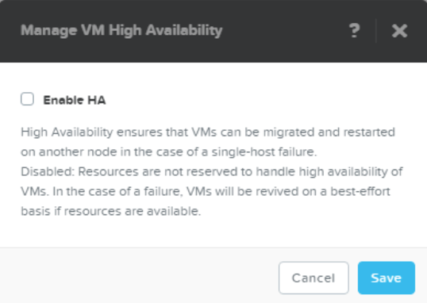

Affinity Rules - Host
.....................

VM-Host Affinity:

- Place and always keep a powered ON VM on selected group of hosts

Use Cases:

- SW License Compliance
- Security / Governance
- Hardware Segmentation

“Must” rule - never violated by:

- Initial placement
- HA
- Host maintenance mode
- ADS
- Manual live migration

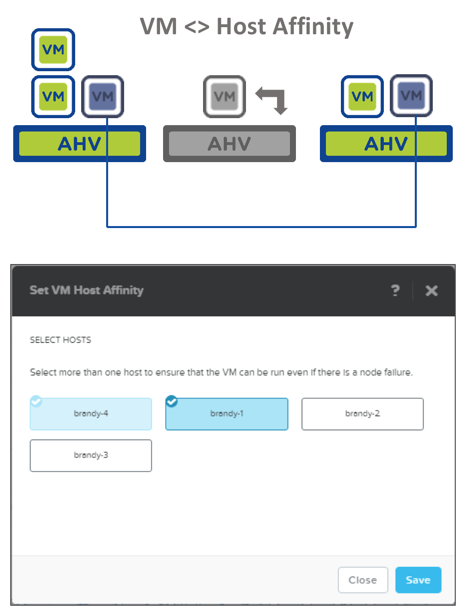

Affinity Rules - VM
...................

VM-VM Anti-affinity:

- Place and always keep a group of powered ON VMs on different hosts.

Use Cases:

- VM HA fault domain separation (e.g. SQL cluster)
- Manual Hot Spot avoidance

“Should” rule – best effort but can be violated.

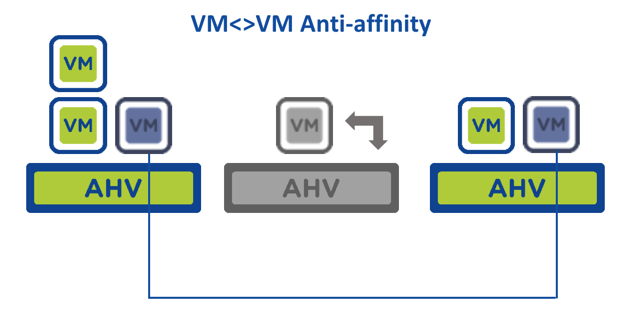

Nutanix Networking
++++++++++++++++++

AHV – Software Defined Networking
.................................

Fully distributed networking, based on open standards, simplifies deployment and ensures configuration consistency.

- Based on Open vSwitch
- Fully distributed to all nodes
- Virtual Networks w/vLANs
- IP Address Management (DHCP)
- Bond / Link Aggregation
    - Active / Backup
    - Source-NIC Load Balancing
    - LACP
- Each bridge has a bond, backed by one or more uplinks

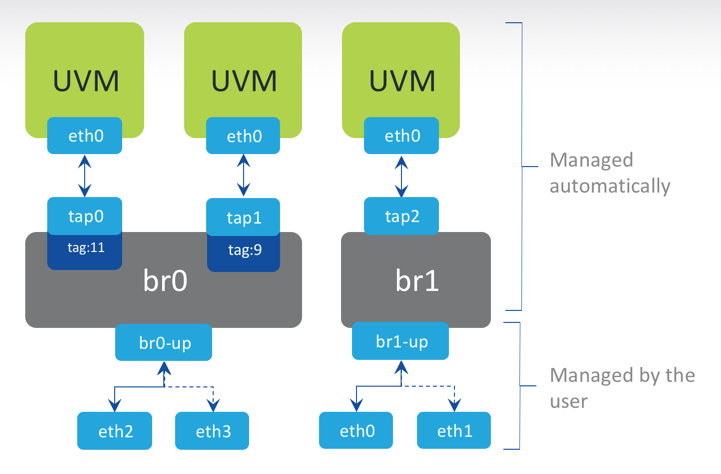

Flow (Microsegmentation)
........................

Regain Visibility and Control Inside Your Datacenter

- All networking native in AHV (nothing to install)
- Logical grouping via Categories in Prism Central
    - Categories group VM or Applications
- Security policies map to categories
    - Management of category membership simplifies process
- Rules pushed from PC -> CVM -> AHV -> OVS
    - AHV host OVS enforces rules
- Rules logical enforced at VM (vNIC) level
    - Firewall in front of every VM

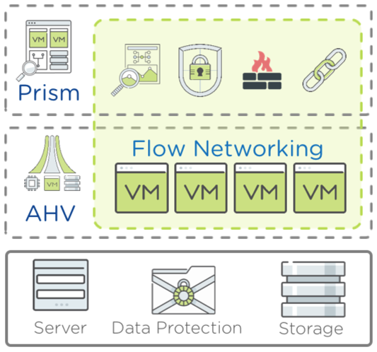

Flow Scenario – Environment Zoning with Isolation
.................................................

- Isolating environments simplified through one-click policies.

- Predefined categories for environment-type makes policy writing easy - simply add VMs to the desired category

- Moving workloads across environments is simply swapping the categories from Dev to Prod

.. figure:: images/nutanix_terminology_18.png

Nutanix Image Management
++++++++++++++++++++++++

Image service
.............

- Managed catalog of disk images (RAW & ISO)
- Leverage existing images with AHV
- Image management through PE or PC
- Inline conversion to Acropolis DSF
- Broad Format support:
    - qcow
    - qcow2
    - vmdk
    - VHD
    - VHDx
    - RAW
    - ISO

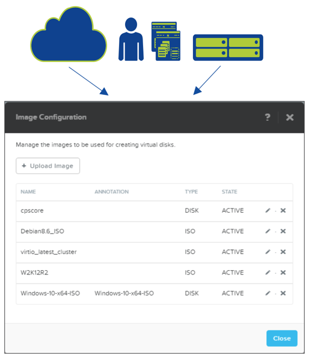
