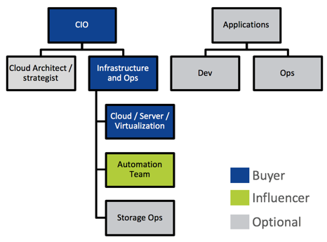
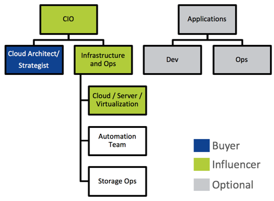
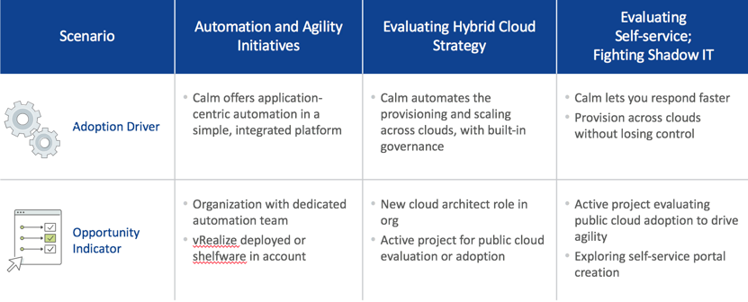

.. _selling_calm:

------------
Selling Calm
------------

Overview
++++++++

In this section we will look at how to sell Nutanix Calm. What to look for with different types of teams, and how we can help them.

What to Look For, Target Persona
++++++++++++++++++++++++++++++++

Datacenter and Infrastructure Teams
...................................

Looking for:

- Automate common app-centric activities
- One-click provisioning/lifecycle
- Empower self-service
- Hybrid cloud management

DevOps, Application and Dev Teams
.................................

Looking for:

- Single app modeling language
- Better collaboration
- Unified governance
- Eliminating IT personnel bottlenecks

IT Team Focus Areas
+++++++++++++++++++

Infra & Ops Focused
...................

- Automate provisioning of applications
- Streamline daily and mundane operations like upgrades, scaling, etc.
- Provide self-service to multiple groups
- Achieve better governance

Dev and DevOps Focused
......................

- Support DevOps practices, foster cross-team collaboration
- Provide cloud-like services to developers on-prem
- Improve development, testing release processes
- Centralize and govern developers’ public cloud consumption

.. figure:: images/selling_calm_02.png

Strategic – Cloud Architect
...........................

- Plan for long term hybrid cloud consumption
- Provide optionality through multi-cloud management
- Build cost visibility, governance, insights across clouds

Calm Addresses Both IT Automation andCloud Management Platforms Needs 
......................................................................

