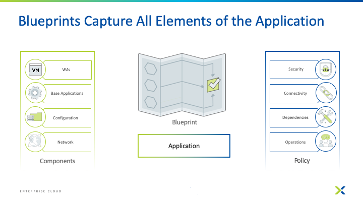
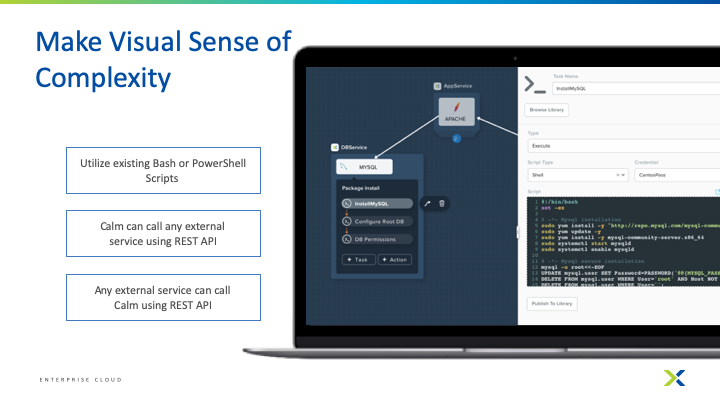
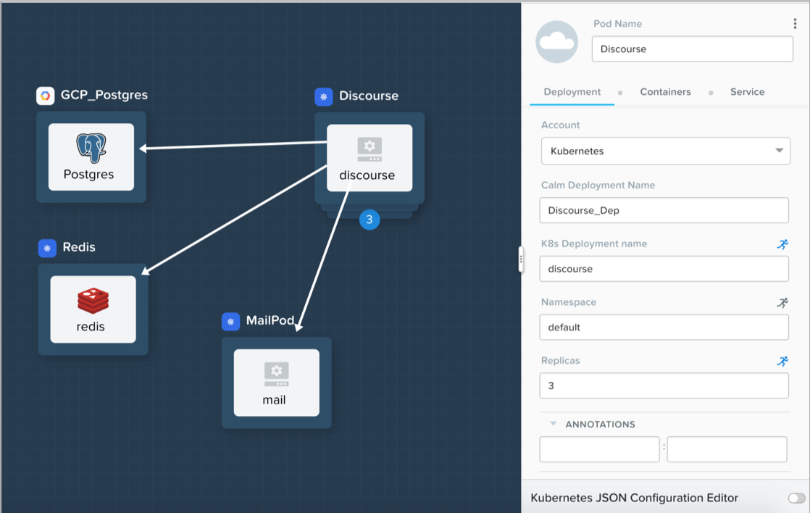
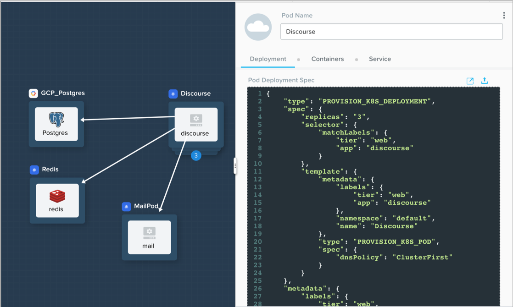
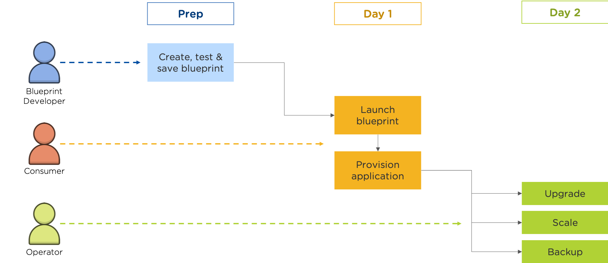
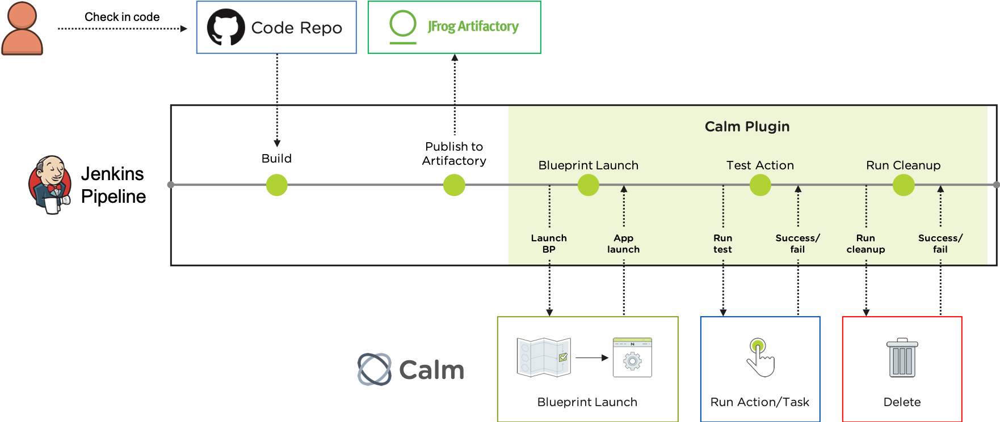
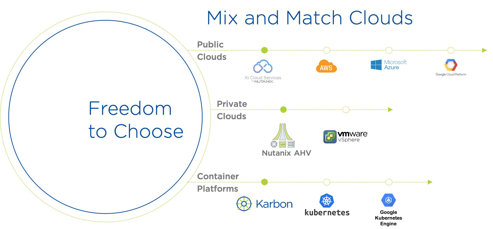
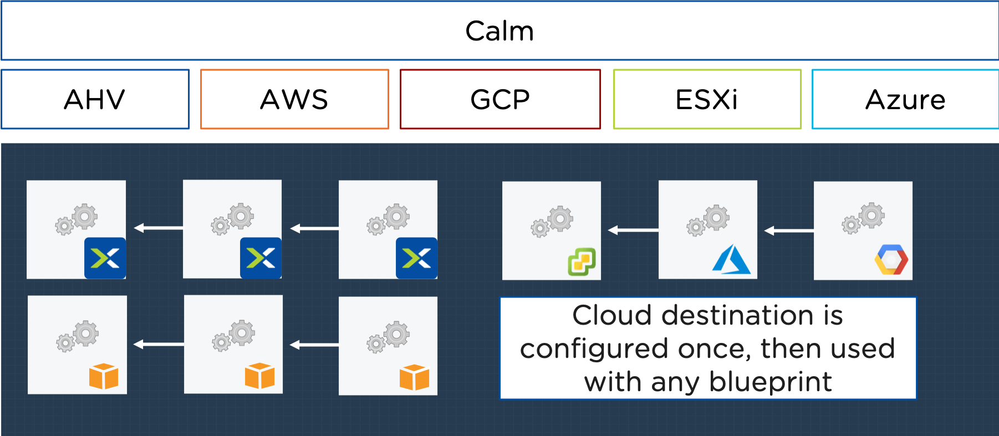
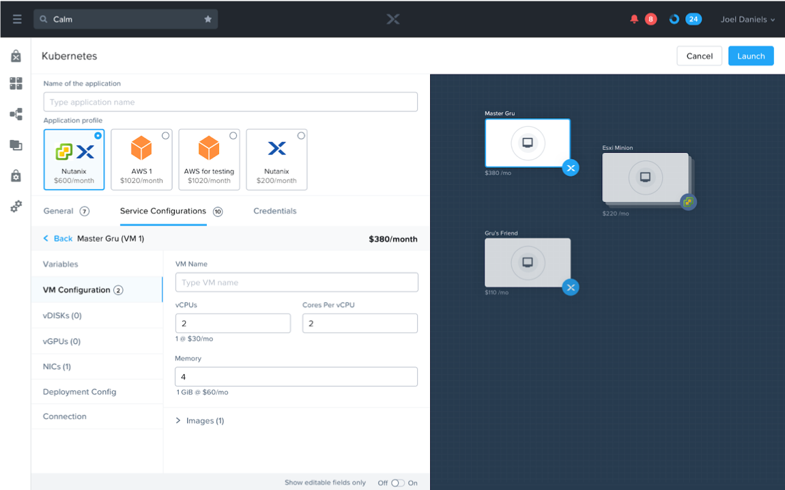
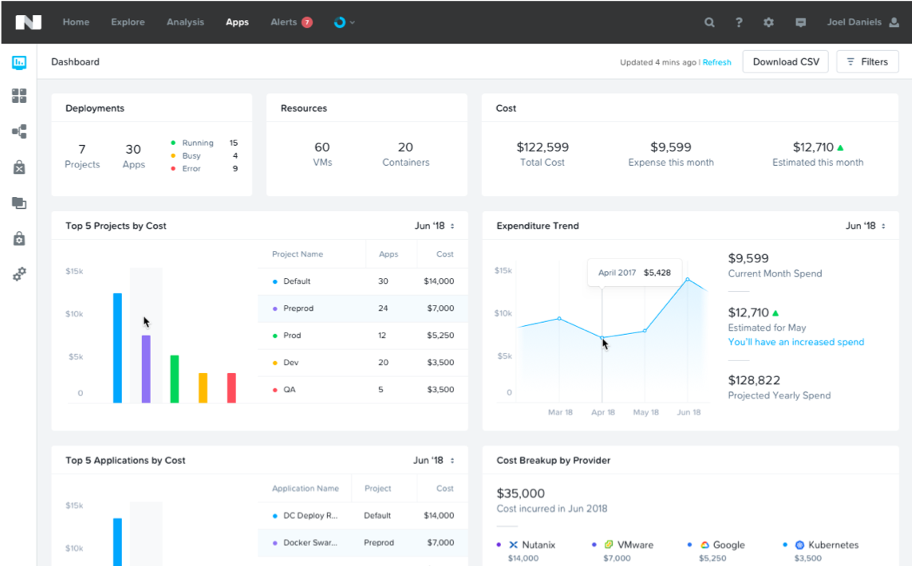

.. _what_is_calm:

------------
What Is Calm
------------

Overview
++++++++

Calm provides advanced application-level orchestration that transforms how IT teams manage applications and support the business. Fully integrated into the Nutanix platform, Calm delivers a powerful, common management framework that can be simultaneously leveraged by multiple IT teams to rapidly create and deliver applications.

By approaching applications as complete entities, not just virtual machines (VMs), Calm automates how applications are created, consumed and governed. Calm delivers simple, repeatable and automated management of applications across a variety of environments, including private and public clouds.

What is the State of Things Today
+++++++++++++++++++++++++++++++++

Managing Apps Is Increasingly Challenging
.........................................

.. figure:: images/what_is_calm_01.png

How Does Nutanix Solve This Problem
+++++++++++++++++++++++++++++++++++

Foundation For Enterprise Cloud
...............................

Nutanix provides the foundation for your Enterprise cloud.

.. figure:: images/what_is_calm_02.png

Delivering the Enterprise Cloud Vision
......................................

.. figure:: images/what_is_calm_03.png

Self-Service and Governance
...........................

- Publish blueprints to different groups using a policy-driven model
- Reduces miscommunications between teams
- Provides an attractive alternative to roll-your-own cloud services while maintaining complete control and visibility over operations

Marketplace
-----------

- 50+ Pre-integrated blueprints
- Publish custom apps to marketplace

Partners
--------
.. figure:: images/what_is_calm_05.png

User Case 1: Self-Service App Provisioning
------------------------------------------

.. figure:: images/what_is_calm_07.png
.. figure:: images/what_is_calm_08.png
.. figure:: images/what_is_calm_09.png

User Case 2: Self-Service via ServiceNow & Calm
-----------------------------------------------
.. figure:: images/what_is_calm_10.png

Role-Based Access Control
-----------------------------------------------

- Full RBAC for self-service
- Multiple in-built roles out of the box
- Ability to customize roles and link to AD

.. figure:: images/what_is_calm_11.png

End-to-End Audits
-----------------

- Every action and the response is logged
- Identify who did what and why across environments
- Export logs to your choice of logging system for archival

.. figure:: images/what_is_calm_12.png

On-Prem Resource Cost
---------------------

- Define vCPU/Memory/Storage cost for On Premise cloud

.. figure:: images/what_is_calm_13.png

- Analyze cost 
    - Per VM
    - Per App
    - Per Project

.. figure:: images/what_is_calm_14.png

Application Lifecycle Management
................................

- Simplify the set-up and management of custom enterprise applications into an easy-to-use-blueprint
- Deployment and lifecycle management of common applications both automated and easily repeatable
- Infrastructure teams can eliminate the hours and days devoted to routine application management

Calm Blueprints
---------------

- Provides a framework to launch ready to go apps
- Intuitive and visual way to model applications 
- Drive repeatable provisioning of applications

.. figure:: images/what_is_calm_15.png

- Makes sense of complexity in a visual way
- Auto generated system action flows
- Utilize existing Bash or PowerShell scripts
- Call any external service using HTTP Tasks
- Easy to understand dependencies

.. figure:: images/what_is_calm_16.png

Kubernetes with Calm
--------------------

- Supports Vanilla K8s API, Karbon, Public K8s Services
- Combined Life Cycle Management of VMs and Kubernetes Pods in a single blueprint
- Manage Kubernetes deployments and services using spec editor

Use Case 3: Application Life Cycle Management
---------------------------------------------

Use Case 4: CI/CD using Calm and Jenkins
----------------------------------------

- Jenkins Calm plugin provides a complete native integration between the CI/CD and life cycle management of the application 
- This plugin eliminates “configuration silos” in the Jenkins build process by leveraging Nutanix Calm to deploy and test applications in a multi cloud environment
- Developer/Admin need not worry about 
    - Configuring multi cloud environments in Jenkins build steps 
    - Calling multiple runbooks from Jenkins for running tests / cleanup etc. 

Multi-Cloud Orchestration
.........................

- Abstract applications from cloud infrastructure
- Deploy and manage applications on any cloud
- Application mobility between clouds

Define Apps Once, Use Everywhere with Profiles
----------------------------------------------

- Application Profiles can be used to define different deployment scenarios, such as public cloud deployments, without redefining the entire application
- There is no need for complex refactoring or new training required if you wanted to use a new cloud
- Each Profile also calculates it's unique cost of running 

Compare Cloud Costs and Predict Future Spend
--------------------------------------------

- Track cloud costs across teams
- Instant information to make informed cloud decisions

Takeaways
+++++++++

Calms Native Capabilities:

- **Application Lifecycle Management:** Fully automate the provisioning, scaling, and deletion of both traditional multi-tiered applications and modern distributed services using pre-integrated blueprints that make management of applications in private and public clouds extremely simple.
- **Customizable Blueprints:** Simplify the set-up and management of custom enterprise applications by incorporating all elements of each app, including relevant VMs, configurations and related binaries, into an easy-to-use-blueprint that is managed by the infrastructure team. IT teams can eliminate the hours and days currently devoted to routine application management.
- **Nutanix Marketplace:** Blueprints can be published directly to end users through the Nutanix Marketplace, giving application owners and developers the ability to request IT services that can then be instantly provisioned.
- **Governance:** Calm maintains control with role-based governance that limits user operations based on permissions. Additionally, all activities and changes are centrally logged for end-to-end traceability, aiding security teams with key compliance initiatives.
- **Hybrid Cloud Management:** Automate the provisioning of Hybrid Cloud architectures, scaling both multi-tiered and distributed applications across different cloud environments, including AWS. Calm shows the overall utilization and true cost of your public cloud consumption at a glance so that decisions are based on business needs and budget requirements.
