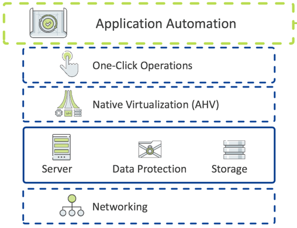

.. _what_is_calm:

------------
What Is Calm
------------

Overview
++++++++

Calm provides advanced application-level orchestration that transforms how IT teams manage applications and support the business. Fully integrated into the Nutanix platform, Calm delivers a powerful, common management framework that can be simultaneously leveraged by multiple IT teams to rapidly create and deliver applications.

By approaching applications as complete entities, not just virtual machines (VMs), Calm automates how applications are created, consumed and governed. Calm delivers simple, repeatable and automated management of applications across a variety of environments, including private and public clouds.

.. figure:: images/what_is_calm_01.png

.. figure:: images/what_is_calm_02.png

.. figure:: images/what_is_calm_04.png

.. figure:: images/what_is_calm_05.png

.. figure:: images/what_is_calm_06.png

.. figure:: images/what_is_calm_07.png

.. figure:: images/what_is_calm_08.png

.. figure:: images/what_is_calm_09.png

.. figure:: images/what_is_calm_10.png

.. figure:: images/what_is_calm_11.png

.. figure:: images/what_is_calm_12.png

.. figure:: images/what_is_calm_13.png

.. figure:: images/what_is_calm_14.png

.. figure:: images/what_is_calm_15.png

.. figure:: images/what_is_calm_16.png

Takeaways
+++++++++

Calms Native Capabilities:

- **Application Lifecycle Management:** Fully automate the provisioning, scaling, and deletion of both traditional multi-tiered applications and modern distributed services using pre-integrated blueprints that make management of applications in private and public clouds extremely simple.
- **Customizable Blueprints:** Simplify the set-up and management of custom enterprise applications by incorporating all elements of each app, including relevant VMs, configurations and related binaries, into an easy-to-use-blueprint that is managed by the infrastructure team. IT teams can eliminate the hours and days currently devoted to routine application management.
- **Nutanix Marketplace:** Blueprints can be published directly to end users through the Nutanix Marketplace, giving application owners and developers the ability to request IT services that can then be instantly provisioned.
- **Governance:** Calm maintains control with role-based governance that limits user operations based on permissions. Additionally, all activities and changes are centrally logged for end-to-end traceability, aiding security teams with key compliance initiatives.
- **Hybrid Cloud Management:** Automate the provisioning of Hybrid Cloud architectures, scaling both multi-tiered and distributed applications across different cloud environments, including AWS. Calm shows the overall utilization and true cost of your public cloud consumption at a glance so that decisions are based on business needs and budget requirements.
