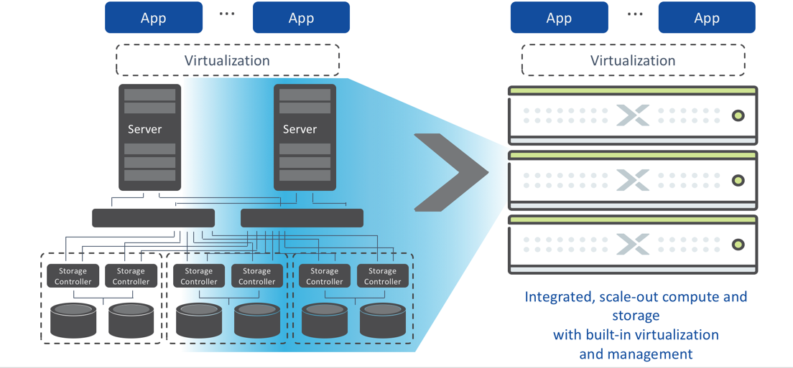
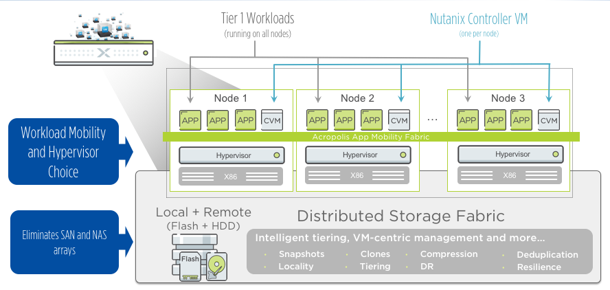
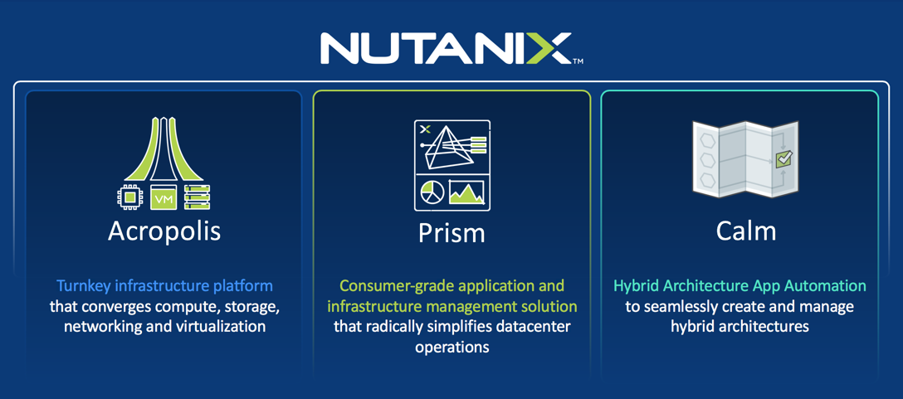
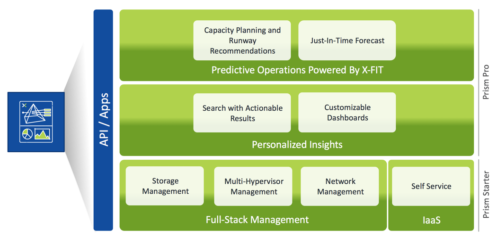

.. _what_is_nutanix:

---------------
What is Nutanix
---------------

What is Nutanix Enterprise OS?
++++++++++++++++++++++++++++++

Streamlining The Datacenter
...........................

Nutanix has the features required to run most of today’s Enterprise Applications and MORE…

Nutanix Web-Scale Architecture
..............................

Nutanix is built on Web-Scale Architecture

The Nutanix Solution
....................

Nutanix is made up of two parts, Nutanix Prism and Nutanix Acropolis.

Prism Central Management
........................

Nutanix Prism Central is your Multi-Cloud & Multi-Hypervisor management plane.

